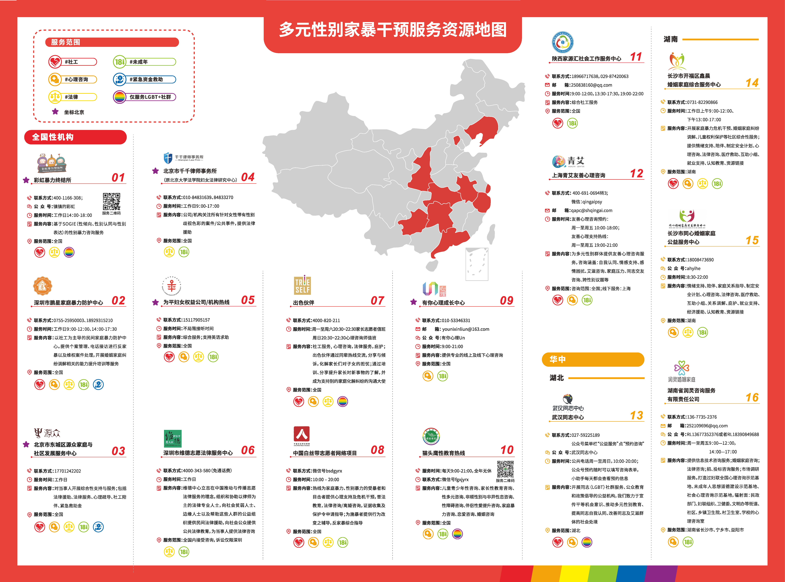
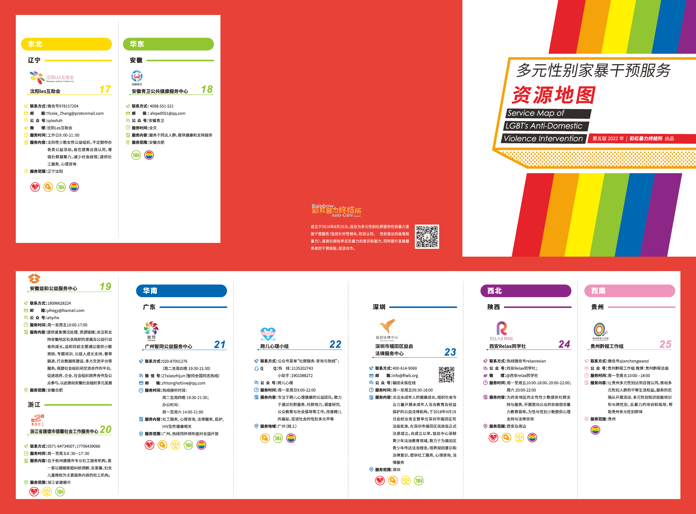

本文档旨在发布由其他可信来源获取但 wiki 可能没有相关细节的信息，如果有以下信息相关的详细内容，欢迎向 wiki 报告！


由于这些资料均来自第三方，具有强时效性，有效与否请自行甄别。


## 心理科/精神科机构 {#organization}



本列表来自 潘柏林助理 - 微信号 PBLzl09 的推荐

本转载是建立在**改善阅读体验**的前提下进行对内容的还原，并不代表 MtF.wiki 的就医建议



**最后更新时间：2023 年 4 月 8 日**

下列列表并不是唯一选择，需要进一步的探索

```csv
城市,机构,科室,医师,备注
北京,北京回龙观医院,精神科,[邸晓兰](),
北京,北京回龙观医院,精神科,[过斌](),
北京,北京回龙观医院,精神科,[牛雅娟](),
北京,北京回龙观医院,精神科,其他医师,可能未收录
北京,北京大学第六医院,精神科,[唐宏宇](),
北京,北京大学第六医院,精神科,其他医师,可能未收录
北京,北京大学第三医院,心理咨询科,[胡佩诚](),仅激素治疗
北京,北京大学第三医院,心理咨询科,[郝树伟](),仅激素治疗
天津,天津市安定医院,精神科,周天红,未收录
上海,[上海精神卫生中心](),精神科,陆峥,
上海,[上海精神卫生中心](),精神科,其他医师,可能未收录
上海,上海忻奥临床心理诊所,精神科,褚索宇,未收录
上海,上海忻奥临床心理诊所,精神科,其他医师,可能未收录
广州,暨南大学广州华侨医院,精神科,[贾艳滨](),
深圳,[深圳市康宁医院](),心理健康门诊,位照国,
深圳,[深圳市康宁医院](),心理健康门诊,刘文英,未收录
西安,西安交大第一附院,精神心理卫生门诊,高成阁,未收录
西安,西安市精神卫生中心,,雷莹,[wiki 记录]()：受举报，拒绝接诊
重庆,重庆医科大学附属第三医院,临床心理科门诊,宁洁,未收录
武汉,武汉市精神卫生中心,,,wiki 仅收录了[李赋]()
长沙,中南大学湘雅二医院,,[贺莹](),
哈尔滨,哈尔滨医科大学附属第四医院,精神心理科,张磊晶,未收录
沈阳,沈阳市精神卫生中心,,郭影,未收录
大连,大连市第七人民医院,精神科,[张亮](),
济南,[山东省精神卫生中心](),,刘金同,未收录
济南,[山东省精神卫生中心](),,寻广磊,未收录
济南,[山东省精神卫生中心](),,于晓东,
济南,[山东省精神卫生中心](),,其他医师,可能未收录
南京,南京鼓楼医院,医学心理科,[曹秋云](),
南京,南京脑科医院,,陈建国,已退休<br>请找其他医生，例如[武欣]()
徐州,徐州市东方人民医院,精神科,靳自斌,未收录
杭州,浙大一附院,精神卫生科,胡少华,未收录
泉州,福建省泉州市第一医院,心理科,孔东燕,未收录
```

### 多元性别家暴干预服务地图 {#map-page}

（来源：微信公众号 - [同语II](weixin://tongyu2005-ii)）

***最后更新时间： 2022 年 7 月 13 日 - 第五版***（[公众号文章](https://mp.weixin.qq.com/s/jzFVpU99rlFaxZZkqWDM0g)）




