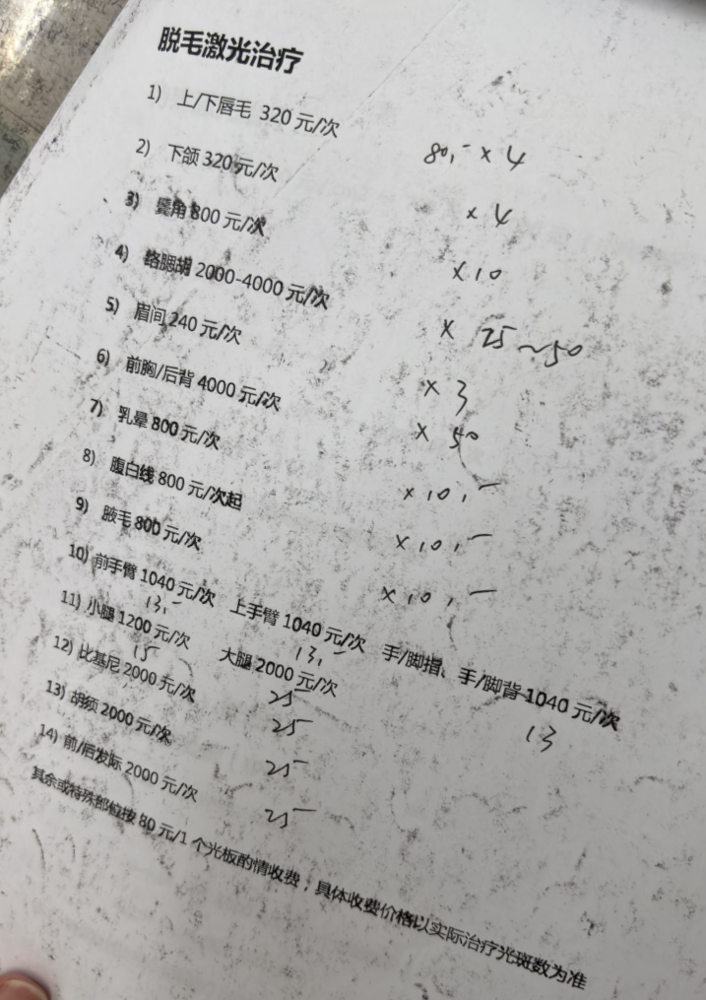
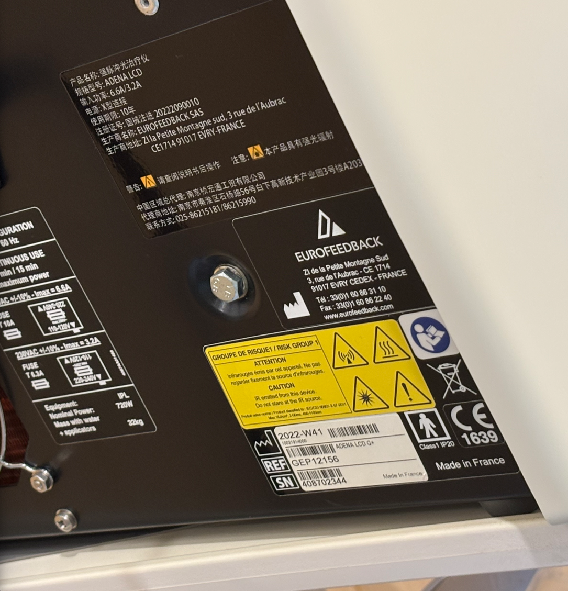
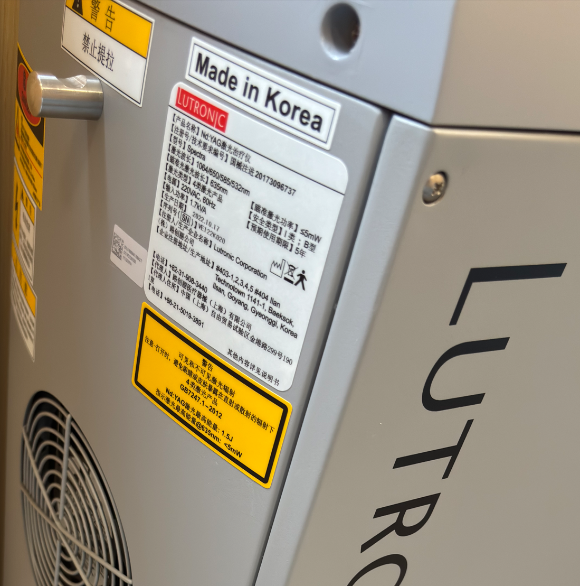
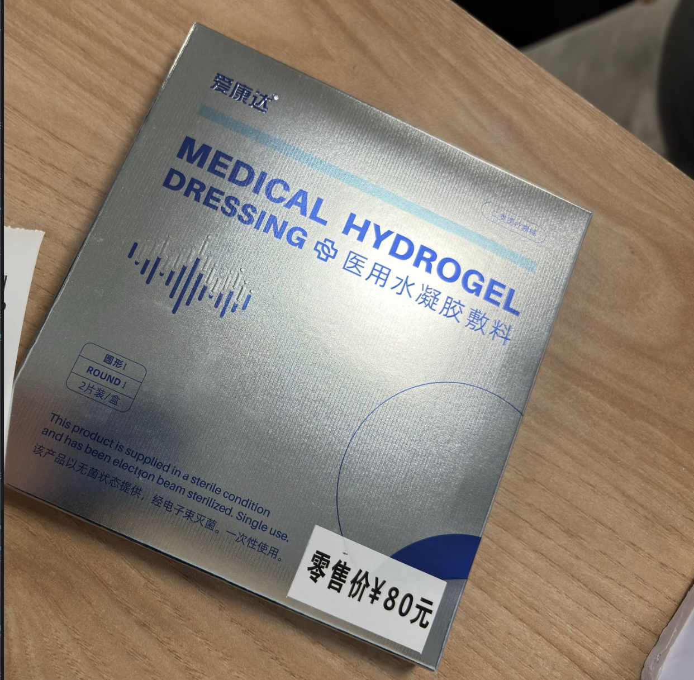
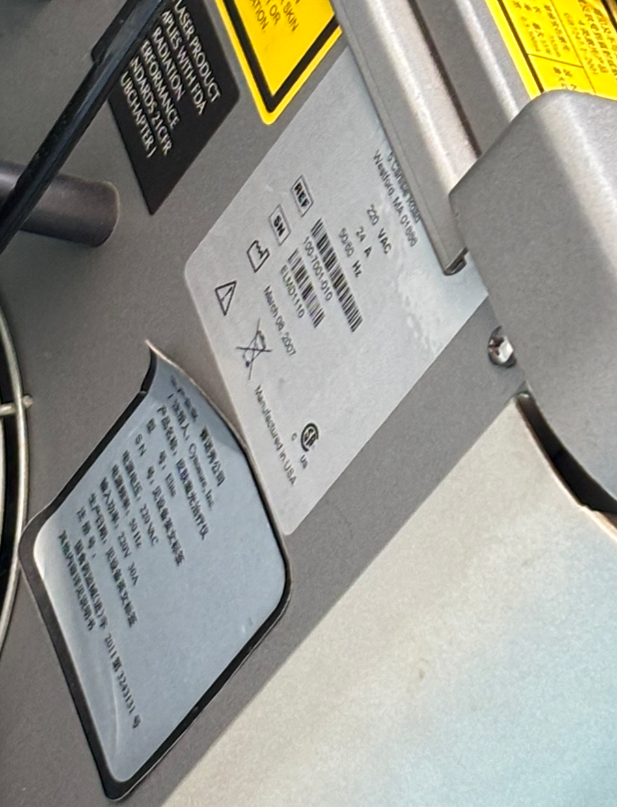

医院：[上海第九人民医院](https://www.9hospital.com.cn/)

## 参考价格

九院的计价单位：80元/光斑。\
光斑不等于实际操作时的打光次数，一般同区域会覆盖多次，取决于操作师。\
部位价格可能因为院区或患者部位情况有差异。[^1]




如果你在某些部位有少量毛发，可以对那个区域单独购买。

## 挂号

- 微信公众号「上海第九人民医院九院」
- **激光美容科**或**整复外科门诊-整形激光专病**

## 浦东院区

位置与交通途径：

- 高科西路1908号
- [openstreetmap](https://www.openstreetmap.org/search?lat=31.189145&lon=121.527498)
- 7号线，杨高南路2号口，步行约11分钟

设备：

- EuroFeedback ADENA，IPL
- Nd:YAG，1064nm激光









注意事项：

- 打下颌前可去国际门诊楼提前买冷敷贴



- 建议在家剃好毛，现场剃毛概率收费
- 下午去有概率当天能打到
- 能够指定使用仪器

## 南部院区, 新门诊楼

位置与交通途径：

- 瞿溪路500号
- [openstreetmap](https://www.openstreetmap.org/search?lat=31.203782&lon=121.482669)
- 8号线，西藏南路5号口，步行约7分钟

仪器：

- Alma Soprano XL，810nm





注意事项：

- 打完会让你自己去自助机买冰袋敷着
- 人比较多，医生建议挂上午号，否则可能当天打不到大部位如小腿
- 操作员可能对毛发较少的部位处理不够仔细，需要强调让其完整覆盖
- 脱毛不需要拍照，其他激光项目需要拍照

## 南部院区, 旧门诊楼

位置与交通途径：

- 制造局路639号
- [openstreetmap](https://www.openstreetmap.org/search?lat=31.204727&lon=121.481194)
- 8号线，西藏南路5号口，步行约13分钟

仪器：

- Cynosure Elite，具备755nm和1064nm





注意事项：

- 人非常多，打大部位(如小腿)需要去现场进行二次预约，一般能排到半个月之后
- 需要拍照
- 仪器会吹冷风，打面部会有些呼吸困难
- 会直接给你一个冰袋敷着

[^1]: 在6月和8月于浦东院区对双小腿及下颌进行脱毛，分别收费330+1248(含剃毛费)，1040
