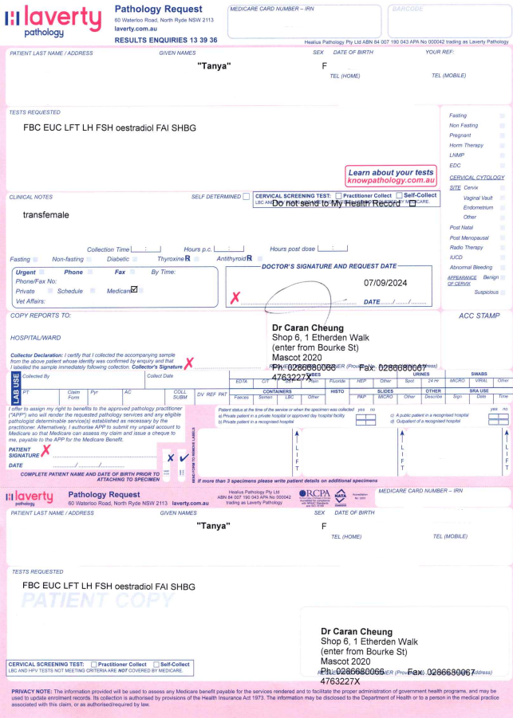
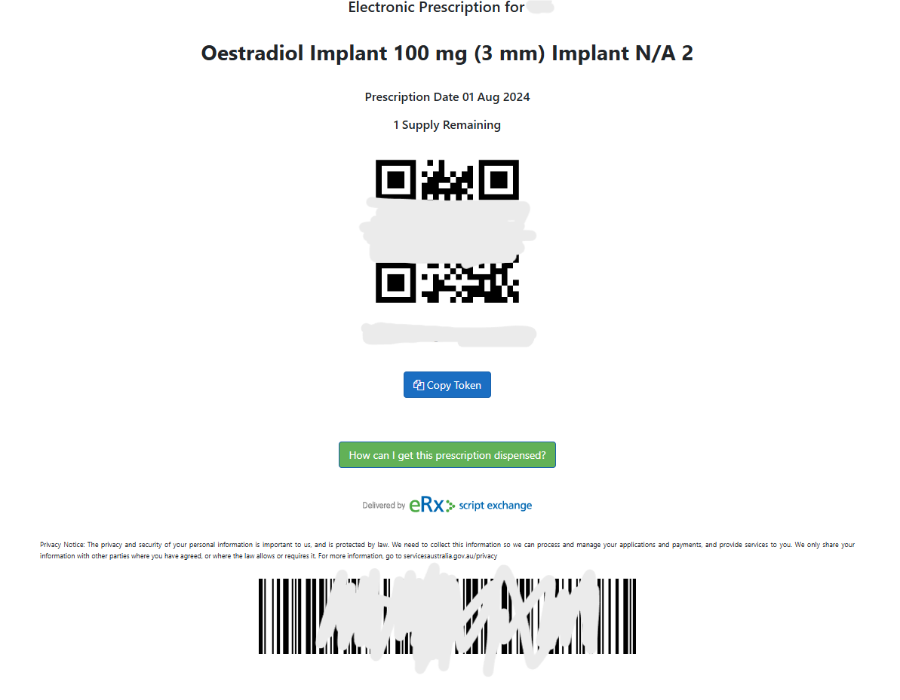

## 介绍

悉尼对HRT非常友好，可以走概论提到的[informed consent](https://www.transhub.org.au/informed-consent)流程进行HRT，一般如果可以约到GP（家庭医生）的话，那么只需要等待第一次看GP的时间+复诊时间（一般不超过15-20天）即可获取HRT资源。如果约不到GP也可以走Endo（内分泌科医生）的流程，大概需要25-30天(和友跨GP，一定一定和诊所确认好医生友跨）。

本人是PR，但是临时签证也是差不多的流程，只是报销需要你自己处理，并且不像Medicare是即时报销。

## GP选择

以下列表为我个人亲自看过并验证过友跨的医生。目前并不多但可能会随着我搬家等进行相应补充。

[Dr Caran Cheung](https://www.hotdoc.com.au/medical-centres/mascot-NSW-2020/mascot-medical-practice/doctors/dr-caran-cheung)

> 位于Mascot Medical，可以乘坐T8/350/420前往也可以开车（免费停车一个半小时，足够用），非常方便。

[Dr Andrew Crossman](https://www.sydney.edu.au/students/health-wellbeing/health-services.html)

> 悉尼大学的校医，人非常友善，而且对悉尼大学学生免费，非常方便！在Wentworth Building 3楼，从Food hub右转走到头就是了。

这个列表上的医生我没看过，但据说都很友跨并可以提供informed consent，不用再refer endocrinologist。

[TransHub Doctor List](https://www.transhub.org.au/doctors)

## 走GP进行informed consent的流程

### 初诊

首先在[HotDoc](https://www.hotdoc.com.au/)上预约自己想看的医生，这里以Caran为例（因为我亲自去看过，基本流程不会差太多）。一般可以约到5-7天后的时间。如果你想bulk bill（医保全包），那你想多了……因为一般都不会open patient book或者排队时间超过6个月，完全不值得因此延误HRT。

进行预约后就可以前往GP进行初诊了。记得提前15分钟到。初诊的时候可以任意穿着，我当时是戴了假发和穿了裙子丝袜并化了淡妆，是典型的女性穿着，但据反映不进行任何RLE也没有问题。

向医生表明自己有跨性别的意愿，并说明自己希望通过HRT来达成减轻性别焦虑的目的。医生会量你的身高体重血压，并询问你一些简单的问题，是否成年（informed consent需要18+）以及一些基础的个人背景（学习专业，未来规划等）。随后，医生会对HRT进行介绍，并发给[informed consent表格](https://static1.squarespace.com/static/5d8c2136980d9708b9ba5cd3/t/5e7a65dce1294b32cd6929d3/1585079773283/Informed+Consent_Feminising+Hormone+Therapy_TH2019.pdf)供阅读和填写。然后会发给你一张查血单查一下你的baseline（即使你之前DIY过这个步骤也要做，而且未来如果发现自己两性畸形可以查这个查血单来初步判断）和生殖能力保存（如果你要求的话），然后尽快去进行查血。第一次面诊到此结束，这时候是没有处方的，但理论上就可以拿小证去改各大系统里的性别了。然后可以预约下一次面诊，但是需要隔2-3个工作日等查血结果出来（如果当天不能查到血，顺延一个工作日），所以尽量预约查血后3-5个工作日后的复诊。

查血方法很简单，前往查血中心（一般诊所里就有，但如果没有，谷歌地图搜索blood test），会给你抽血。抽完血叫你签个名就可以走了。你看完了以后可能诊所里的或者隔壁的查血点已经关门了，这样的话这里推荐[Darlinghurst Medical Centre](https://www.darlinghurstmedical.com.au/)，7天都开（一般查血点只有工作日开）所以可以第二天查。

**如果医生以非生理相关的理由在这里卡你，包括但不限于BMI，生殖能力保存，pass度，声音等，你可能被gatekeep了。建议不要再继续面诊，并更换医生。**

#### 查血单样板

### 复诊

拿到baseline结果后就可以去复诊了，可以打电话确定有没有拿到结果。记住：**如果没有拿到结果，去复诊也没用**，因为没有baseline level，开不了处方。

和初诊一样，提前15分钟到，RLE是可选的。

医生会再次确定你的跨性别意愿并询问性别焦虑的历史（对回答内容卡的不是太死，基本上提到你多少岁想做女生和为什么就行（据另一位跨女描述），本人性别焦虑过程相对完整所以当然就可以了。非二元的话，表示自己对男性身份的厌恶就行，这里不是为了gatekeep你，只是确认一下你真的有这个意愿不是当糖吃），确定你理解并同意informed consent表的内容。

**同样的，如果医生以非生理相关理由卡你，建议不要再继续面诊，并更换医生。**

然后医生会介绍各种药物的形态以及使用方法。在澳洲有以下药物可供选择（价格均为2024-11-26查询，基于Chemist Warehouse网站）：

#### 雌二醇口服

[Progynova](https://www.chemistwarehouse.com.au/buy/7279/progynova-2mg-tablets-56-estradiol): 也就是补佳乐。56x2mg，$10.99，一般一天3片，折合一个月$18.25。

[Zumenon](https://www.chemistwarehouse.com.au/buy/57557/zumenon-2mg-tablets-56-estradiol)：相当于诺坤复。56x2mg，$9.99，一般一天3片，折合一个月$16.59。

#### 雌二醇凝胶

[Estrogel](https://www.chemistwarehouse.com.au/buy/95280/estrogel-0-06-gel-pump-80g-estradiol)：也就是凝胶。64x（1.25gx0.06%），$30.99，一般一天2泵，折合一个月$30.02。

[Sandrena](https://www.chemistwarehouse.com.au/buy/7517/sandrena-1mg-gel-sachet-28-estradiol)：袋装的凝胶，既可以有凝胶的好处又方便携带，防止爆柜。28x1mg，$16.99，一般一天2包，折合一个月33.98。

#### 雌二醇贴片

不建议，因为经常缺货。但是还是打出来给大家参考。我不知道用法用量，因为没用过。

[Estradot](https://www.chemistwarehouse.com.au/buy/54256/estraderm-mx-25mcg-patches-8-estradiol)

#### 抗雄

与雌激素同时进行。因为澳洲没有针剂，单靠雌激素不太现实，所以抗雄还是需要的。

[Spiractin](https://www.chemistwarehouse.com.au/buy/7861/spiractin-25mg-tablets-100-spironolactone)：也就是螺内酯。25mgx100，$12.99，一般一天4片，折合一个月$16.1。

[Cyproterone Sandoz](https://www.chemistwarehouse.com.au/buy/68585/cyproterone-sandoz-50mg-tablets-20-cyproterone)：也就是色普龙。50mgx20，$16.99，一般一周2x12.5mg（需要另外买切药器），折合一个月$1.85。

根据个人需求自己选择就行了。医生随后会给你开处方，一般会给6个repeat。可以选择纸质处方或电子处方（临时签证需要申请[IHI](https://www.servicesaustralia.gov.au/how-to-get-individual-healthcare-identifier?context=22591)，PR可以直接要）。如果是临时签证且需要IHI，建议提前申请好IHI。

#### 处方样板

恭喜！到这里你美妙的HRT旅程就可以开始了！

## 走Endo（内分泌科医生）进行informed consent的流程

如果实在找不到informed consent的GP或极其不方便，也可以走这个流程。后面所述的implant必须走endo。

以下列表为我个人亲自看过并验证过友跨的医生。目前并不多但可能会随着我搬家等进行相应补充。

[Dr Jon Hayes](https://www.healthdirect.gov.au/australian-health-services/healthcare-service/st-leonards-2065-nsw/dr-jonathan-garth-hayes-endocrinologist/endocrinology-service/e482a024-2b01-2049-9892-e4cbfce102b8)

> 位于St Leonards，可以坐车到同名火车站，下车走 5 分钟就到。或坐 M1 线到 Crows Nest 地铁站后下车倒 254 巴士往 McMahons Point Wharf 坐 3 站就到。注意前台有点凶，说话最好语气缓和一点，但他人很好。

这个列表上的医生我没看过，但据说都很友跨并可以提供informed consent。

[TransHub Doctor List](https://www.transhub.org.au/doctors)

去你最方便的GP那里说明自己想跨性别的意愿，并要求refer到endo那里。然后过程就和GP差不多了，两次查血后会给你开处方。

**如果任意一位医生以非生理相关的理由在这里卡你，包括但不限于BMI，生殖能力保存，pass度，声音等，你可能被gatekeep了。建议不要再继续面诊，并更换医生。**

恭喜！到这里你美妙的HRT旅程就可以开始了！

## 后续随诊

建议每2-3个月去看一次医生，要新的查血单。医生会根据你的性激素水平进行对HRT适当的调整。

## 进阶治疗

### 孕激素

如果医生觉得你的女性第二青春期达到一定水平，会开具孕激素来帮助你的发育。你也可以自己提出想要孕激素。医生会和第一次复诊一样确定你的意愿，然后开具处方。处方样板和上文相同。

#### 孕激素药物

[Prometrium](https://www.chemistwarehouse.com.au/buy/81825/prometrium-100mg-soft-capsules-30-progesterone)，100mgx30，$38.99。一般一天一颗。这个价格也是每个月的价格。

### 皮下埋植

在澳洲，一种很方便的HRT方法是进行雌二醇皮下埋植(estrogen implant)。相当于在你身体里植入了卵巢，可以不需要每天吃药，多舒服！

但是，这个需要HRT 3-6个月以后才能开始，因为医生需要了解你身体对雌二醇的反应，是否有不良现象之类的，不是第一次就能皮下埋植的。而且，这个可能对生育能力造成一定的伤害，如未进行生殖能力保存且后续有相关想法，建议三思而后行。（实际上，获取处方不需要证明自己进行过生殖能力保存）

以下列表为我个人亲自看过并验证过友跨，可开具并植入皮下埋植雌二醇的医生。目前并不多但可能会随着我搬家等进行相应补充。

[Dr Jon Hayes](https://www.healthdirect.gov.au/australian-health-services/healthcare-service/st-leonards-2065-nsw/dr-jonathan-garth-hayes-endocrinologist/endocrinology-service/e482a024-2b01-2049-9892-e4cbfce102b8)

> 位于St Leonards，可以坐车到同名火车站，下车走 5 分钟就到。或坐 M1 线到 Crows Nest 地铁站后下车倒 254 巴士往 McMahons Point Wharf 坐 3 站就到。注意前台有点凶，说话最好语气缓和一点，但他人很好。

这个列表上的部分医生可开具并植入皮下埋植雌二醇。选择相应选项(Estrogen implant insertion)即可。

[TransHub Doctor List](https://www.transhub.org.au/doctors)

在复诊过程中，直接和医生提出想要皮下埋植，医生会和第一次复诊一样确定你的意愿，然后开具处方。处方样板和上文相同。

本人已经获取皮下埋植处方，但是暂未进行以下流程。这些均为理论，本人实践后会更新。

在打电话咨询后，将你的处方邮寄（或将电子处方**截图**（也就是上述处方界面））给合成药物的厂家。合成药物厂家会给你制作皮下埋植，并寄给你（也可以寄到医生那里，省去麻烦）。你收到（或医生收到）后就可以预约复诊并植入了。

#### 合成药厂

[Stenlake](https://www.stenlake.com.au/)

[Complementary Compounding Services](https://custommedicine.com.au/)

两家药厂对不同的身体适应程度不同。如果雌激素水平太低，可能需要做2个皮下埋植。
