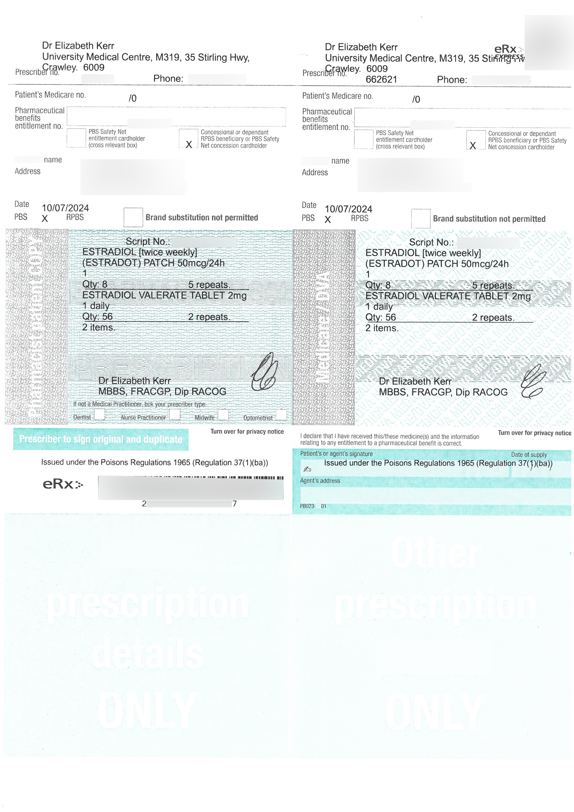
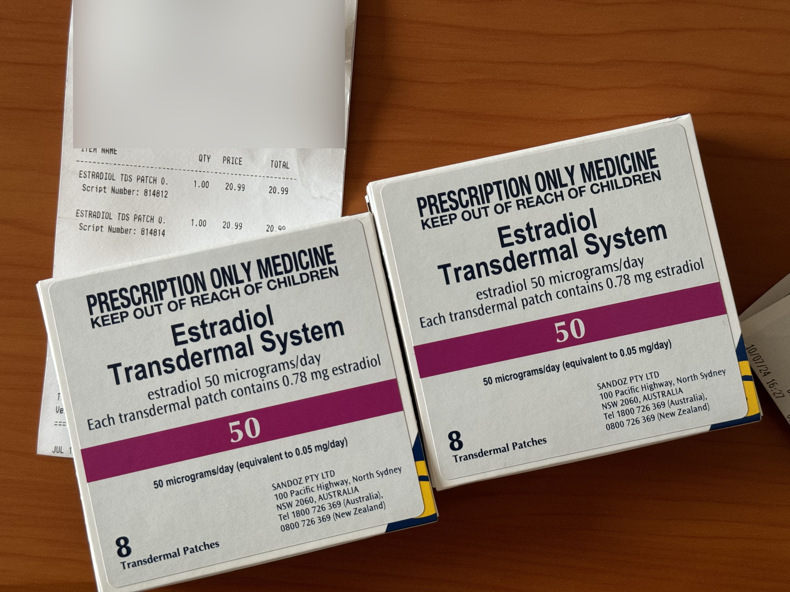

[**UWA Health and Medical Services**](https://www.uwa.edu.au/students/support-services/medical-centre)

## 流程

初抵澳洲记得激活你的[**OSHC**](https://www.studyaustralia.gov.au/en/plan-your-move/overseas-student-health-cover-oshc)学生保险**本校建议直接跟随offer缴纳学校推荐的Comprehensive MediBank OSHC**，填好你住宿的地址，等待邮件寄到。通常需要10天的时间，所以请确保你的租房地址稳定。  

初抵学校先申领学生卡，使用Capture Me系统上传你的大头照，等待两个工作日即可前往学生中心领取。领取学生卡后不要忘记前往Guild 学生中心贴上贴纸，这样可以在学校的咖啡店获取10%折扣。  

学生卡也可以在Guild中心购买或者转换你的Smart Rider公交卡成为学生公交卡，这样坐车可以打折，结合Autoload可以实现大约47折坐公交的效果。  

---

等待收到OSHC卡以后,就可以前往学校的医疗中心预约GP啦，本校的医疗中心GP可以直接开处方，并且是5次有效，每次很多剂量的。所以基本上不用担心。第一次问诊会询问一些既往病史、家族病史、过敏之类的问题。  

不确定没有证明能不能开药，但是从题主的经历来看，什么都没有提供的情况下，没有做检查，仅聊天直接给我开具了5次循环每次两个月剂量的处方。术后娘

第一次前往本校的医疗中心，如果你小于26岁，可以免费当场立刻注射一针九价HPV疫苗。询问医生开具处方，然后在隔壁护士站即刻注射，不论性别。  

本校医疗中心LGBTQIA友好，且彩虹旗贴纸贴在门口。  

## 医生

### Dr Elizabeth Kerr

是题主这次预约的GP医生，出乎意料的是，她佩戴一个彩虹胸牌，是LGBTQIA的彩虹。而且可以直接开具处方，不需要再预约Specialist来开具处方，省钱且省时间。因为学校的医生是和Medibank合作的，可以Direct Billiing，所以此次看诊没有花费。  

在寒暄以及询问病史、过敏、家族病史后，医生非常友善的关心了我在澳大利亚如何复健，选择什么样的润滑剂，以及提出建议我可以使用Vaginal Hyaluronic Acid当作通模的润滑剂。  

医生表示很少见到在上海做手术的跨性别，一般都是泰国，并且提到了大部分人没有长期保持复健的习惯，因为真的很无聊。但是题主坚持三年啦

总之Dr Elizabeth医生非常友善，在问诊结束后还顺便询问我有没有打过HPV，题主表示没有的情况下直接顺便给了一张处方，并且表示任何性别，低于26岁都可以免费接种一针。而且是在隔壁护士站立刻接种，不要钱。很赞！  

## 处方

医生开具的处方可以在澳大利亚的药店购买所需的药品，这里医生可以开局1mg/2mg的补佳乐类似物，50mg的雌二醇贴片以及凝胶。  

因为雌二醇贴片经常遇到短缺的情况，所以医生会很贴心的帮你多做一个备用的处方，这样可以在断货时期买到补佳乐类似物来进行治疗。  

注意，默认情况下开具的是补佳乐类似物，需要凝胶/贴片请主动和医生说。  

**处方样例：**

## 药房

在澳大利亚获取处方以后可以前往药房购买你的药品，但是需要凭借处方单原件。而且原件以及购买后的黄色单子需要保存好，这样才能重复购买。  

简单的带上你的处方单，前往药房询问有没有药品即可，有的话就能购买啦。  

## 费用

通常你的OSHC保险有一个免赔额，超过免赔额的费用是可以报销的。题主购买两盒的情况下，可以报销超过免赔额30以上的全部费用，年限额1000。这取决于你的保险公司以及项目类别不同有所不同。  

**开具的贴片:**

## 相关文档

[非正式的 药品说明](https://forum.limonnur.party/t/topic/14374)
