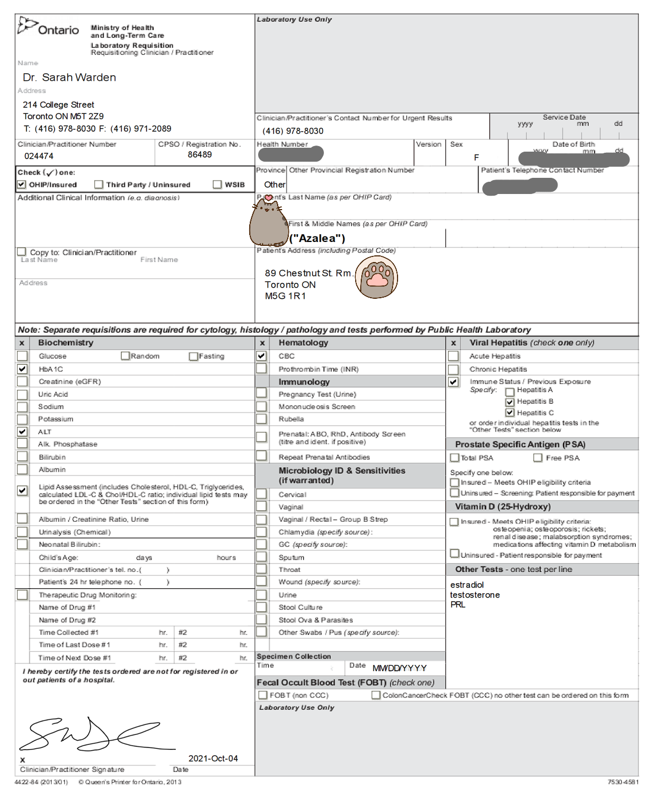
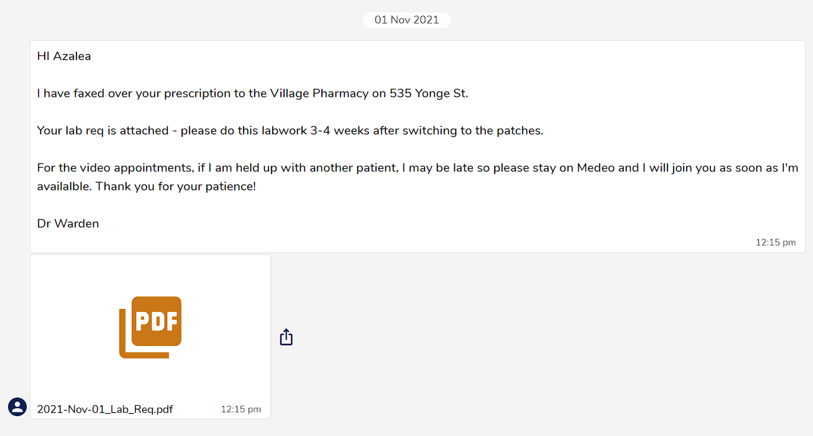
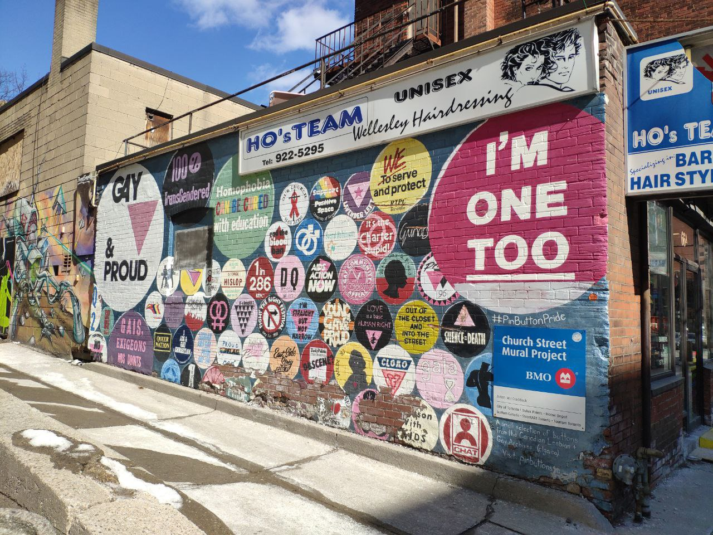
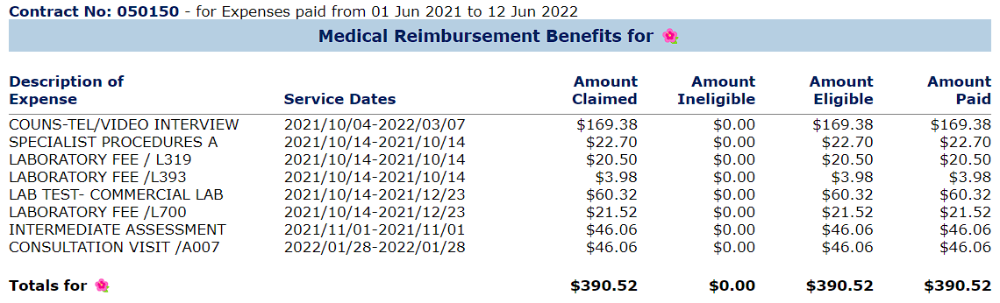

[**UofT LGBTOUT Home Page / Discord (English)**](https://lgbtout.sa.utoronto.ca/) \
**校医电话**: 

## 流程 {#workflow}

加拿大一般开始 HRT 的流程是先去 Walk-in clinic 找  / 家庭医生开  去看 ，但是因为多大校医有在跨性别 HRT 方面经历很充分的医生所以不需要这么麻烦，ta们自己就可以诊断并开出与之相关的药物。

刚来到多伦多首先要领 ，然后 [领保险卡]()，然后 [打电话给校医注册医疗信息][apply]，然后创建 Medeo 在线医疗账号（链接同上）。记得填一个常用的电话哦，如果是在线预约的话医生会打电话和你聊。

[apply]: https://studentlife.utoronto.ca/task/book-appointments-and-view-lab-results-online/

这些都注册完之后就可以在 Medeo 上预约电话问诊了。如果不想电话，想和医生视频的话就只能给校医前台打电话预约了。打电话预约需要等很久，但是其实我更喜欢视频，因为 Medeo 的视频系统比电话更能听清医生说话，而且可以露脸。 **一定要记得尽早预约哦！** 这个医生只有周一周三出诊，今年每次我预约都只能预约到半个月之后，所以一定要尽早。

取决于你在医生面前对于自己性别身份的肯定程度，医生可能会需要1~3次的问诊以及一次该医生开的检查才能下诊断以及后续的HRT药物。问诊的间隔时间通常在一个月左右。也就是说，假如说你是国际学生且来加拿大之前就已经开始服用HRT的药物了，你可以考虑在出发之前准备1~3个月你所服用的药物，不过如果你携带了处方药入境加拿大的话，那你就需要在入境时向加拿大边境保护局（CBSA, i.e.海关）申报自己所携带的药品。

## 医生 - Dr. Sarah Warden {#doctor}

[LinkedIn][linkedin] |  | [RateMDs][ratemds]

[linkedin]: https://ca.linkedin.com/in/sarah-warden-37801675/
[ratemds]: https://www.ratemds.com/doctor-ratings/4013764/Dr-Sarah-Warden-Toronto-ON.html

是非常好心的医生！问诊流程和别的地方都差不多啦，可以参考下美国那边的。我只记得第一次问诊的时候问了些跨性别相关的问题，不需要心理证明诊断也没有做 MMPI 之类的，具体问了什么记不清了，欢迎补充。然后第一次问诊开了一个... 对加拿大这边不能想抽血就抽血，必须要医生开请求，然后抽血结果也只会发到医生那边，然后医生再转发给你。下面的截图是我收到的抽血请求，医生勾的那些是要查的项目，需要打印然后带到附近的 LifeLabs 预约去抽血。第一次要空腹，之后的抽血只查 E2 和 T 就不需要空腹了。

（一定要选一个 Google Maps 上评价好一点的 LifeLabs，我推荐 208 Bloor St W。我第一次去的 14 College St 抽血疼死了，报告上性别还写了 M，明明医生提交的请求上写的都是 F (╯‵□′)╯︵┻━┻

抽完血大概一周后医生会发给你结果，然后第二次问诊与我讨论了这个结果，并问了我去哪个  取药最方便之类的。医生默认要给我开  和口服雌，我问了让医生换成  和 ，然后医生说了下注意事项就结束了。挂掉视频电话之后给我发消息说把处方传真过去了，最后我拿到的是  的色谱龙和 Estradot 100 贴片，你也可以选择  ，但是原研药与仿制药之间价格可能存在差异。消息里面同时给我发了一个月之后第二次抽血的请求单，上面只有 E2 和 T。

然后药店给我打了电话，过一天去取，然后就可以啦。取决于你的保险覆盖情况你可能需要自付一部分的药费（通常总价在$30以内）。第一次买药我因为怕遇到恐跨药店所以专门选了 ~~多伦多 LGBT 街~~ Church St 的 The Village Pharmacy。Church & Wellesley 两条街的交叉点周围又叫做 "The Village"，是一个到处都可以看到彩虹旗跨旗的地方。之后搬到离这里远一点的地方就换成 Rexall Pharmacy 啦，普普通通哪里都有的连锁药店，不过也没有遇到恐跨。你也可以选择让医生把处方发送至你觉得最最近的药房。

取决于药物当时宏观的供需情况，由药房收到处方到最终拿到药的时间在0~5工作日不等。

在服用药物之前请仔细核对药品名称，剂量，详细阅读说明书（如有）。如果包装上写的和医生所讲的用法用量由出入，请联系药房请求ta们与医生核对。

一个月之后第二次抽血之后就不用问诊啦，抽完之后过几个工作日医生会把结果发回来说一切正常什么的。然后每个月去  也不需要问诊，直接去药店带着 Photo ID 和信用卡去问就可以了。

如果 Dr. Sarah Warden 不在的话也可以约其他的友跨校医: Dr. Lowe, Dr. Zacharin, Dr. Krivy, 和 Dr. Genkin，欢迎补充。

## 费用/保险 {#register}

2024-2025 学年多伦多大学一学期的学费里需要交  UTSU Health Plan 和  可以退的 UTSU Dental Plan。如果你和我一样是留学生的话还要交  的 UHIP (University Health Insurance Plan)，用来不完全替代只有安省,或者持有工作许可且在安省全职工作的员工才能申请的 OHIP (Ontario Health Insurance Plan)。

UHIP 目前由 Cowan Group负责，来到加拿大之后记得注册一下 Cowan 的账号才能打印 UHIP 卡哦，去诊所去领药什么的把 UHIP 卡带上。[注册教程](https://internationalexperience.utoronto.ca/international-student-services/healthcare-coverage-and-u-of-t/university-health-insurance-plan-uhip/accessing-your-uhip-card-and-online-registration/)

### 保险内容 {#audit}

**OHIP / UHIP**: 跨性别相关的话，OHIP / UHIP 可以报销咨询医生的费用和检查抽血费用，UofT 的校医是半小时 。OHIP可以 [报销](https://www.ontario.ca/page/gender-confirming-surgery#section-0) SRS 的手术费用，但是需要在手术**之前**向安省卫生厅**以及**安省长期护理厅提出申请并得到这两个政府部门的批准。此段的链接也包含了获得批准的资格，以及申请途径。至于UHIP则需要向手术前向保险公司提出申请并得到了保险公司的批准。

UHIP 保险范围和 OHIP 比起来还是有限的。比如说：25 岁以下的持有OHIP的人，OHIP+ 可以报销  费用，但是 UHIP 只能报销住院的处方药费用。

值得注意的是，UHIP也包含每年一次的全身体检，你可以在到期之前把这个报销额度用掉。

另外，UHIP本质上来说是一款商业保险，是由私营公司负责的并有**逐利性**的。因为保险公司有利益相关并掌握了批不批准报销报销多少的权力，公司可以从拒绝报销中获利，所以说你可能会被不合理地拒绝出险。另外，UHIP的网站所介绍的保险覆盖范围可以说是比较模糊的，所以说对于不能  得自掏腰包再向保险公司报销的医疗服务，你可能需要和保险公司提前沟通好包不报销和报销多少这个问题。如果你认为保险公司不合理地拒绝了你的报销请求，通常保险公司内部有复核的机制，你可以联系保险公司请求复核，不过保险公司内部的复核机制因为还是利益相关（i.e.“都穿一条裤子的”）很可能会维持保险公司原来的决定，对此你可以通过尝试司法途径解决。（未完待续）

在 Sunlife 网站上可以看到所有报销的费用清单，下面的截图是我 2021-2022 学年的，总共报销了 ... ~~算下来好亏呀~~。(此内容已过时，保险公司换了）

**UTSU (UofT Only)**: UTSU是由Greenshield负责的，同样也是私营的商业险。作为补充保险，它可以报销 UHIP 不覆盖的处方药费用，最高只报销 80% 但是也非常足够了。我的处方是 12.5mg/d 色 + Estradot 100 贴片，每个月大概要花 。处方药保险每年报销限额是$5000，并且一款药品能的报销的金额被限定在相同仿制药的价格，不过通常原研药的厂商（可能是出于与仿制药竞争）会提供折扣，让最终你需要付的钱和仿制药差不多。折算折扣之类的是通常是药房处理的不需要你操作什么。

另外UTSU的保险也覆盖一部分的处方药之外的性别肯定医疗，一生除了处方药以外所有的性别肯定医疗加起来的报销额度最高 $5000，具体报销的项目可以在 [这里](https://www.studentcare.ca/RTEContent/Document/GAC/EN_Gender_Affirmation_Care_Eligible_Procedures.pdf) 查看。
