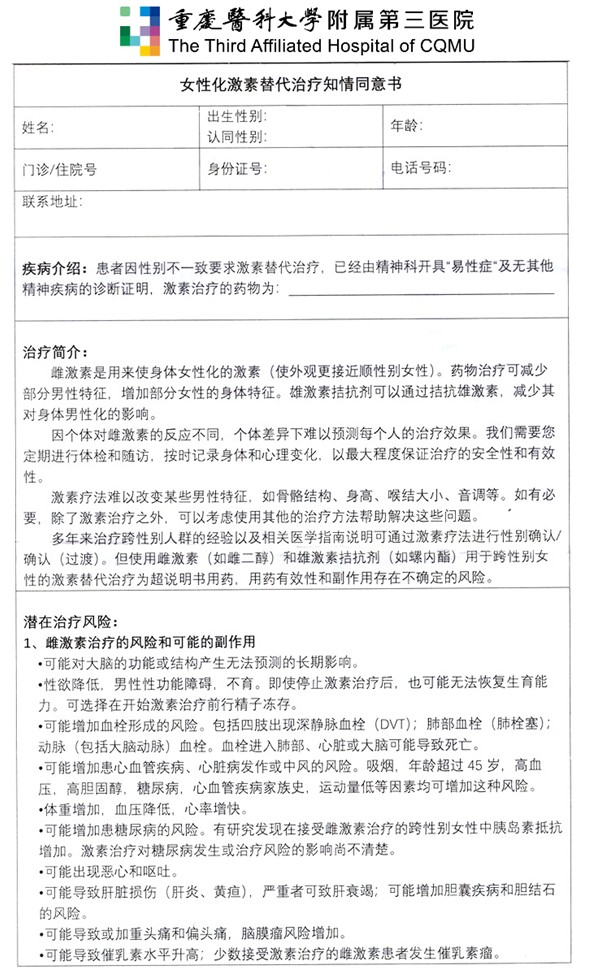
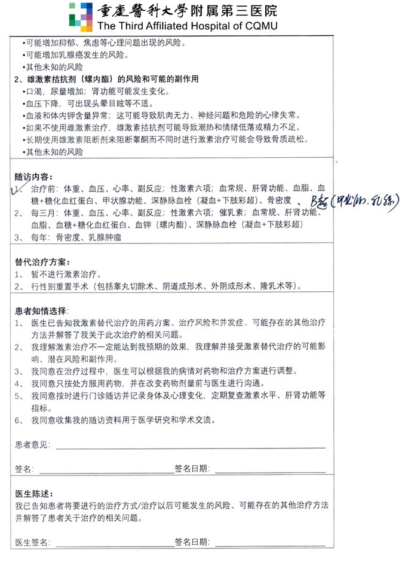


2025年4月中旬医生本人表示「本院没有处方资质，故已暂停开具处方」。  

根据本院临床心理科医生任正伽介绍，重庆市目前已没有具有相关资质的医疗机构，其建议前往北京开具 HRT 处方。


医生姓名：段炼

所在医院：[重庆医科大学附属第三医院](https://amap.com/place/B0FFGPSPQC)

## 出诊时刻

```csv
周次,时间
星期三,全天
```

## 挂号

医院微信公众号挂号

## 注意事项

1. 目前首次开方需要易性症诊断证明材料，在父母明确支持的情况下提供本院易性症相关病历可能也可以
1. 未成年人需监护人签字，成年人自己签字
1. 用药建议比较宽松，会兼顾考虑安全性和药效
1. 要求的监测和复诊比较频繁，3个月一次大体检，一次只能开三盒补佳乐or一支凝胶
1. 药房有补佳乐、爱斯妥、螺内酯。环丙孕酮会协助开具互联网处方购药






## 病历样式



