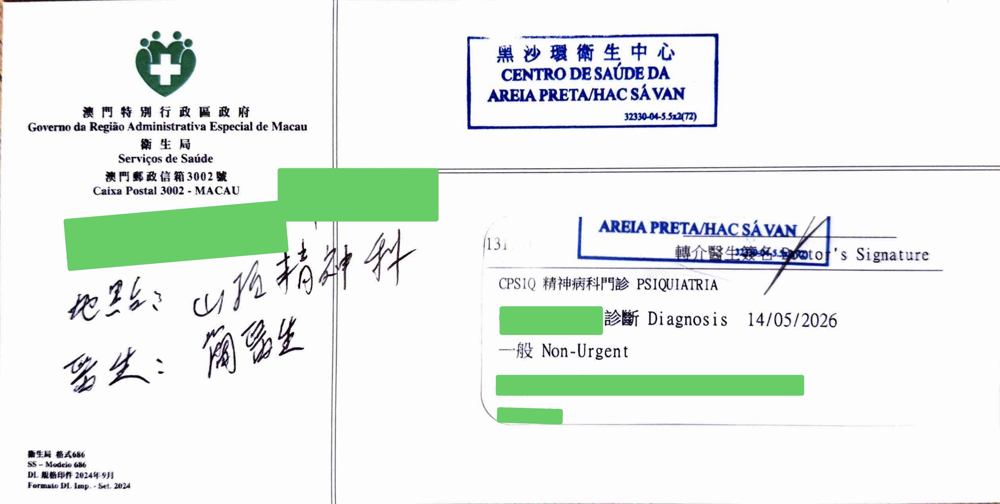
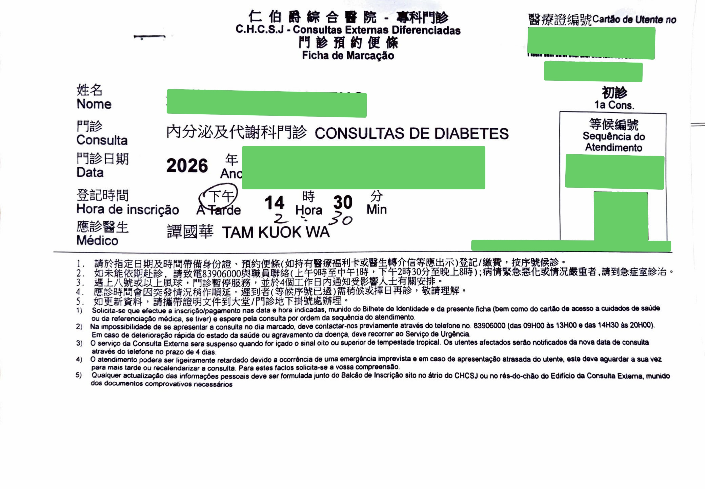
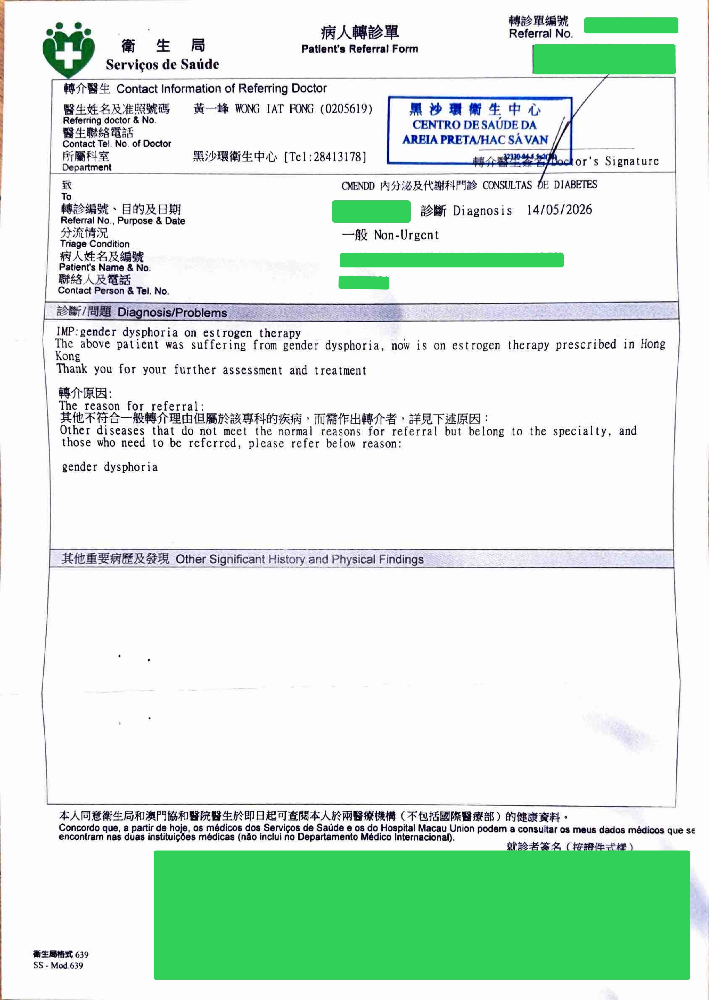

## 流程

已持有性别焦虑/易性症相关诊断时，可先到卫生中心 Walk-in，请医生开转介至仁柏爵综合医院（CHCSJ）相关內分泌门诊；再到卫生中心挂号处，由护士协助预约 CHCSJ 门诊，拿到预约单（含时间、地点）。

如果尚未持有相关诊断，在卫生中心 Walk-in即可，请医生开精神科转介信，在卫生中心挂号处预约精神科门诊；在精神科完成评估并取得相关诊断后，精神科可直接转介至内分泌相关门诊，然后按流程到挂号处预约。精神科等待时间通常较长（约三至四个月），内分泌相关门诊预约相对更快（约一周）。

## 示例

