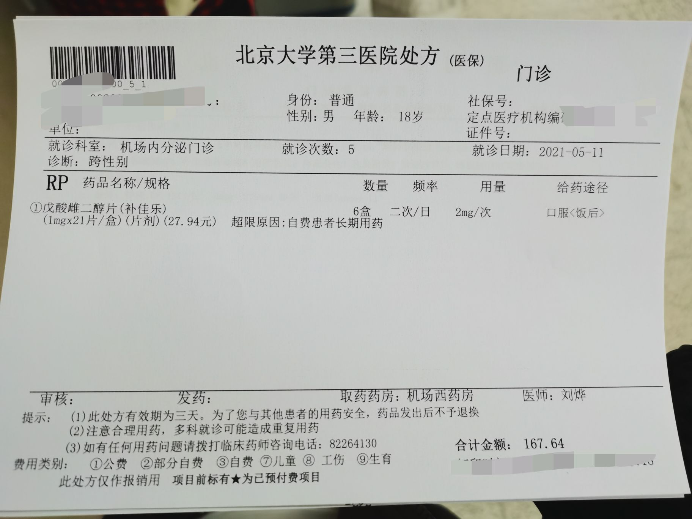

# 刘烨 {#liu-ye}

  

医生姓名：刘烨
所在医院：[北京大学第三医院](https://amap.com/place/B000A7CGSS)

## 挂号

目前刘烨在三院本区，每周出诊时间不稳定，可以在周日询问微信获得一周的出诊时间，也可以在好医生上面通过潘柏林去挂刘烨的号

## 青春期阻断剂相关事宜

要求有假条，年龄 16 岁以下，需要父母之一签字，花费约每月 2~3k，初次 HRT 会要求住院，并在儿科检查骨龄等有关项目。

## 问诊细节

位于三层一诊区，到后先去刘烨诊室，说明来意并盖章，之后在分诊台告诉护士要找刘烨（重要），然后刷预约时得到的码，排队

刘烨到得挺早的

带假条、检查结果去询问激素治疗有关事宜，可掉落补佳乐或爱斯妥凝胶、螺内酯(可选)或华典醋酸环丙孕酮(自行购买)处方一份。医生会推荐维生素 D，加在病历中但是不提供处方。

## 注意事项

记得带易性症病历！记得空腹！

因存在医保拒付的先例，刘烨等内分泌科医生有几率因⌈易性症医保无法报销⌋为由将检查项目开为自费项目，请特别注意。有部分内分泌科医生因此会选择在检查单上使用⌈体检⌋作为临床诊断导致无法正常通过医保进行报销。

这里是北京跨性别一条龙服务的第二站，预计用 2~3 周时间、花费 1500~2000 元，做全面检查(姐姐可不拍照)，获得巨量检查报告一套，之后复诊即可获得处方和药物。

## 处方与用药建议

- [爱斯妥]()（80g）

## 出诊时刻表

无法确定
