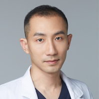

# 潘<ruby>柏<rt>bǎi</rt></ruby>林

 

医生姓名：潘柏林

所在医院：[北京大学第三医院](https://amap.com/place/B000A7CGSS)

## 挂号

微信公众号「北医三院服务号」-「导诊」-「预约挂号」-「外科」-「成型科门诊」-「周二」-「门诊号」（易性症综合治疗门诊）
周六上午 7:00 准时放号，只需反复切换日期
号较充足，一次 15 个左右，先抢先诊
挂号费 60 元

> 首次在公众号上挂号需要填写一堆信息，可以提前点一个别的挂号填写到确认前的一步。

## 问诊细节

位于门诊楼北侧医疗美容中心，到后在分诊台刷预约时得到的码，排队
潘柏林大约 9:00 ~ 9:30 才会来（好晚啊）
潘柏林处开具的检查单可正常走医保，目前尚未收到医保拒付的先例。
身后两个助手都挺认真的
带假条去询问激素治疗有关事宜，潘柏林会开出一系列检查单，抽血 8 张，超声 1 张，骨密度 1 张，总共约 1500 元
此时可趁机请求做染色体，500 元
之后会填写一个调查性问卷（助手超贴心！）
抽血去三楼抽血处做，一次性抽 8 管，速度很快，2 分钟之内即可解决
骨密度回二楼二诊区分诊台预约
超声去四楼超声诊断科预约
染色体去院外西侧 400 米处的生殖中心预约
抽血结果下午即可出
其实裸照可以不用去拍（逃
在有了检测报告第二次去的时候潘柏林会问你父母的意见如何，然后会让你现场打电话确认。潘医生会劝家长。

## 注意事项

记得带易性症病历！记得空腹！
抽血时请不要拍照哦
生化结果 CO2 偏低是空腹太久了，属正常现象
这里是北京跨性别一条龙服务的第二站，预计用 2~3 周时间、花费 1500~2000 元，<ruby>做<rt> pāi </rt>全<rt> quán </rt>面<rt> shēn </rt>检<rt> luǒ </rt>查<rt> zhào </rt></ruby>~~（去114房间找年大夫）~~，获得巨量检查报告一套，之后复诊即可获得处方和药物。


拍照是外科检查的一种，是潘柏林医生为了获取跨性别者对于激素药物的反应而进行的定性数据的获取，并放入病例中进行留档，并进行临床研究，类似于拍X光片或是做CT。

所有在整形外科接受整形治疗的患者基本都要进行拍照，其原因主要也是为了放入患者的整形病例中留档并进行临床研究。

在进行拍照之前，潘医生会通过书面形式告知，获取的照片会通过保密的形式用于临床研究。

如不愿意被拍照，可直接去找刘烨医生。


## 检测项目

## 出诊时刻表


周次,时间,科室,价格
周二,上午,外科（易性症综合治疗门诊）,60 元
周四,上午,美容中心,60 元

