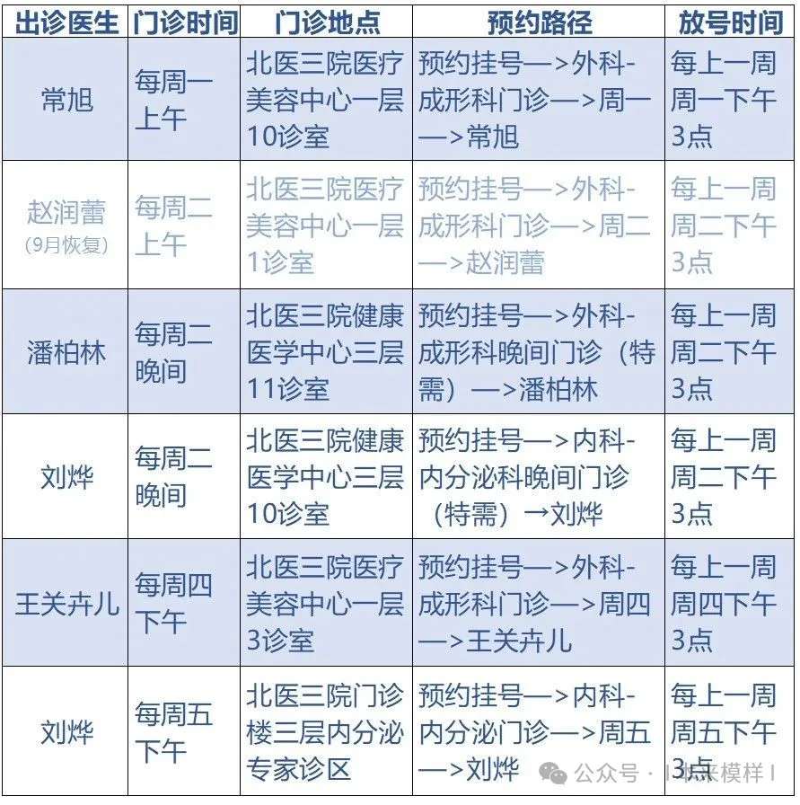
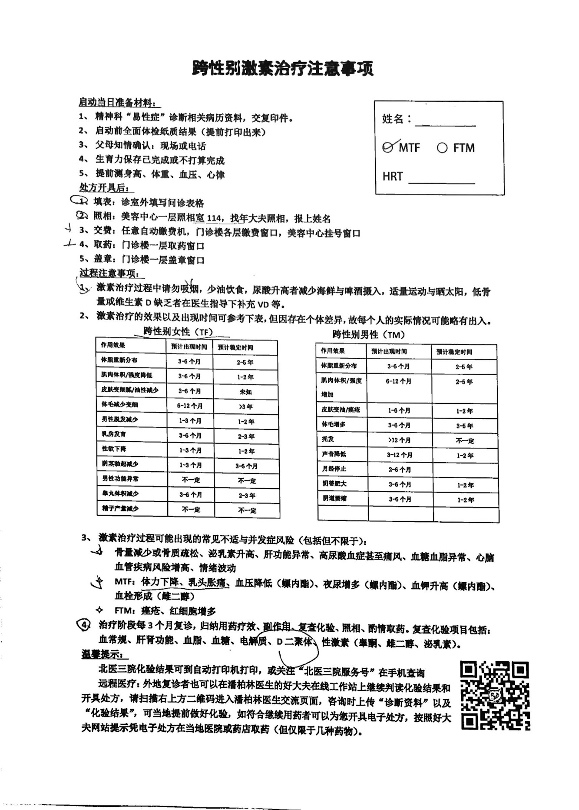

## 概况

[北京大学第三医院](https://www.puh3.net.cn)（Peking University Third Hospital，PUTH）是集医疗、教学、科研、预防保健、康复与健康管理为一体的综合性三甲医院。北京大学第三医院部分医生一直致力于跨性别医疗事业的发展，创建了一支跨性别序列医疗团队，并设置了跨性别专科门诊。具体而言，如果符合要求，可以在北京大学第三医院获得易性症诊断及进行 HRT，这包括了定期检查、获得用药建议及购买部分药物。北京大学第三医院也可进行性别重置手术。



北医三院跨性别序列医疗团队微信公众号：[| 本来模样 |](weixin://a14chuang)

### 地理位置及交通

北京大学第三医院设有多个院区。

- 北京大学第三医院（主院区）：位于[北京市海淀区花园北路 49 号](https://amap.com/place/B000A7CGSS)，刘烨、潘柏林等医生通常在此出诊。
- 生殖医学中心：位于[北京市海淀区学院路甲 38 号](https://amap.com/place/B000A85I42)，主院区旁边。如果要检测染色体需要在这里领取结果。

### 预约挂号 {#register}


诊室与排班信息可能经常变动，请以挂号时信息为准。





参阅 [北医三院易性症门诊时间调整](https://mp.weixin.qq.com/s/HeTO4XQEAiUjmoZDCfQBSA)。


- 潘柏林：易性症综合咨询、面部女性化改善、喉结缩小手术、性别肯定主体手术、启动激素治疗、激素治疗复诊
- 刘烨：易性症综合咨询、启动激素治疗、激素治疗复诊、青春期阻滞剂治疗、激素治疗精细化调药
- 赵润蕾：平胸手术、缩胸手术、丰臀手术、丰胯（丰髋）手术、吸脂体雕、隆胸手术、性别肯定主体手术、启动激素治疗、激素治疗复诊
- 常旭：性别肯定主体手术、性发育异常、上眼皮和眼袋手术、面部女性化改善、射频注射类项目、启动激素治疗、激素治疗复诊
- 王关卉儿：激光脱毛、射频、注射类项目、面部女性化改善，目前不接诊激素治疗方面的咨询



跨性别相关内容如跨性别初诊咨询、启动内分泌治疗、激素治疗复诊、性别重置主体手术咨询等服务，均需挂“易性症门诊”或相关特需门诊就诊，其他门诊时段不接诊上述医疗咨询和复诊。



目前团队共有五位医生开设易性症门诊。且因目前就诊量大，为保证每位来诊者的就医质量，均需预约挂号。无特殊情况，不予现场加号。

潘柏林医生、常旭医生的其他门诊时间，仅接诊美容整形的来诊者，其中可包括跨性别整形手术（非性别重置主体手术）的咨询。

线上预约挂号可通过北医三院 APP，「[北医三院服务号](weixin://bysy_001)」微信公众号及[北京市预约挂号统一平台](https://www.114yygh.com)挂号。其中前二者号源共享，同有同无；最后一种方式的号源独立。

北医三院 APP

```qrcode
https://a.app.qq.com/o/simple.jsp?pkgname=com.founder.bysypatientapp
```

微信公众号：[北医三院服务号](weixin://bysy_001)

北医三院现已可预约接下来七天的号源。具体而言，对于前两种方式，每天 15:00 可以开始预约其后七天的号源[^1]；对于第三种方式，每天中午 12 点可以开始预约其后七天的号源。

- 若通过北医三院 APP 或北医三院服务号挂号，则应逐级选择对应科室，找到所需的医生或「门诊号」[^2]，然后选择具体号源预约。在 APP 预约时需要精确选择挂第几号，这就是就诊时的排序号。预约时支付挂号费。
- 若通过北京市预约挂号统一平台挂号，则应访问 <https://www.114yygh.com> 或关注微信公众号「[北京 114 预约挂号](weixin://beijing114guahao)」，然后选择北京大学第三医院进行挂号。挂号方式与前两种类似。预约时不可选择精确时段，只能选择上午或下午。取号时支付挂号费。

线下预约挂号可使用医院内的自助机或到人工窗口，其号源与北医三院 APP、北医三院服务号共享，同有同无。



因近期北医三院整体预约挂号系统调整，16岁以下的来诊者首诊时需使用家长身份证注册ID号、使用家长姓名预约挂号，其他情况预约挂号方式不变。参阅 [通知](https://mp.weixin.qq.com/s/xvoG9DQ6HWRsYVuRcJyTMg)



### 取号就诊

- 采用前两种方式挂号的**非医保**用户，原则上不必领取挂号单，可凭电子就诊卡（二维码）直接到对应诊区报到/登记[^3]
- 其他情况需要先到自助机或人工窗口缴费取号，然后到对应诊区报到/登记

切记请勿忘记报到/登记[^4]，否则不会叫号。

对于预约挂号，上午号需在 11:30 前取号，下午号需在 16:30 前取号。

由于医疗美容楼的开门时间是8:00-17:00，如果到达时间早于早上八点，美容楼大门**可能**还是上锁状态，所以请勿担心，非意外的情况下找个休息的地方~~比如门诊楼进门左手旁的椅子~~等到8:00再过去就好了

### 缴费

自助机可以提供大部分服务，如需现金支付需在人工窗口进行。人工窗口可提供收费票据和收费明细。北医三院所开具检查项目在检查之前可申请退款。

### 检查

- 门诊血液检查通常在门诊楼三楼进行采血。医生开具的「门诊引导单」上有所有的项目，可在采血费项中得知一共需要采多少管血。需要在缴费后60天内采血（其他具体请见「门诊引导单」左下角提示）。
- 骨密度检查在二层外科二诊区分诊台预约（仅能预约至工作日进行检查，请做好安排）。
- 超声检查在四楼超声诊断科/自助机预约。
- 染色体检查现随血液检查一同抽血。

### 取检验结果

- 常规检验结果可以在自助机上打印，也可以在北医三院 APP 和北医三院服务号上查询。如果想永久保存建议取实体检验报告。医院的医生在接诊时可以用电脑查到过往的检验结果。
- 特殊检验检查结果（如染色体等）可能有专门的领取方式，在检查时医生会告知。目前染色体在北京大学第三医院生殖医学中心三楼人工窗口取。这些结果医生往往无法在电脑上查询到，需要在就诊时携带。

## HRT

本节描述的是如何在北医三院医生的帮助下得到专业的剂量、控制不良反应评估等服务，同时获得 HRT 治疗方案和 SRS 所需要的病历。自行用药后依然可以向医生求助，这不会对后续诊疗受到影响。北医三院可开出的药物见下文。

更多信息可添加助理微信（微信号：PBLzl09）或在好大夫平台咨询。

### 基本要求


启动 HRT 需要父母知情，且不反对用药。

- 16岁及以下，不能启动激素治疗，可以考虑使用青春期阻滞剂缓解性别焦虑；
- 16~18岁，启动激素治疗时，需至少父母一方陪同门诊并现场签字；
- 18岁及以上，建议至少家长一方陪同门诊，如果无法陪同，也强烈建议取得家长认同后再来门诊。~~如果与家长实在意见相左，原则上尊重就诊者本人意愿。~~


年满 16 周岁有监护人伴诊知情同意，或年满 18 周岁与家长电话沟通确认不反对，可开展激素治疗或青春期阻断治疗，青春期阻断治疗详见[刘烨]()。

进行 HRT 之前需要有三级医院精神科或心理科就诊病历，记录“易性症/性别焦虑/性别不认同/性别认知障碍”等诊断。没有有关证明或许可以开有关检查但是 HRT 会被打回。获取病历或证明的方法详见 [心理科／精神科]()。

### 医生选择

不同医生的 HRT 策略会有差异。目前在本页面下的几个医生处均可以走完全流程，中途换医生也可以，但是医生熟悉了会对你身体状况有更好了解，体验会好很多。

青春期阻断剂只有刘烨处可以开！


如果 PTH 组合中「全段甲状旁腺素」指标偏高，潘柏林处无法开具处方，反而会开具一些不必要的检查，请直接去找刘烨！

不过现在因为刘烨特需门诊出诊时间移至周二晚，所以如果周二晚前往就诊遇到内分泌相关问题可能可以得到“会诊”待遇。


### 就诊过程

#### 第一次就诊（进行身体检查）

如果携带了「易性症」诊断的病历或证明，则医生会开具检查。（如果已经在在 3 个月内进行过其中部分检查，可以告知医生，以免重复进行；如果已经进行过全部检查，则可以直接将这次就诊视为「第二次就诊」，即制定 HRT 方案。）通过这些检查医生会确定你的身体情况是否适合进行 HRT，并且会帮助监测一些副作用。（大部分人会有骨量减少，需要补充维生素 D．）涉及的检查包括：

- 血常规
- 凝血七项（含 D-Dimer，雌激素副作用）
- 血生化（含转氨酶、胆红素、肌酐、尿酸、钙磷、钾钠氯、血糖、血脂）
- 糖化血红蛋白
- 甲功三项（FT3、FT4、TSH）
- 甲状旁腺素
- 2,5-羟维生素 D
- 空腹胰岛素
- 性激素六项
- 腹部超声（肝、胆、胰）
- 乳腺超声（发育前基线检查）
- 骨密度（基线检查）（双能X线法或超声、检查部位是腰椎和髋关节）
- 染色体检查（可选）
- 妇科超声（FtM）

总花费介于 1000 - 2000 之间。

采血前须空腹。血液检查很快提供报告，结果最晚次日可取。


生化结果 CO<sub>2</sub> 偏低是空腹太久了，属正常现象


根据医院接诊情况，以上检查来得早的话超声可以预约到当天甚至早上，结果当/次日可取，或者因为排队很长预约到另一天。骨密度可能可以当天约上，也可能排队很长通常会约在另一天，但是检查之后结果立等可取。


目前北医三院超声检查排期较长（可能需要等待3个工作日以上），如果急需检查结果（特别是外地且未提前进行检查的人士），可联系原为你开具检查申请的医生为你更改为国合/特需超声检查（平均每个检查费用会高出350元以上，但基本可以签到后当即完成检查）。


染色体检查需要整整 30 天才能出结果；第三方检查结果也是是有效的，价格接近，但时间能缩短到大约 15 天并且可以提前做。

骨密度与乳腺超声是开具处方的必要条件，如因个人原因导致无法在预约时间前往，可拨打分诊台电话  申请更改时间。

北医三院承认外院检查结果。上述化验检查若在当地完善，建议在具有一定规模的三甲医院完成，一般内分泌科的医生会熟悉上述检查~~甚至知道你做这些是为了HRT~~，可请其照单开具。同样的，也可以找北医三院任何院区的任何内分泌科医生请其照单开具（本部和北方院区皆可，后者在当天也容易挂到号且也可开本部检查单）。

注：北医三院本部的性激素六项检查在系统中是分开的，直接搜索“性激素六项”只能搜索到北方院区的检查项目，遇到对此不太熟悉的医生还请提醒注意（同时，没有“标注北方院区的检查项目可以在本部抽血然后在北方院区进行化验”这一说法，本部会拒绝进行该项目的化验）。

**注意：分诊台较为繁忙，请务必保持耐心联系时不要急躁，不然有几率以无法更改为由拒绝。**

#### 第二次就诊（制定 HRT 方案）

应当在所有检查结果产生后前去就诊。启动当日所需材料如下图所示，这张清单在第一次就诊时医生会给出。

**第二次就诊请务必携带「易性症」或其他类似诊断的病历或诊断证明。**





其中血压、心率会当场测量，无需特别准备，候诊时或者接诊后，对应的助理会带领测量，若明显偏离异常值将可能影响 HRT 处方的开具。若在医院等场合易因情绪紧张~~或快要迟到了跑过来的~~等心率血压异常，可向助理出示可穿戴科技设备（手环、手表等）记录的近期数据，和或近期数次自行测量血压的记录代替。

医生可能会询问你自己对雌激素药物（补佳乐或爱斯妥）和抗雄激素药物（螺内酯或醋酸环丙孕酮）的倾向。可以根据自己的意愿和医生的建议选择药物。北医三院没有的药物，可在好大夫平台上获取电子处方并购买药物（详情见下文 线上问诊）。

医生可能会询问是否生育力保存。

#### 复诊（调整 HRT 方案或继续购买药物）

开始 HRT 之后要求每三个月复查一次，以继续开具药物。要求的检查项目包括：肝肾功能、血脂、血糖、电解质（以上项目可以直接和医生说检查生化组合）、性激素（睾酮、雌二醇、泌乳素，这三项为必查的三项，查六项也没关系），视情况可能会有其他检查项目。

线下复诊开药时记得在取号或签到前在护士站旁测量血压，并拍照记录测量结果~~当然你记忆力足够好也可以不用拍~~，同时建议自行测量近期体重，这些医生会在写病历时询问到。同时也会被要求填写抑郁、焦虑量表（题目不多，各10道题左右）以及对于个人身体满意度的评分（李克特量表1-10计分，内容包括但不限于毛发、面部、身材等）。

也可通过线上问诊方式上传三个月内的复查结果并开具后续药物。

### 时间安排


外地人士可在当地做完相关检查后，携带检查报告和带有「性别焦虑」或者「性别认知障碍」等字样（你觉得它是它就是）的诊断病历（不一定是邸奶奶或者丛大爷的）直接前往北医三院开处方，可以节省时间与经费支出，使用当地医保，检查有效期三个月。

之后的每三个月复查，在本地完成后可通过线上问诊方式上传复查结果并开具后续药物。


如果计划在北京进行身体检查，但时间有限，希望尽量减少在北京停留的时间，可以参考以下时间安排：

1. 约在诊前两周进行染色体检查（可选）。
2. 初诊时，按预约时间前往医院，领取检查单后缴费，首先进行血液检查。
3. 完成血液检查后，预约乳腺超声和骨密度检查。如当日预约已满，可预约复诊当天的号。
4. 按照预约时间进行骨密度和乳腺检查，并现场领取检查结果。
5. 复诊时，携带「易性症」病历，前往任一医生处复查，如无问题，可当天获得处方及药物。


若医生出诊时间为上午，且打算与检查同一天做，建议控制预约检查的序号不大于 15 号，否则检查时间容易超时


## 线上问诊

### 线上问诊团队成员

目前北医三院线上问诊团队包含了北医三院跨性别医疗团队的主要成员，参与人员为：

```csv
医师,科室
**潘柏林**,成形外科（整形外科）
**刘烨**,内分泌科
张坤,妇科
杜姗姗,整形外科
常旭,成型外科（整形外科）
韩萌,医学心理系
杨文慧,成型科
```

### 问诊方法

目前，北医三院跨性别医疗团队支持通过[好大夫在线](https://www.haodf.com/doctor/2168666201/xinxi-tuandui/7362239193.html)平台进行在线问诊，方式同时支持图文问诊与简短咨询方式，为方便流畅的沟通和检查相关资料得发送，建议使用图文问诊方式。

线上问诊**不能代替面诊**，问诊中/医生回复/仅供参考

如需线上问诊，可通过好大夫在线微信小程序或官网进入潘柏林医生主页，选择**多学科会诊**按钮（200元/次的那个）。


请注意，目前直接向潘柏林申请服务是不支持咨询跨性别相关问题的，将会提示分诊审核不通过。


预计接诊时间为 13 小时左右，实际使用下来较显示时间快。2 日内可以多次交流，期间主要为刘烨与潘柏林交叉问诊。

线上问诊无法开具 HRT 处方，但是可以通过化验结果提供具体的 HRT 用药建议。

在**第一次线下问诊**之后，接下来可以通过线上问诊的方式获取后续建议和开具药物。

### 临床招募

[【临床招募】北医三院性别肯定激素治疗新启动者随访对象](https://mp.weixin.qq.com/s/rwqSyldRDWmDw24qmb0dTA)

本项目招募计划启动性别肯定激素治疗的跨性别男性和女性，按照常规激素治疗的复诊频率随访1年，评估激素治疗对中国跨性别者的生理、心理和认知功能的效应。

本项目已通过北医三院伦理委员会批准。

#### 入组条件

1. 已就诊精神心理科，诊断易性症、性别认同障碍、性别焦虑或性别烦躁;有性别肯定激素治疗的诉求；
1. 满18周岁且≤ 40岁，具备完全民事行为能力；
1. 从未使用过相关药物;或既往连续使用< 30天，且近三个月未使用；
1. 重要亲属 (如父母、在婚配偶) 知情理解您进行性别确认激素治疗的诉求；
1. 能够在医生指导下规律用药，不自行改变方案；
1. 能够每3个月来我院复诊 (具体来诊可根据您的时间微调)；
1. 1年内无计划进行子宫、卵巢、乳房、阴茎、睾丸的性别重置手术；
1. 无自然生育诉求或已完成生育力保存；
1. 近2周未服用精神类药物；
1. 未患有严重的慢性胃肠道、肝胆胰腺疾病。

#### 正式参与后您将获得

1. 规范的性别肯定激素治疗医疗指导；
1. 满足条件正式入组后，常规复诊所需的血液化验、心理和认知功能评估的费用均免除；
1. 一对一复诊预约的绿色通道。

#### 联系我们

1. 邮箱: <transhormone@126.com>
2. 电话:  (工作日8:30-16:30)
3.
    - 北医三院易性症激素门诊: 内分泌科，周四下午(本部门诊楼3层内科2诊区)
    - 北医三院易性症综合门诊: 成形外科，周一/二上午(本部医疗美容中心1层)
    - 晚间特需门诊: 内分泌科/成形外科，周二6~7pm(健康医学中心楼7层)

[^1]: 也可以于每天早晨 7 点开始约当天的号源。
[^2]: APP 和服务号的科室索引结构不完全相同。
[^3]: 刘烨在内分泌科普通号出诊时，需要先由刘烨在挂号单上盖章方可在分诊台指定分归刘烨医生接诊，因此仍然需要取挂号单。不过她已经有专门的挂号选项啦。
[^4]: 就是扫下挂号小票上的条形码
