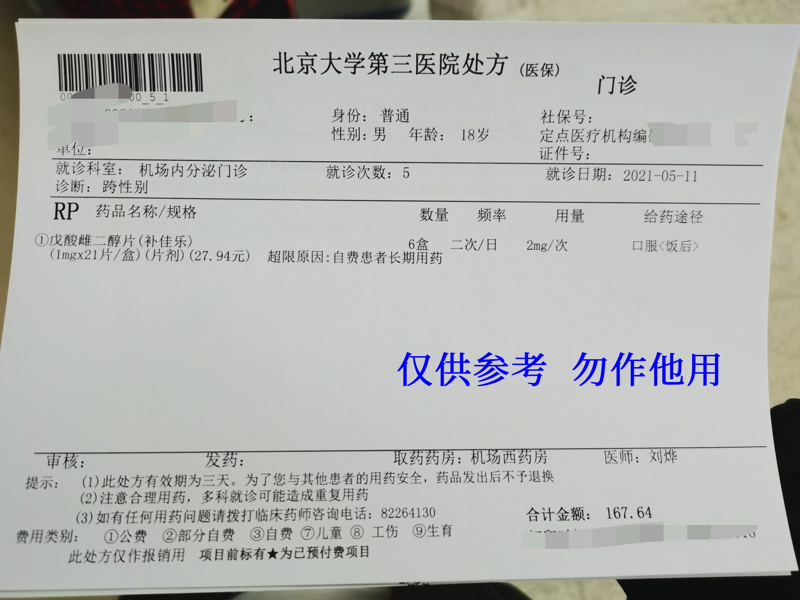

## 刘烨



  

医生姓名：[刘烨](https://www.haodf.com/doctor/2168666201.html)
所在医院：[北京大学第三医院]()

## 挂号

刘烨医生的出诊时间为

```csv
周次,时间,科室,价格
周三,下午,内分泌门诊（易性症激素治疗门诊）,60 元
```

如何挂号详见 [北医三院：预约挂号]()。

## 青春期阻断剂相关事宜

要求符合易性症诊断，年龄 16 岁以下。需要父母之一签字，花费约每月 2000~3000．初次 HRT 会要求住院，并在儿科检查骨龄等有关项目。

## 问诊细节

前往三层一诊区刷码排队候诊。

医生可能会推荐维生素 D，写在病历中但是不提供处方。

## 注意事项

（初次和第二次就诊）记得带易性症病历！（如果想当天采血）记得空腹！

因存在医保拒付的先例，刘烨等内分泌科医生有几率因⌈易性症医保无法报销⌋为由将检查项目开为自费项目，请特别注意。有部分内分泌科医生因此会选择在检查单上使用⌈体检⌋作为临床诊断导致无法正常通过医保进行报销。

## 处方与用药建议




