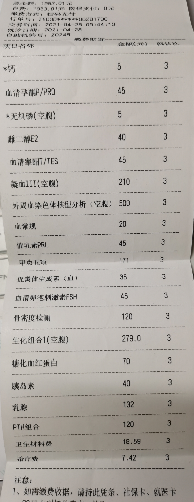

## 潘{}林



 

医生姓名：[潘柏林](https://www.haodf.com/doctor/227082.html)

所在医院：[北京大学第三医院]()

[潘柏林医生的个人空间 - 哔哩哔哩视频](https://space.bilibili.com/2085711307)


潘柏林会向跨儿本人及家长建议生育力保存，即精子冻存。




跨性别相关内容如跨性别初诊咨询、启动内分泌治疗、激素治疗复诊、性别重置主体手术咨询等服务，均需挂“易性症门诊”就诊，其他门诊时段不接诊上述医疗咨询和复诊。



如何挂号详见 [北医三院：预约挂号]()。

## 问诊细节

诊室位于健康医学楼七楼西侧（出电梯右拐），到后在分诊台刷码排队候诊。潘柏林大约 17:30 会来，他开具的检查单可正常走医保，目前尚未收到医保拒付的先例。会被要求填写一个调查性问卷。

在有了检测报告第二次去的时候潘柏林会问你父母的意见如何，然后会让你现场打电话确认。潘医生会劝家长。

潘医生专业为鼻唇整形，有 FFS 需要可以询问。

## 注意事项


拍裸照是外科检查的一种，是潘柏林医生为了获取跨性别者对于激素药物的反应而进行的定性数据的获取，并放入病历中进行留档，并进行临床研究，类似于拍 X 光片或是做 CT．

所有在整形外科接受整形治疗的患者基本都要进行拍照，其原因主要也是为了放入患者的整形病历中留档并进行临床研究。

在进行拍照之前，潘医生会通过书面形式告知。如有用于研究的需要，将会提前告知。

如不愿意被拍照，可直接去找 [刘烨]() 医生。


## 检测项目

## 处方

1. 北医三院药房目前并无醋酸环丙孕酮。如有需要可请医生在处方上手写加注，自行院外购买；或于好大夫在线[线上问诊]()并购买。
2. 北医三院药房有爱斯妥，目前可开出。
