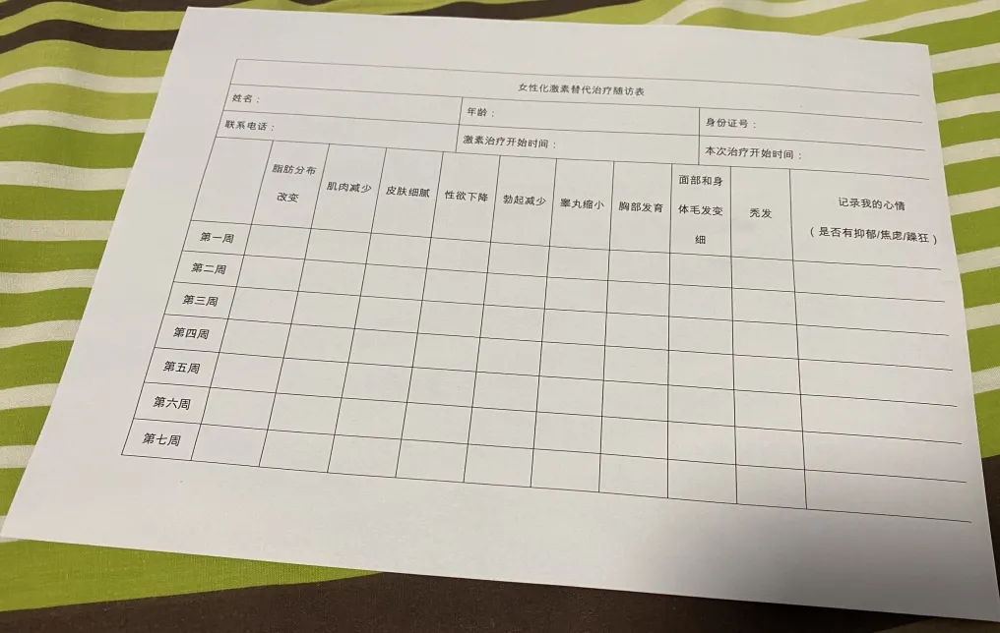

本文大部分内容基于 [上海跨儿说](https://mp.weixin.qq.com/s/YfwBpWsmKbHxjxzoVeD6mw) 和 [上海九院医务社工](https://mp.weixin.qq.com/s/wnvrYViJfsJSxzAlAM_mUw) 撰写。

（虽然这里是 上海九院，但是 上海六院 用男证可以挂妇科）

医生姓名：[程辰](https://www.haodf.com/doctor/3308881283.html)

所在医院：[上海第九人民医院（南部）- 新门诊楼](https://amap.com/place/B0FFHGMHTC)

出诊时刻：<https://www.haodf.com/doctor/scheduletips/3308881283.html>

## 挂号

1. 参考出诊时刻，可以直接挂整复外科周二下午的普通号。
1. 九院新增了整复外科跨性别专科，为整外周六上午。可以直接预约挂号(目前不确定坐诊医生是否为程医生，有待进一步确认)。





## 就诊

- 如非周六就诊，建议早点去、空腹去，这样血液检查可以和其他所有检查一起当天就做掉，不用多跑一次了。如果在别的医院有做过检查，建议都带上，这样可以节约不少开支。

就诊地点位于新门诊大楼，不是 10 号楼急诊。[AMap](https://surl.amap.com/lFB8mBri3X3) [Apple Map](https://maps.apple.com/?address=Quxi%20Road%20No.500,%20Huangpu,%20Shanghai%20China&auid=1118368604912837&ll=31.201690,121.487349&lsp=57879&q=Shanghai%20Ninth%20People's%20Hospital,%20Shanghai%20Jiaotong%20University%20School%20of%20Medicine%20South%20Hospital%20Out-patients%20Building&_ext=CjEKBAgEEAQKBAgFEAMKBAgGEAoKBAgbEAMKBAhSEAkKBAhVEA4KBAhZEAEKBQikARABEiQpTfaKM0sxP0AxBslBqWleXkA5xOs/pvA1P0BBPapbnfBfXkA%3D&t=r)

进入 1 楼大厅后，直接去挂号窗口/挂号机器排队挂号。如果你持有医保卡或仅有身份证，你需要在窗口/机器办一张就诊卡。

（可选）挂好号在窗口边上拿一本九院的病历本

然后直接上 9 楼整复外科，到程医生的诊室门口排队。

因为普通号的原因，可能你的号并不一定为程医生接诊，如果为其他医生，进诊室直接说明情况之后会让你去程医生那边接着等待，可以在其他人问诊完之后去程医生诊室询问。

（建议）携带“易性症”证明。未自行服药者可能需要出示证明后给予激素治疗的知情同意书。(目前，九院的 HRT 认可所有三甲医院给出的诊断证明。)





对于未自行服药者，回去后一定要仔细地看完这份文件，如果还是决定要开展 HRT 的话，下次复诊时需要签好字带过来。





开检查，把检查全部做完拿到报告之后再去复诊。

### 检查项目及地点（更新于 2021 年 11 月 18 日）

- 首次检查费用可能不超过 2000，检查费贵是因为首次就诊希望查得全面一点，后续的检查每 3 个月一次，每次 100 - 200 元。最贵的彩超如果没有问题的话可以一年做一次。如果经济有困难记得和九院医生说，可以酌情删减检查项。
- 不能刷医保卡是因为九院整形科整个科室都是自费，且“易性症”没有纳入医保。如果需要刷医保卡，可以告诉九院医生，九院医生在病历本上注明需要的检查，然后去挂普外科/内分泌等科室的号，或者去外院做检查。
- 九院默认的激素六项可能不是 wiki 所说的激素六项，请说明是性激素六项。
- 血液检查需要空腹。


以下项目可能不准确，仅供参考。
血液检查项目：CRP + 血常规、凝血、肝功能、电化学、乙肝三对半、性激素六项、HIV + TRUST
超声检查项目：乳腺及掖窝淋巴结、甲状腺、双下肢动脉、双下肢静脉
骨科项目：骨密度



周六没有超声检查、骨科检查。超声可能需要预约。

血液检查在 1 楼，需要空腹。直接拿着就诊卡去机器上取号，然后就等着叫号抽血。

抽血（9 管，数量不确定）所有结果出来需要 3 个工作日。

B 超（~~照奶子~~）当场有结果。

骨密度室在 3 楼 B 超的那一侧，不需要前往骨科问询，直接敲门即可。

## 复诊

需要事先告知“程辰”进行预约





报告都拿到手之后，就带着所有报告以及自己签字的知情同意书“三刷”程医生。

如果检查报告看完一切都没问题的话，程医生会问你对于那份知情同意书还有什么问题。记住，这个时候，一定要向他提一些问题，切记切记~



PS:2022年1月8号更新———现在九院已经愿意提高hrt处方上的补佳乐用量至2mg了（可能需要特别说明提高的意向才会开）（~~好耶比原来翻了一番~~）


约定 3 周后复诊，如果有突然的不适一定提前回去复诊。还有提供一张情况记录表。




