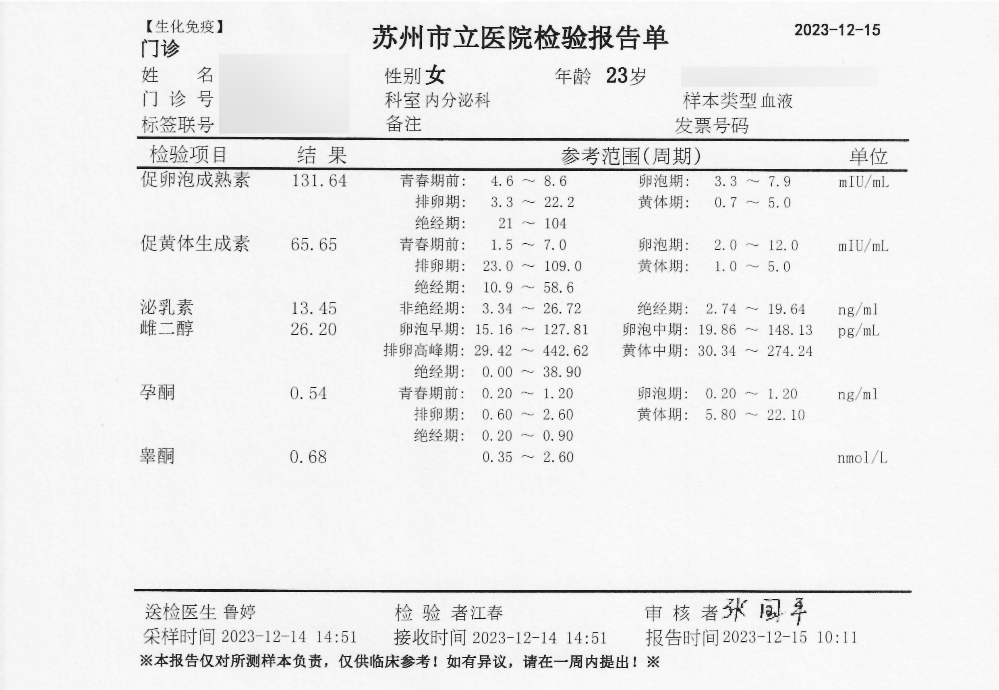

- **医院：** 苏州市立医院（北区）
- **科室：** 内分泌科 **普通门诊**
- **时间：** 周四、周五 2023年12月14、15日
- **医生：** 鲁婷、吴冕
- **药品：** 补佳乐、螺内酯

## 问诊细节

进门即自述病史，~~医生听到后主动去关门（好评）~~，然后再详细讲了一下性别不一致的诊断时间以及手术时间。要求医生姐姐帮忙开一个激素六项和两盒戊酸雌二醇（补佳乐）。**医生全过程友好**，还主动问我有没有其他需要开的药，~~甚至问了我的一些经历。~~

在填写病历的时候，**需要选择一些与之相关的症状**，给我选择的是性别发育异常。医生跟我说**放心，我们不会泄露你的数据**，打消了顾虑。

## 挂号

进入医院大厅在自助机器挂号，选择普通门诊，内分泌科。或者在苏周到、健康苏州掌上行 app、微信公众号「苏州卫生 12320」、支付宝「医疗健康-预约挂号」进行预约网上平台挂号。

## 就诊路线

大厅电梯上楼左转，看到一个比较大的护士台，挂号单给予护士录入系统后等待叫号。化验中心和缴费台也在二楼，可以很方便的一站式验血。

> 结合本人在2018年未手术期间以男性身份在市立医院北区开具补佳乐的经历，可以倾向于认为苏州市立医院（北区）的内分泌科普通科室长期能够开具药品、测试激素 以及性别不一致友善。

> 注：以男性身份开具戊酸雌二醇处方时本人使用了丛中的诊断病历，但不是证明。当时也选择的是普通门诊，医生同样非常友善，记忆犹新。~~忘了名字真对不起医生，记得也是个姐姐。~~

## 复诊更新

周五下午前往医院去报告后复诊咨询，这次遇到的是吴冕医生，非常友跨 了解过上海的跨门诊发展，但表示苏州这边案例太少 她们也缺乏指导HRT经验。吴冕医生认为按照女性月经周期的激素来规划药物是科学合理的，但提出这样做有情绪波动风险，而且缺乏实验论证。建议本人还是按照一天两颗补来吃。 只能开具补佳乐和螺内酯，无凝胶，无琪宁黄体酮，无CPA，补佳乐每次限制2盒。

> 至此，至少确认苏州市立医院北区内分泌科有三名医生非常友善，且吴冕医生认为她们科室整体友跨。

## 出诊时间

周次 | 时间 | 科室         | 价格
----|-----|--------------|-----
周四 | 下午 | 内分泌普通门诊 | 12元
周五 | 下午 | 内分泌普通门诊 | 12元

