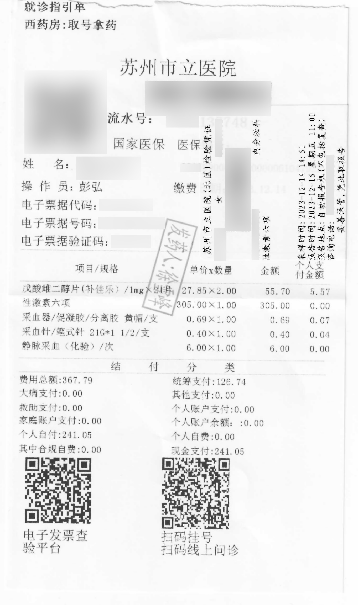
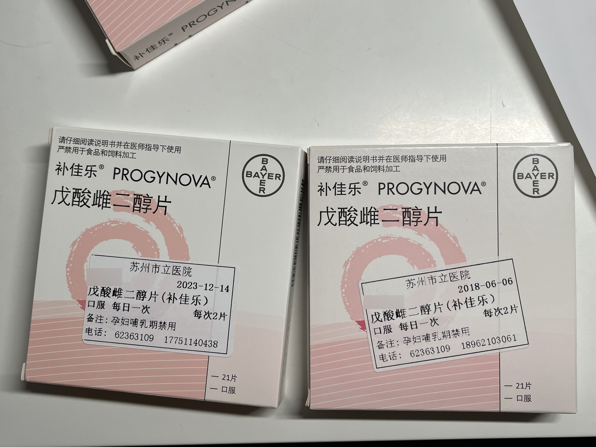
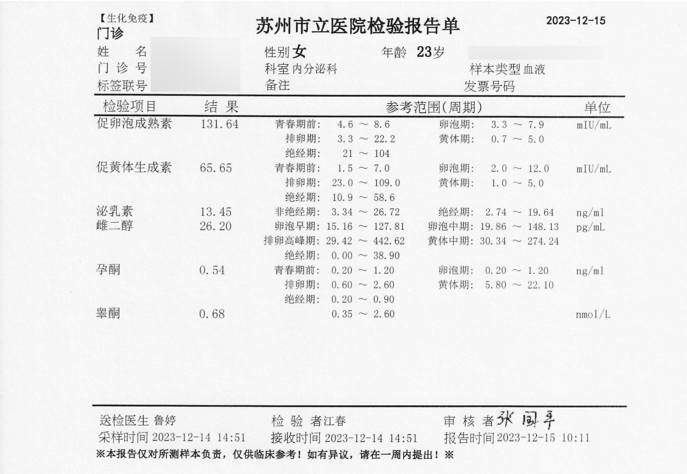

- **科室：** 内分泌科 **普通门诊**
- **药品：** 补佳乐、螺内酯

## 挂号

可通过医院挂号机、健康苏州掌上行 app、微信公众号「[苏州卫生 12320](weixin://Health_SZ)」、支付宝「医疗健康-预约挂号」进行预约，一般现场都有号，提前 14 天放号。

## 东区 - 内分泌科专家号 - 周建英



医生姓名：[周建英](https://www.haodf.com/doctor/6964360738.html)

所在院区：[苏州市立医院（东区）](https://www.amap.com/place/B020003GXC)

### 就诊路线

从门诊入口进入医院，然后在入口左边能看到自助服务机，取号之后不用缴费，门诊结束后再去缴费窗口。诊室在一楼正门入口右手处，安全通道内的慢病中心（代谢性疾病管理中心）。注意看叫号。门诊号在挂号单左边中间位置。

~~这样可以完美避免说话询问~~





### 问诊细节

跨性别友好。~~甚至会询问认不认识本站某维护人员~~

- 凭易性症证明可开具 HRT 处方。（未成年无需家长）
- 可凭病历与其它医院开药相关材料开出处方。
- 可以开具激素检查，如果长期没检查会建议附带检查肝肾功能。
- 可以在病历上要求注明“不建议剧烈运动”，这句话可能具有能在苏州各高校军训/体育课减免的效果。

> 首先询问已经用药了多长时间、用的什么药、如何用的药。我有自带病历，建英医生翻看了历史的抽血检查和别的医院的病历后，给我建议用药时间长了之后（本人接近2年），每一年检查相关的功能（肝肾等等）。
>
> 然后，有询问到我有没有做过染色体检查，我回答“没有”，但是不影响我最后开到处方，只是看了病历后，建议回广东（我家）检查一下染色体和其他功能。（我有和医生提到我从广东过来看）
>
> 建议把需要开方的药品，打字在便签上给医生看，写上药品名称、商品名、规格（比如50mg，0.06% x 80g）、每日用量、每日用药次数，这样可以避免医生再问相关细节。

### 出诊时刻

```csv
周次,时间,科室,价格
周五,整天,内分泌专家,35 元
```

### 处方例子






### 参考来源

- <https://zhuanlan.zhihu.com/p/346909177>

## 北区 - 内分泌科普通号

- **院区：** [苏州市立医院（北区）](https://ditu.amap.com/place/B0200075XV)
- **医生：** 鲁婷、吴冕

### 问诊细节

进门即自述病史，~~医生听到后主动去关门（好评）~~，然后再详细讲了一下性别不一致的诊断时间以及手术时间。要求医生姐姐帮忙开一个激素六项和两盒戊酸雌二醇（补佳乐）。**医生全过程友好**，还主动问我有没有其他需要开的药，~~甚至问了我的一些经历。~~

在填写病历的时候，**需要选择一些与之相关的症状**，给我选择的是性别发育异常。医生跟我说**放心，我们不会泄露你的数据**，打消了顾虑。

周五下午前往医院取报告后复诊咨询，这次遇到的是吴冕医生，非常友跨，了解过上海的跨门诊发展，但表示苏州这边案例太少 她们也缺乏指导HRT经验。<sup>吴冕医生认为按照女性月经周期的激素来规划药物是科学合理的，但提出这样做有情绪波动风险，而且缺乏实验论证。建议本人还是按照一天两颗补来吃。 </sup>只能开具补佳乐和螺内酯，无凝胶，无琪宁黄体酮，无CPA，补佳乐每次限制2盒。

> 注：以男性身份开具戊酸雌二醇处方时本人使用了丛中的诊断病历，但不是证明。当时也选择的是普通门诊，医生同样非常友善，记忆犹新。~~忘了名字真对不起医生，记得也是个姐姐。~~

> 至此，至少确认苏州市立医院北区内分泌科有三名医生非常友善，且吴冕医生认为她们科室整体友跨。

### 就诊路线

大厅电梯上楼左转，看到一个比较大的护士台，挂号单给予护士录入系统后等待叫号。化验中心和缴费台也在二楼，可以很方便的一站式验血。






