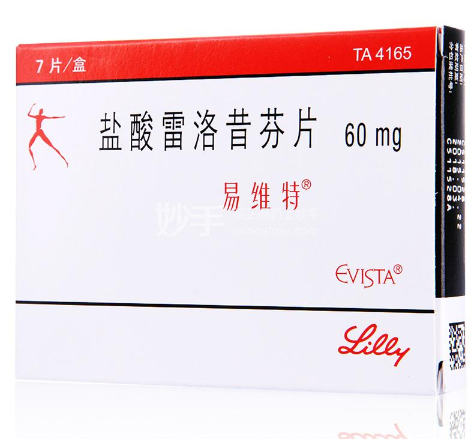
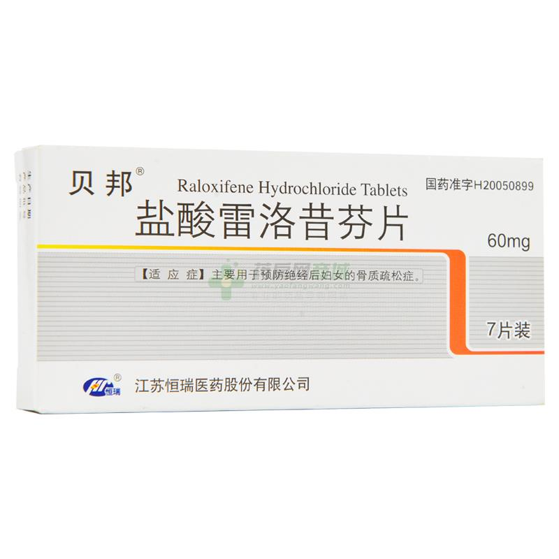

## 简介

雷洛昔芬（Raloxifene）是一种常用的 SERM。作为一种 ER&alpha; 的部分激动剂、ER&beta; 的完全拮抗剂和 GPER（G 蛋白偶联雌激素受体）的激动剂，其在肝脏代谢、皮肤、骨骼、脂肪分布等方面起雌激素作用，在乳房发育、阴道干燥、潮热等方面起抗雌激素作用，无抗促性腺激素作用。在顺性别女性中，雷洛昔芬主要用于绝经后骨质疏松和乳腺癌的预防 [^4]。在跨性别者中，其可以在带来女性化效果的同时抑制乳房发育 [^3]。

| 易维特 盐酸雷洛昔芬片包装 | 贝邦 盐酸雷洛昔芬片包装 |
|:--:|:--:|
|  |  |

说明书：<https://tfsci.mtf.wiki/zh-cn/misc/evista/>

## 不良反应与禁忌

获得以下信息的临床试验主要在绝经后的顺性别女性中进行，然而其仍有一定的参考价值。

根据其处方信息 [^9]，雷洛昔芬的不良反应与禁忌如下：

1. 血栓与中风：雷洛昔芬增加血栓和中风的风险。在患有房颤、高血压、吸烟和有中风历史的患者中应当慎用。
1. 肝脏损伤：在有肝损伤的患者中，雷洛昔芬应当被谨慎使用。此外，根据 LiverTox，雷洛昔芬是临床显著的肝损伤的可能罕见原因。在大型临床试验中，血清肝酶升高发生率并不高于安慰剂组；然而，在大规模应用中，有一些被归因于雷洛昔芬的肝损伤孤例 [^10]，可能由药物相互作用有关。
1. 潮热：雷洛昔芬增加潮热的发生率。在骨质疏松预防的临床试验中，接受雷洛昔芬治疗的志愿者中大约有 1/4 经历了潮热症状，而此情况对照组中为 1/6。
1. 腿部痉挛：雷洛昔芬增加腿部痉挛的发生率。在骨质疏松治疗的临床试验中，此情况的发生率为 7.0%与 3.7%（雷洛昔芬与安慰剂）；在骨质疏松预防的试验中，此情况的发生率为 5.9%与 1.9%。
<!-- 1. 药物相互作用：**TODO** -->

此外，雷洛昔芬减少肝脏合成的 IGF-1，从而反馈性地导致 GH 水平增加，且拮抗雌激素的抗促性腺激素作用，最终导致有睾丸者体内睾酮水平的上升 [^1] [^2]。

## 雷洛昔芬的 HRT 方案

雷洛昔芬的用量应为每日 60mg。

值得注意的是，不同于雌二醇，雷洛昔芬无抗促性腺激素作用 [^4]，因此其不可与孕激素联合来充分降低雄激素水平。而单独使用孕激素只可降低睾酮水平约 50%-70%，且长期使用下睾酮水平会发生一定程度的回升 [^6]，螺内酯不能有效拮抗高水平的雄激素 [^7]。该方案下，一般的抗雄激素疗法（CPA 或螺内酯，皆需与雌激素合用）不适用。

有效的抗雄激素疗法如下：

* 一种方案是，同时使用低剂量（6.25-12.5mg）醋酸环丙孕酮和比卡鲁胺（50-100mg）。尽管从药理学上可能可行，但此方案无大量研究和试验，故应谨慎使用。

* 另一种方案是，使用高剂量（150-200mg）比卡鲁胺来拮抗雄激素受体。由于此方案可导致睾酮水平反馈性地上升，由其芳香化而产生的雌二醇也会相应地增多，所以不确定此方案下 60mg 雷洛昔芬是否足够。可尝试将 60mg 掰成两份，分早晚两次服用。此方案亦应谨慎使用。
一项在患有前列腺癌的老年男性中进行的研究显示，20mg 的他莫昔芬只能阻止大部分的大剂量比卡鲁胺所致的乳房发育[^5]。然而研究中的志愿者主要为老年男性，这意味着他们具有更低的性激素水平，且根据研究，对于乳腺癌的预防，60mg 的雷洛昔芬弱于 20mg 的他莫昔芬 [^8]。

* 此外，也可以使用 GnRH 类药物来抑制雄激素。此方案开销较高，每月需约 1000 人民币。或者，直接行睾丸切除。

不应同时使用雌激素和雷洛昔芬。雷洛昔芬对骨骼、皮肤和脂肪分布已有雌激素作用。而同时使用雌激素与雷洛昔芬，会导致需要极高剂量的雷洛昔芬才可抑制乳房发育，这会大幅提高雷洛昔芬对肝脏的影响（凝血和脂代谢），且并不能提供更多的其他方面的女性化作用。

[^1]: [雷洛昔芬与他莫昔芬在顺性别男性中导致的 LH 与睾酮水平变化](https://www.fertstert.org/article/S0015-0282(08)01280-6/fulltext)
[^2]: [雷洛昔芬在顺性别男性中导致的睾酮水平变化；然而仅老年者](https://academic.oup.com/ejendo/article/150/4/539/6694331)
[^3]: [用于非二元性别认同者 HRT 的 SERMs](https://www.ncbi.nlm.nih.gov/pmc/articles/PMC8253879/)
[^4]: [Wikipedia 雷洛昔芬](https://en.wikipedia.org/wiki/Raloxifene)
[^5]: [20 mg 他莫昔芬用于 150 mg 比卡鲁胺导致的乳房发育；然而仅老年者，且 60 mg 雷洛昔芬有效性不及 20 mg 他莫昔芬](https://doi.org/10.1200/jco.2005.12.013)
[^6]: [Transfeminine Science 醋酸环丙孕酮抑制睾酮水平](https://tfsci.mtf.wiki/zh-cn/articles/cpa-dosage/)
[^7]: [Transfeminine Science 螺内酯](https://tfsci.mtf.wiki/zh-cn/articles/spiro-testosterone/)
[^8]: [他莫昔芬与雷洛昔芬用于预防乳腺癌](https://www.ncbi.nlm.nih.gov/pmc/articles/PMC5110043/)
[^9]: [雷洛昔芬处方信息](https://www.accessdata.fda.gov/drugsatfda_docs/label/2018/020815s034lbl.pdf)
[^10]: [LiverTox](https://www.ncbi.nlm.nih.gov/books/NBK548475/)
