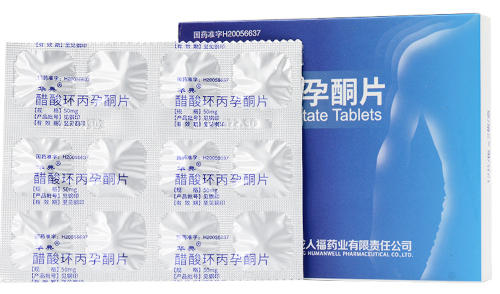


请仔细阅读说明书并在医师指导下使用药物。


醋酸环丙孕酮（Cyproterone Acetate，俗称「色普龙/色谱龙」）是一种常用的抗雄药物，多用于男性前列腺癌的治疗、女性因高雄激素引起的痤疮、脱发等症状治疗[^5] [^6]；现为女性化激素治疗中使用最多的抗雄药物之一[^8]。常见的商品名有 Androcur&reg;（安得卡）、Siterone&reg;、华典&reg;、LuciCyp&reg; 等。

该药具有极强的孕激素作用，抑制卵巢功能[^15]，故也用于复方避孕药，如「达英-35」（*Diane-35*）。

## 基本信息



Androcur&reg; 的品牌归属已变更，但生产厂未变。Androcur&reg; 原为拜耳（Bayer）旗下品牌。2023 年 11 月，总部位于英国的 Advanz Pharma 宣布自拜耳收购 Androcur&reg; 的全球权利，交易于 2024 年第一季度完成[^16]。此后各市场的登记持有人陆续变更：德国改为 Advanz Pharma Limited（爱尔兰），中国香港改为 Amdipharm Mercury (Hong Kong) Limited，澳大利亚改为 Amdipharm Mercury Australia Pty Ltd，英国的原研商品名 Cyprostat&reg; 亦归 Advanz 所有；中国台湾的登记持有人则变更为美纳里尼（Menarini）台湾分公司[^18]。

**但制剂的生产厂并未随品牌一并变更。** 德国与中国台湾的登记／说明书资料均显示，成品由德国 Bayer Weimar GmbH und Co. KG（魏玛）生产[^17] [^18]；德国、中国台湾、土耳其三地说明书对片剂外观的描述亦完全一致——一面有刻痕，另一面为六边形内「BV」字样。因此，**不宜再按「产地」区分不同市场销售的 Androcur&reg;**，实际生产厂请以包装标注或当地登记资料为准。



### Androcur&reg;（安得卡）

| 地区 | 登记号 | 登记持有人 | 规格 |
| ---- | ------ | ---------- | ---- |
| 中国内地 | 未上市 | — | — |
| 中国台湾 | 卫署药输字第 012554 号[^18] | 新加坡商美纳里尼医药有限公司台湾分公司 | 50 mg |
| 中国香港 | HK-46443[^19] | Amdipharm Mercury (Hong Kong) Limited | 50 mg |
| 德国 | Zul.-Nr. 6929701.00.00[^17] | Advanz Pharma Limited（爱尔兰） | 10 mg &times; 45 片；50 mg &times; 10、50、100 片 |
| 土耳其 | 88/77 | Bayer Türk Kimya San. Tic. Ltd. Şti. | 50 mg &times; 50 片 |
| 土耳其 | — | Avixa İlaç San. ve Tic. A.Ş. | 100 mg &times; 30 片 |

- 商品名：Androcur&reg;
- 简称：台色（中国台湾）、土色（土耳其）、德色（德国）
- 生产厂：德国 Bayer Weimar GmbH und Co. KG
- 说明书：[中国台湾版（繁体中文）](/documents/androcur-zh.pdf)｜[简体中文释义](https://tfsci.mtf.wiki/misc/androcur-tw/)；[德国版（德文）](/documents/Androcur.pdf)｜[译文](https://tfsci.mtf.wiki/misc/androcur-de/)｜[南非版译文](https://tfsci.mtf.wiki/misc/androcur-za/)

德国销售的 10 mg（左）与 50 mg（右）包装：




中国台湾／土耳其市场的旧版包装：






在土耳其销售的 Androcur 可通过土耳其药品追踪系统查询信息：

<https://www.its.gov.tr/its/ilac_sorgula>



### Siterone&reg;（新西兰）




- 商品名：Siterone&reg;
- 简称：新色
- 厂商：REX Medical Ltd（新西兰奥克兰）
- 规格：50 mg、100 mg，均为 50 片／盒
- [上市信息](/documents/siterone.pdf)
- [说明书（英文，Medsafe）](https://www.medsafe.govt.nz/Profs/Datasheet/s/Siteronetab.pdf)
- [说明书（中文翻译）](https://tfsci.mtf.wiki/misc/siterone-nz/)

新西兰另有 Procur&reg;（50 mg、100 mg）销售[^20]。

### 华典&reg; 醋酸环丙孕酮片 {#huadian}

- 商品名：华典&reg;
- 简称：国色
- 厂商：武汉九珑人福药业有限责任公司
- 批准文号：国药准字 H20056637
- 规格：50 mg &times; 24 片
- [说明书（PDF）](/documents/huadian-zh.pdf)
- [说明书（网页）](https://tfsci.mtf.wiki/zh-cn/misc/cpa-hd/)

### LuciCyp&reg;（老挝）



- 商品名：LuciCyp&reg;
- 厂商：Lucius Pharmaceuticals (Lao) Co., Ltd（老挝万象）
- 注册号：11 L 1038/23
- 规格：50 mg
- [产品信息](https://lucius-pharmaceuticals.com/drug/cyproterone-acetate/)

### 其他品牌与地区

- **Cyprostat&reg;（英国）**：英国的原研商品名，现由 Advanz Pharma 持有，有 50 mg、100 mg 两种规格。
- **Cyproterone（加拿大）**：AA Pharma 生产的 50 mg 仿制药（DIN 02245898）。
- **Androcur&reg;（澳大利亚）**：50 mg，登记持有人为 Amdipharm Mercury Australia Pty Ltd（ARTG 156920）。
- **Androcur&reg;（韩国）**：50 mg，由拜耳韩国（Bayer Korea）持有。
- **印度**：有多家厂商生产醋酸环丙孕酮片，如 Cipla 的 Cyproterone 50 mg。
- 日本、美国等国家未批准醋酸环丙孕酮上市。

### 特别提示



- 「日色」为醋酸氯地孕酮（Chlormadinone Acetate），同样具有抗雄激素活性[^1]，但并非醋酸环丙孕酮，请不要误用。



## 使用方式与用量



本章节内容仅适用于同时使用雌激素制剂的女性倾向跨性别者。



长期仅使用醋酸环丙孕酮单方制剂的跨性别者与多元性别群体相关的资料较少，尚待进一步研究与整理。有此类需求的群体请寻求医师的专业指导。

CPA 单药治疗时，即使在最大推荐剂量（10～12.5 mg/d）下，也不能实现睾酮水平的完全抑制[^2]；只有在和雌激素合用时方可实现[^2]。

- 服用方式：口服（无明显味道）
- 建议使用剂量：**10 ~ 12.5 mg/天**[^8]
  - 多项研究发现，在与雌二醇同时使用时 10 mg/天左右剂量已可最大程度抑制睾酮，且效果与高剂量一致[^2]。WPATH最新发布的《跨性别和多元性别人群健康照护指南》第八版（SOC-8）亦建议 10 mg/天的剂量[^8]。
  - 超出建议剂量会有更大的副作用与健康风险（见下副作用章节）；低于建议剂量可能会使睾酮抑制效果不显著。
- 进一步研究则发现，每周两次 12.5 mg（等效约 3.5 mg/天）的超低剂量同样可以实现睾酮水平的充分抑制[^10]。**在推荐剂量达到效果后，尽可能减少用量至 5～6.25 mg/d**。由于研究资料有限，暂不推荐减至 5 mg/d 以下。
  - 可用切药器切为四片或五片（即每份 12.5 mg / 10 mg），每 1 ~ 3 日一服。
- 若在推荐剂量（10 mg/天）下血清睾酮水平仍较高，请首先检查雌激素血药浓度是否足够高，必要时咨询相关专业医师。
- 建议适量补充维生素 B12。
- 停药时须逐步减药。

## 副作用

- **脑膜瘤风险**：色普龙可能诱发脑膜瘤，风险与剂量和使用时长正相关。建议尽可能以更小剂量服用；如累积剂量已很大（高于 10 g），建议进行核磁共振扫描（MRI）[^7]。
- **精神疾病**：色普龙可能导致抑郁风险升高。主要原因是色普龙对于生理男性起到了抗雄激素和潜在的糖皮质激素作用，并可能诱发维生素 B12 缺乏[^4]，而维生素 B12 的缺乏和多种精神/情绪状况的改变有关，包括抑郁[^3]。有必要适量补充维生素 B12。
- **高血压**与**高血糖**：色普龙可能会提高体内胰岛素抗性，从而引起血糖偏高[^9]。糖尿病患者应慎用，用药时抗糖尿病制剂或胰岛素的需求可能改变；并发血管病变时禁用[^6]。
- **血栓**与**乳腺癌风险**：与雌激素合用时可一定程度提高其风险[^12] [^13]。此外，也有色普龙单药引起更高的血栓风险之报告[^14]。
- **高泌乳素水平**：可明显增加泌乳素水平，且随剂量上升，严重时可引起**垂体泌乳素瘤**。应定期检查泌乳素水平[^2]。
- **肝毒性**：色普龙最严重的副作用，与剂量相关，表现为肝转化酶水平升高；严重时可引起**肝衰竭**甚至**死亡**[^2] [^5] [^6]。使用前应当检查**肝功能**，使用时定期检查[^5]。
-  过早导入色普龙（尤其高剂量）可能造成乳房发育不良[^11]。

## 成分信息

- 有效成分：醋酸环丙孕酮（Cyproterone Acetate）
- 化学名称：6-氯-1α,2α-亚甲基-3,20-二孕酮-4,6-二烯-17α-醋酸酯
- 分子式：C24H29ClO4
- 分子量：416.94
- CAS：427-51-0

[^1]: Wikipedia. Chlormadinone acetate [EB/OL]. (2023-11-25)\[2024-05-01]. <https://en.wikipedia.org/wiki/Chlormadinone_acetate>
[^2]: Aly. Low Doses of Cyproterone Acetate Are Maximally Effective for Testosterone Suppression in Transfeminine People [EB/OL]. *Transfeminine Science*, 2019. 译文：《[低剂量的醋酸环丙孕酮足以最大限度地抑制女性倾向跨性别者的睾酮水平](https://tfsci.mtf.wiki/articles/cpa-dosage/)》
[^3]: Sadock B J, Ahmad S, Sadock V A. Kaplan and Sadock's Pocket Handbook of Clinical Psychiatry [M]. 6th ed. Philadelphia, US: Wolters Kluwer, 2018: 92.
[^4]: Ramsay I D, Rushton D H. Reduced serum vitamin B12 levels during oral cyproterone-acetate and ethinyl-oestradiol therapy in women with diffuse androgen-dependent alopecia [J]. *Clinical and Experimental Dermatology*, 1990, 15(4): 277–281. DOI: [10.1111/j.1365-2230.1990.tb02089.x](https://doi.org/10.1111/j.1365-2230.1990.tb02089.x)
[^5]: [醋酸环丙孕酮（新西兰 Siterone）说明书](https://tfsci.mtf.wiki/misc/siterone-nz/)
[^6]: [醋酸环丙孕酮（台湾 Androcur）说明书](https://tfsci.mtf.wiki/misc/androcur-tw/)
[^7]: Aly. Recent Developments on Cyproterone Acetate and Meningioma Risk Out of France and Implications for Transfeminine People [EB/OL]. *Transfeminine Science*, 2020. 译文：《[法国关于醋酸环丙孕酮和脑膜瘤风险的研究的最新进展以及对女性倾向跨性别者的影响](https://tfsci.mtf.wiki/articles/cpa-meningioma/)》
[^8]: Coleman E, Radix A E, Bouman W P, et al. Standards of Care for the Health of Transgender and Gender Diverse People, Version 8 [J]. *International Journal of Transgender Health*, 2022, *23*(Suppl 1): S1–S259. DOI: [10.1080/26895269.2022.2100644](https://doi.org/10.1080/26895269.2022.2100644) ——[中文译本](https://project-trans.org/SOC-8)
[^9]: Stahnke N, Ilicki A, Willig R P. Effect of Cyproterone Acetate (CA) on Growth and Endocrine Function in Precocious Puberty [J]. *Acta Paediatrica*, 1979, 68(S277): 32–40. DOI: [10.1111/j.1651-2227.1979.tb06189.x](https://doi.org/10.1111/j.1651-2227.1979.tb06189.x)
[^10]: Warzywoda S, Fowler J A, Bisshop F, et al. How low can you go? Titrating the lowest effective dose of cyproterone acetate for transgender and gender diverse people who request feminizing hormones [EB/OL]. *International Journal of Transgender Health*, (2024-02-20). DOI: [10.1080/26895269.2024.2317395](https://doi.org/10.1080/26895269.2024.2317395)
[^11]: Aly. Considerations in Understanding the Possible Role and Influence of Progestogens in Terms of Breast Development [EB/OL]. *Transfeminine Science*, 2020. 译文：《[关于孕激素在乳房发育过程中有何潜在作用及影响的随笔](https://tfsci.mtf.wiki/articles/progestogens-breast-dev/)》
[^12]: Yuk J-S. Relationship between menopausal hormone therapy and breast cancer: A nationwide population-based cohort study [EB/OL]. *International Journal of Gynecology & Obstetrics*, (2024-03-12). DOI: [10.1002/ijgo.15461](https://doi.org/10.1002/ijgo.15461)
[^13]: Seaman H E, de Vries C S, Farmer R D T. The risk of venous thromboembolism in women prescribed cyproterone acetate in combination with ethinyl estradiol: a nested cohort analysis and case–control study [J]. *Human Reproduction*, 2003, 18(3): 522–526. DOI: [10.1093/humrep/deg120](https://doi.org/10.1093/humrep/deg120)
[^14]: Seaman H E, Langley S E M, Farmer R D T, et al. Venous thromboembolism and cyproterone acetate in men with prostate cancer: a study using the General Practice Research Database [J]. *BJU International*, 2007, 99(6): 1398–1403. DOI: [10.1111/j.1464-410X.2007.06859.x](https://doi.org/10.1111/j.1464-410X.2007.06859.x)
[^15]: Kumari G L, Das R P, Madoiya K K, et al. Effect of short-term cyclic administration of cyproterone acetate on pituitary-ovarian function in the human [J]. *Fertility and sterility*, 1977, 28(11): 1168–1174. DOI: [10.1016/S0015-0282(16)42912-2](https://doi.org/10.1016/S0015-0282(16)42912-2)
[^16]: ADVANZ PHARMA. ADVANZ PHARMA acquires global rights to Androcur® from Bayer [EB/OL]. (2023-11-07)\[2026-09-22]. <https://www.advanzpharma.com/news/2023/advanz-pharma-acquires-global-rights-to-androcur-from-bayer>
[^17]: Advanz Pharma Limited. Androcur® 50 mg Tabletten: Fachinformation und Gebrauchsinformation [EB/OL]. (2024-09)\[2026-09-22]. <https://www.fachinfo.de/fi/pdf/002755>（上市许可持有人 Advanz Pharma Limited；生产厂 Bayer Weimar GmbH und Co. KG）
[^18]: 卫生福利部食品药物管理署. 安得卡锭（卫署药输字第 012554 号）药品许可证资料 [EB/OL]. (2025-02-19)\[2026-09-22]. <https://mcp.fda.gov.tw/im_detail_pdf/%E8%A1%9B%E7%BD%B2%E8%97%A5%E8%BC%B8%E5%AD%97%E7%AC%AC012554%E8%99%9F>
[^19]: 香港药物办公室. ANDROCUR TAB 50MG（HK-46443）登记资料 [EB/OL]. \[2026-09-22]. <https://www.drugoffice.gov.hk/eps/drug/productDetail/en/pharmaceutical_trade/154804>
[^20]: Medsafe. PROCUR® 50 mg and 100 mg tablet: New Zealand Data Sheet [EB/OL]. (2021-08-13)\[2026-09-22]. <https://www.medsafe.govt.nz/Profs/Datasheet/p/Procurtab.pdf>
<!-- FIXME link-image-reference-definitions [^21]: Rost A, Schmidt-Gollwitzer M, Hantelmann W, et al. Cyproterone acetate, testosterone, LH, FSH, and prolactin levels in plasma after intramuscular application of cyproterone acetate in patients with prostatic cancer [J]. The Prostate, 1981, 2(3): 315-322. <https://doi.org/10.1002/pros.2990020310>
[^22]: Fung R, Hellstern-Layefsky M, Lega I. Is a lower dose of cyproterone acetate as effective at testosterone suppression in transgender women as higher doses? [J]. International Journal of Transgenderism, 2017, 18(2): 123–128. https://doi.org/10.1080/15532739.2017.1290566 -->
