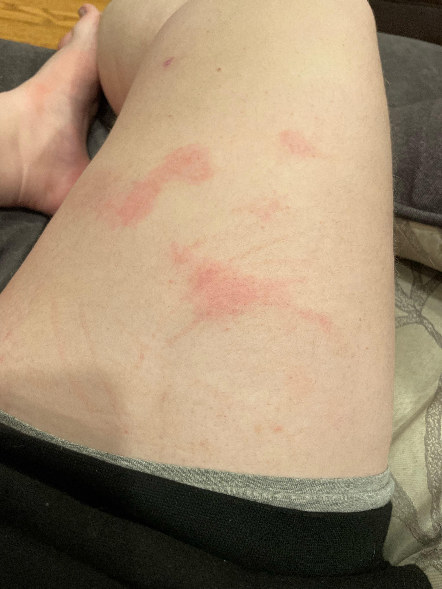
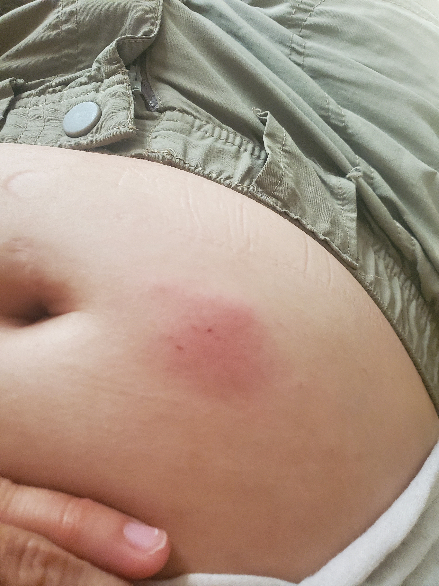

## 基础

### 简介

这个页面介绍肌肉注射和皮下注射的选择、注射器型号的选择、如何自我注射、和注射后可能出现的反应。

自我注射其实是一种很常见的给药方法，大部分人也能学会安全、有效地给自己打针。

较好的这类信息在中文世界中稍难找到，因此你也可以参考一些英文资料。

### 我应选择肌肉还是皮下注射？

长效药物通常使用肌肉注射。然而，有时，皮下注射可能更容易。

- 肌肉注射
	* 大部分的长效药物（激素、抗精神病药等）通常使用肌肉注射。
	* 比起脂肪，肌肉的血液供应远更佳。这有助于较快、较稳定地吸收载剂油和里面溶解的药物。
	* 较大的肌肉（如三角肌、股外侧肌等）可容纳的液体（最多 3-5 mL）远多于脂肪（1.5-2 mL）；且不易在注射后发生局部疼痛。
	* 单点尽量不超过 3 mL。
	* 由于注射部位较深，需要在较为安全、易达、神经少的部位进行。
	* 不容易产生较重的过敏反应；且过敏消退较快。
- 皮下注射
	* 简单、易行。
	* 一些对睾酮和长效抗精神病药的研究显示，吸收可能并无差异。
	* 能舒适容纳的药液偏少。如果注射量较大（比如十一酸等剂型），可能会造成一点疼痛。
	* 单点尽量不超过 1.5 mL。液体较多时，可以拆分成两次分别的注射。
	* 药物释放更平缓，水平波动稍小。
	* 药物吸收偏慢。如果你对载剂油过敏，身体可能需要较长的时间来清除致敏原，导致较长时间的痒、肿。

如果这是你的第一次注射，可以选择皮下注射。\
如果你信任自己的能力，或属于过敏体质，最好选择肌肉注射。\
如果被发现将带来人身安全危险，那你只应选择肌肉注射。

### 基本卫生原则

可以参考：[文表（多语言，WHO，卫生与感染安全）](https://www.who.int/publications/i/item/9789241599252)，[文表（英文，CDC，卫生与感染安全）](https://restoredcdc.org/www.cdc.gov/infection-control/hcp/core-practices/index.html)，[文表（英文，CDC，卫生与感染安全）](https://restoredcdc.org/www.cdc.gov/injection-safety/hcp/clinical-safety/index.html)


- 消毒后的表面和皮肤不能用手触摸，若意外触碰，需重新消毒并等待完全干燥。
- 皮肤或橡胶塞用酒精消毒后，应让其自然风干约 30 秒；不要吹干、擦干、或摇扇。
- 使用时，针头和针管不得接触任何非无菌表面；若**怀疑**污染，应一并丢弃整套注射器和其中的药物。
- 在人体中使用后，或其它方式污染后的器材，不能再次接触药物或穿刺橡胶塞，无论是否更换针头。
- 注射器、针头、针管均为一次性耗材；若怀疑被污染，或在人体中使用完后，必须立即整套弃置，不可复用，即使更换针头也不例外。
- 无论是否戴手套或是否使用酒精，都应严格执行肥皂加流水的手卫生。**消毒不能替代洗手**。

## 如何选择和购买注射器

### 选择注射器

通常，你可以买到以下几种附带针头的注射器：
- 1 mL，0.8-1.2 cm / 0.35-0.5 mm（针头不可替换，胰岛素针，低死腔）
- 1 mL，1.6 cm / 0.45 mm（4.5号，棕黄色，低死腔）
- 2 mL，2.0 cm / 0.5 mm（5号，橙黄色）
- 2 mL，2.5 cm / 0.6 mm（6号，天蓝色）
- 5 mL，3.2 cm / 0.7 mm（7号，深灰色）
- 10 mL，3.2 cm / 0.8 mm（8号，青绿色）

“死腔”指困在针管和针头连接处的空间。低死腔注射器，则专门设计得减少这个空间里浪费掉的药液

规则：\
如果你的药物装在多次使用的橡胶塞瓶里，则需要 1 mL 的注射器，才能精确地衡量剂量。 \
如果你打算做肌肉注射，则需要 6 号以上的针头。 \
如果你的体重指数很大，可能需要 3.2 cm 的 7-8 号针头。

表格：
``` csv
,肌肉注射,皮下注射
一次性药瓶,购买6-8号针,任何皆可
多次性药瓶,4.5号针加上6-8号针,买1毫升4.5号针或胰岛素针
```

如果使用多次性药瓶，但做肌肉注射，你则需要购买 1 mL 的针管，丢弃附带的 4.5 号针头，然后换上 6-8 号针头。

### 获得安全、卫生的注射器

最便捷的方式，是在淘宝或京东上网购。请选择可孚等较大的品牌，不要贪便宜。

此外，本地药店可能有售，可以用现金购买；如果药店拒绝出售，或当地不许出售，你可以用美团、饿了么等外卖平台，在可靠的当地药店购买。

## 注射教程

建议观看：[视频（英文，VA，肌肉注射）](https://www.youtube.com/watch?v=fMEZdNodGM0)，[视频（粤语，香港血友病协会，皮下注射）](https://www.youtube.com/watch?v=s_20-g15v54)\
可以参考：[图文（英文，Fenway Health，肌肉及皮下注射）](https://fenwayhealth.org/wp-content/uploads/MG-6_TransHealth_InjectionGuide.pdf)，[图文（英文，开安玻瓶）](https://www.tcichemicals.com/US/en/product/container/ampule)，[图文（英文，开安玻瓶）](https://www.bristol.ac.uk/media-library/sites/vetscience/documents/clinical-skills/How%20to%20Open%20a%20Glass%20Vial.pdf)。

### 1. 准备工作空间

你会需要酒精消毒棉片、无菌棉球、创可贴、一或两支注射器，以及药物。将这些放在一处相对洁净的台面上。

### 2. 卫生：洗手

用肥皂和流水洗手。这是对预防感染很重要。

### 3. 打开药物

#### 如果是安玻瓶装的一次性使用药物：如何正确的打开瓶子

先弹一弹瓶子，让瓶颈上方的药水尽量留到下方。虽然，剩余一点气泡也无所谓。

确认瓶颈是否已有划痕。如有，则划痕上方、瓶盖上通常会有一个圆点来标出划痕部位。如没有划痕，你会需要用砂轮自己划一个。

瓶子应隔着卫生纸掰断。一手握住瓶子的下部，另一手隔着卫生纸，握住瓶盖。

两只手臂应该呈一条直线，直直的抓住瓶子，握瓶盖的手不应该和瓶子垂直。握住整个瓶盖，手指就在瓶颈上方，而不是只握着尖部。

接下来，用力，大胆一点…… 砰，瓶子就安全地打开了。

安玻瓶装的药物不应重复使用。如果一次需要的剂量小于一瓶的量，剩余的必须丢弃。

#### 如果是橡胶塞瓶装的药物

如果是第一次使用的话，把瓶盖翘掉就行。

一般瓶子上会写明是否为多次使用的。一般橡胶塞瓶装的激素药都是多次使用的。如果是多次使用的瓶子，则可以用塑料袋装好，放回冰箱冷藏储存。不用把盖子重新盖上。

有的药物是一次性使用的。这种情况下，瓶子里没加抑菌剂，密封打开后应该丢弃。

使用前，打开一张酒精棉片，擦一下瓶塞。等一会，瓶塞干燥后就可以抽药了。

### 4. 肌肉注射：换长针

打开针筒包装。不要去掉针套。

拔掉注射器上的针头。打开一支带长针的注射器，拔下针头，插到旧注射器上，用力插紧，就好了。

拔下针头时，小心手指不要触碰到注射器的接口处。如果不慎碰到，你应该丢弃整套注射器。

皮下注射则可以直接使用短针进行。

### 5. 抽药

#### 如果是安玻瓶

先打开注射器包装，拔掉针头护套。

一次抽干净就行了。如果还剩余一点，针头不够长，可以把瓶子放平，颈口稍朝下，让药液流过来。

#### 如果是橡胶塞瓶

按自己需要的剂量抽。比如，瓶子里是的浓度是 40 mg/mL，而自己需要 8 mg，则抽 `8 / 40 = 0.2 mL` 的药。

先往针筒里吸入等量的空气，拔掉针头护套。

竖直把针头插进瓶子里，然后倒转针筒和瓶子。先把针筒里的空气打进去，再吸取药物。

清理一下气泡。

然后拔出针头，就好了。

#### 清理气泡

如果注射器里有比较大的气泡，那就倒转注射器，针头向上。轻轻弹一弹注射器，让气泡聚集到上面。

吸一下，以免推掉注射器死腔里的药水，然后把气泡推出去。

#### 吸入一点点空气

如果使用的不是低死腔的注射器，那还要再吸入一点点空气，来补偿死腔，确保不会有太多的药液留在针头和针筒的连接处。

静脉注入大几十毫升的空气，才会有危险（空气栓塞）。

### 6. 寻找注射部位

#### 肌肉注射

用自己的大腿。

直视大腿。想象用~~四~~九宫格来把大腿分成横三段、纵三条，九个部分。选择中间段、最外侧那一条。

这里是股四头肌中的股外侧肌，较易操作，肌肉较大，可以容纳大量的药液，而且不易碰到神经、血管等。

#### 皮下注射

在大腿正面，或肚子上，离肚脐 5 cm 之外的任何区域。

脂肪够多就行了。但是，避开发炎的皮肤、破损处、伤疤、疣、和痣。

注射部位要轮换，不要在同一个部位多次注射。

### 7. 消毒注射部位

和其它消毒一样，用酒精棉片，从中心到外圈，螺旋形地擦拭一小块皮肤。等其自然晾干，不要擦干或吹气。

### 8. 注射

快速、果断地刺入针头。针头刺破皮肤时可能会感到一点阻力；不要害怕，试探着，不敢戳过去。一咬牙，一用力就好了。

#### 肌肉注射

放松肌肉，不要用力，这样就不会疼。

一手持针筒，另一只手拉紧注射部位的皮肤、脂肪层。 \
垂直注射部位，快速、果断地扎下去。 \
要是针头长度小于等于 2.5 cm（国内通常是天蓝色针头），则可以一下子扎到底；否则就扎约 2.5 cm 左右。 \
如果你的体重指数很大，那最好使用长为 3.2 cm 的针头（国内通常是深灰色和青绿色针头），扎到底。

如果肌肉紧张，则会感到疼痛。如果陷入恶性循环，越疼痛，越紧张，特别疼痛的话，那就拔出针头，用棉球按住一会，换掉针头，重打。*但肌注时轻微疼痛是正常的*。

#### 皮下注射

用手捏起一块约 3 cm 宽皮肤。如果用长针的话，45º 进针可能会容易一点；否则垂直进针。大约扎进 1-1.5 cm 的深度。

#### 肌肉注射：检查无回血

轻轻向外回抽一下。不应该看到有血液回血。如有，则说明打到静脉了，应该拔出重打。

~~其实忘了也没事~~。 

#### 推药

推住活塞，推干净。

如果药刚从冰箱取出，还很冷的话，可能会刺激到组织，导致推药有一点疼。这种情况下，推的稍慢一点可缓解。

然后，默数 10-15 秒，再拔出针头。用无菌棉球按住针眼处十几秒。可以在上面贴个创可贴。

如果有少量药液渗出，也无所谓。想想，几到十几微升的药液，就算一大滴水也就 50 微升左右，连十分之一也不到。

### 9. 丢弃针头

国内没有专门的锐器丢弃处。可以小小地盖回针头护套，以免扎伤处理垃圾的人，然后丢弃；*除非你较年长，或在服用某些影响动作的药物，或有动作协调障碍，易扎伤自己*。

如果你动作不便，或在为其他人注射：使用单手挑起法盖帽：将针头护套平放在台面上，单手持注射器，将针头送进护套。针尖进入护套后，挑起护套，轻轻压紧护套。全程勿用另一只手扶住护套。

可以参考：[视频（英文，注册护士，单手挑起法）](https://www.who.int/publications/i/item/9789241599252)

丢弃前不要试图折断、掰弯或拆卸针头，以免飞溅或弹刺。

## 注射后反应

### 哪些情况是正常的？

- 皮下注射后一两天内，按压或揉搓注射部位时疼痛
- 肌肉注射后一两天内，肌肉酸痛
- 注射部位很小、轻微的硬结（通常数周内自动软化）

### 哪些情况，可能说明过敏？

- 皮下注射后，注射部位周围皮肤稍有发红
- 皮下注射后，注射部位周围痒
- 皮下注射后，注射部位轻微发热
- 皮下注射后，经过一两周，注射部位逐渐出现一个较大的硬结
- 肌肉注射后，经过一两周，肌肉一直明显酸痛
- 在打第二针时，前一针的部位突然表现出过敏反应（迟发性过敏）

注意到：肌肉注射后，如果出现过敏，一般远比皮下注射的反应隐蔽。






### 过敏：我该看医生吗？

- 如果注射部位出现硬结，且始终在扩大
- 或，注射部位出现硬结，且连着皮肤，难以移动
- 或，注射部位出现硬结，且皮肤变得青紫
- 或，皮肤瘙痒、触痛，甚至好像快要破溃
- 或，出现迟发性过敏的征兆，且不自行好转
- 或，你不确定这是过敏还是感染 

尽量去看医生。一般急诊一支地塞米松静推，都可以解决问题。

如果有人身安全风险（被抓去“戒网瘾机构”扭转、殴打等），且你自己 100 % 确定这不是感染，且去看医生十分危险；可以考虑自己一次性口服 10 mg 地塞米松。糖皮质激素只能吃一次。

也可以，自己先吃一点抗过敏药（氯雷他定等抗组胺药），局部用一点外用激素（肤轻松等），观察几天。

但是，如遇以下全身性的反应，比如呼吸困难、发烧、全身起红疹、喉咙肿、嘴唇肿等，必须立刻去看医生！

### 哪些情况，可能指示感染？

感染很罕见，但一旦遇到，将需要立即治疗，以免引起局部感染并发症，或全身系统性感染/甚至败血症。这非常要紧。

- 注射后，注射部位红肿、滚烫
- 注射后，注射部位周围皮肤发红，且快速增大
- 注射部位不触碰也自发疼痛，或疼痛逐渐加重
- 注射部位出现条带状的发红，且呈条索型变长（其实是在沿着淋巴系统扩散）
- 发烧 
- 注射部位肿起来，而且摸起来像是里面有液体（脓液）
- 有脓液排出

如果遇到以上的任何情况，你应该立即去医院急诊！

一些反应不是感染。例如，已经打完一个星期，始终没有疼痛，但出现其他局部反应；或者，出现迟发型的反应，打完第二针后，第一针部位突然一同出现反应，等等。

### 如果到医院，你应该怎么说

如果你不想告诉医生你用的药，或觉得不安全（如怕家长知道你是跨性别），可以说是打了其他药，比如减肥药司美格鲁肽（过敏）；或被不知名的毒虫蛰了（过敏），或换座后课桌底下有个细钉子伸出来在上面戳了一下，当时没当回事（感染），等等。

你应该在保证人身安全的前提下，尽可能向医生透露与治疗相关的真实医学信息，例如如实际注射部位、时间、症状演变等。

如果有人身安全风险，但遇到感染，请不要避免看医生。自己提前编好一套故事，每一个细节面面俱到，能融得进你的真实生活；不要有个主意，但不合常理或不一定经得住问；然后一口咬死，理直气壮。例如课桌上的钉子：当时自己没去校医消毒而是去卫生间洗了，怪不了学校，而且那个桌子已经被搬去修理了，死无对证；而当时没敢告诉家长，是因为怕被打骂。