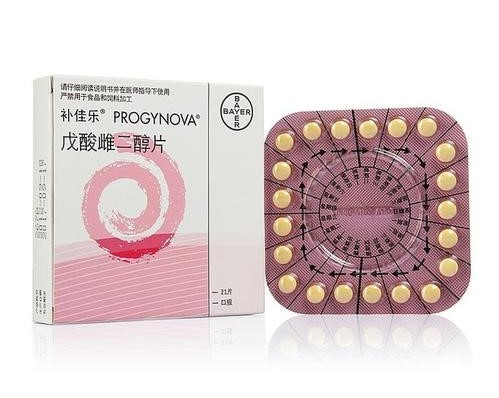


请仔细阅读说明书并在医师指导下使用药物。


补佳乐，即戊酸雌二醇片，是长效雌二醇的衍生物，即雌二醇的戊酸酯。经过肝脏脱酸后具有雌二醇活性，是一种人工合成的天然雌激素。

## 基本信息

| 中国包装 | 泰国包装 (2mg) |
| :--: | :--:|
|  | |

- 药品名称：Progynova&reg;（补佳乐&reg;）
- 药品成分：戊酸雌二醇（Estradiol valerate）
- 简称：补
- 批准文号（中国版）: [国药准字 J20171038](https://www.nmpa.gov.cn/datasearch/search-info.html?nmpa=aWQ9MjM4MCZpdGVtSWQ9ZmY4MDgwODE3YzgzMTJjNDAxN2M5YzU5MjI0ZTA0NWQ=)
- 厂商：拜耳
- 常见规格：

版本,规格,外观
中国包装（国补）,1mg × 21 片/盒,黄色糖衣片
泰国包装（泰补）,2mg × 28 片 × 3 板/盒,蓝色糖衣片


## 使用方式与用量

- 服用方式：口服（味甜）
（亦有含服，含服较口服的效果是否更优未得到验证）
- 使用剂量：2mg 至 6mg
- 说明书：单次 1mg 补佳乐约能提供 15pg/mL 的**峰值**血清浓度（持续服用可维持），远低于 100pg/mL
  生物利用率随个体差异。

## 副作用

- 静脉血栓栓塞（口服建议补充低剂量阿司匹林）
- 体重变化
- 乳腺癌风险增加

## 成分信息

- 有效成分：戊酸雌二醇（Estradiol valerate）
- 生物利用率：3~5%（经口）
- 半衰期：12~20 小时（经口）
- 分子式：$\ce{C23H32O3}$
- 分子量：356.50
