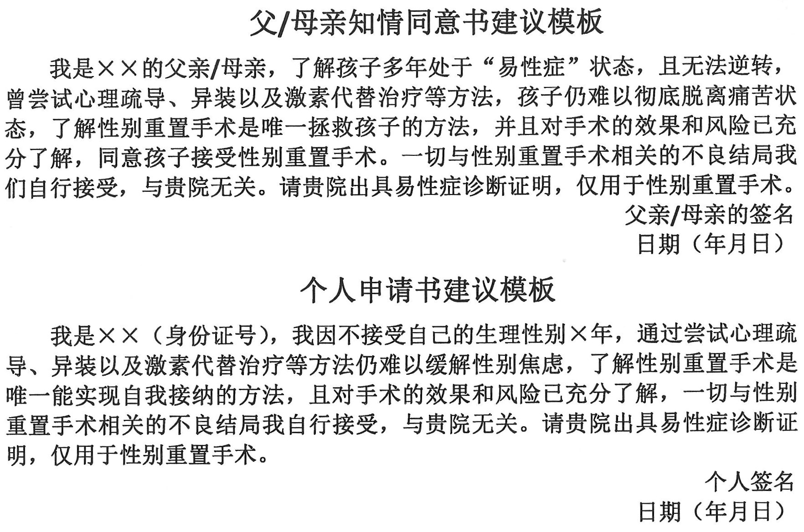
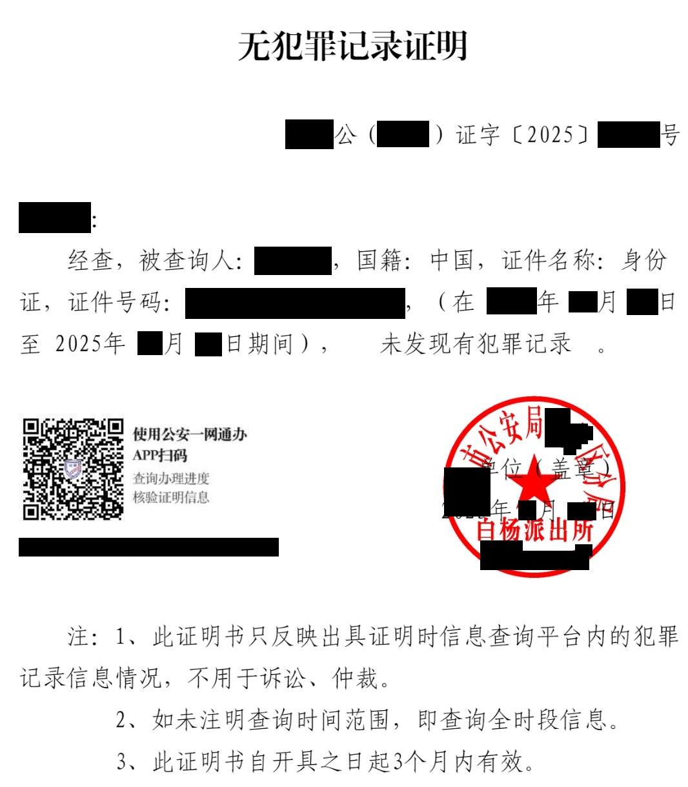

## 概况

[首都医科大学附属北京回龙观医院](https://www.bjhlgh.cn/)（Beijing Huilongguan Hospital，BHLGH）位于 [北京市昌平区回龙观南店路 7 号](https://amap.com/place/B000A0989A)，是北京市卫生健康委、北京市医院管理中心直属的精神卫生专科医疗机构。

## 预约挂号 {#register}

线上预约挂号可通过北京回龙观医院智慧医院微信小程序或 [北京市预约挂号统一平台](https://www.114yygh.com)[^1]。

1. 通过北京市预约挂号统一平台挂号：访问 <https://www.114yygh.com> 或关注微信公众号「[北京 114 预约挂号](weixin://beijing114guahao)」，然后选择北京回龙观医院进行挂号。北京市预约挂号统一平台开放未来七天号源，并于 11:00 放出第八天号源。该平台可挂专家号与特需号，预约时可选择就诊时段。预约时不需要支付挂号费，在取号时支付。
2. 通过回龙观小程序挂号：微信搜索「北京回龙观医院」，搜索结果中显示「预约挂号」，点击进入，添加就诊人并预约挂号。小程序开放未来七天号源，并于 11:00 放出第八天号源。该平台可挂专家号与特需号。预约时不需要支付挂号费，在取号时支付。

线下预约挂号可使用医院内的自助机或到人工窗口。

## 取号就诊 {#visit}

可使用身份证（自费患者）或医保二维码（医保患者）在自助机取号。

## 缴费

可以在自助机进行，支持微信、支付宝、银联卡，人工窗口支持现金。人工窗口可提供收费票据。部分异地医保的二维码可能在自助机上无法识别，如遇此等情况，请至人工窗口或尝试更换不同楼层的自助机以获得医保报销。


每天下午 4:00 后自助机关闭，门诊人工窗口关闭，门诊出口关闭。如遇如此情况，请前往急诊区，那里的人工窗口和出口不会关闭。


## 检查

按要求前往对应位置即可。有的检查项目可能需要排队，请注意合理安排检查顺序。

## 取药

获得处方并缴费后，在一楼药房任意开放窗口排队，将**正方**交给药师即可取药。

## 疾病休假证明与诊断证明书 {#diagnosis}

### 医院对相关医疗文件的规定


开具「易性症」诊断证明书已不再需要介绍信。相关要求仍可能随政策变动，请以医院实际要求为准。



以下是医院对此的基础性的要求，**不代表符合这些要求就可以获得对应证明**。有时想要获得易性症诊断证明书还需要观察期、父母知情同意等等，请与医生沟通。如果需要在北京大学第三医院进行 HRT，只需要复印病历。


开具疾病休假证明的要求如下：

1. 患者须持就诊手册或门诊大病历就诊。
1. 医生根据病情需要，开具休假证明；休息时间长短根据病情需要决定。轻性精神障碍病休一次壹天至贰周，重性精神障碍病休一次不得超过壹个月。
1. 本院只开具与本专业有关的疾病休假证明。
1. 休假证明只说明患者需要病休和休息时间，不作为诊断证明之用。
1. 门诊部盖章有效。

开写假条流程：「挂号就诊」-「医师根据病情需要开出假条」-「二楼西侧服务台盖章」

开具诊断证明书的要求如下：

1. 符合以下条件的，可以开具诊断证明书：
   1. 患者持门诊大病历（门诊病案室建的病历）就诊。
   1. 医师已经明确诊断。若就诊 3 次以上（含 3 次）未明确诊断的，可要求医师转诊或会诊。
   1. 持有关部门介绍信，如：
      1. 凡涉及司法办案的需要，须接到公检法机关等有关部门的介绍信。
      1. 因病退休、伤害、残疾、保险、索赔等应接到有关部门的介绍信。
1. 开具诊断证明书流程：「挂号就诊」-「医师审核条件是否符合，开出诊断证明书」-「二楼西侧服务台护士复核，盖章」
1. 其他说明：
   1. 本院只开具与精神疾病相关的诊断证明。
   1. 门诊部盖章有效。

诊断证明书上会印有当次挂号的科室名称，**不影响**其效力。

### 开具诊断证明书

需要一年观察期，需要已成年，不需要介绍信。观察期内去就诊 4 次，每次间隔一个月以上。观察期满后即可开具诊断证明书。

开具诊断证明书可能需要的材料包括：

1. 其他医生的一次相同诊断
2. 自己的身份证复印，写明自己如何体验性别困扰，使用激素和女性化生活了多久，变性手术决心以及能够承担手术的不良后果。将手写的内容放置在 A4 纸的上方，将身份证正反面复印件放置在下方即可。手写内容模板见下。
3. 父母的身份证复印，写明他们支持、同意手术，也能够承担手术的不良后果。将手写的内容放置在 A4 纸的上方，将身份证正反面复印件放置在下方即可。手写内容模板见下。
4. 无犯罪记录证明。
5. 染色体检查结果（原件或复印件均可）。
6. 如果你和你的父母三个人户口不在一起，需要证明亲属关系，可以去公安局开具亲属关系证明（别说自己有出生医学证明，否则可能不给开）；认可出生医学证明复印件（毕竟有父母姓名和身份证号）。

以上材料需要提交复印件（黑白即可），北京回龙观医院北门出门左转红绿灯处有文印店。


随着政策变动，获取诊断证明书所需的材料也会发生变化，请务必与医生提前沟通，备齐材料，以医生要求为准。

邸医生说精神障碍得到控制半年以上方可开易性症诊断证明，因此以开大证为目的的姐妹们请勿表现出过重的焦虑与抑郁。


开具的诊断证明在二楼分诊台盖章。

诊断证明书如下。



#### 开具诊断证明书使用的各类材料的模板

##### 知情同意书

请注意此处的内容可能有时效性，请向医生索取模板，医生会为你打印如下所示的模板（可能有变化）。






我是××的父亲/母亲,了解孩子多年处于“易性症”状态,且无法逆转, 曾尝试心理疏导、异装以及激素代替治疗等方法,孩子仍难以彻底脱离痛苦状态,了解性别重置手术是唯一拯救孩子的方法,并且对手术的效果和风险已充分了解,同意孩子接受性别重置手术。一切与性别重置手术相关的不良结局我们自行接受,与贵院无关。请贵院出具易性症诊断证明,仅用于性别重置手术。

<a class="block text-right not-prose">父亲/母亲的签名</a>

<a class="block text-right not-prose">日期(年月日)</a>




**个人申请书建议模板**

我是××(身份证号),我因不接受自己的生理性别×年,通过尝试心理疏导、异装以及激素代替治疗等方法仍难以缓解性别焦虑,了解性别重置手术是唯一能实现自我接纳的方法,且对手术的效果和风险已充分了解,一切与性别重置手术相关的不良结局我自行接受,与贵院无关。请贵院出具易性症诊断证明,仅用于性别重置手术。

<a class="block text-right not-prose">个人签名</a>

<a class="block text-right not-prose">日期(年月日)</a>



##### 无犯罪证明

简而言之，可以使用各类在线政务服务平台（可以在户籍所在地或持有有有效居住证地区的政务平台）开具。电子政务平台上生成的 PDF 文件黑白打印即可。

### 注意事项

- 原则上需要跨性别想法持续 2 年及以上，只差一点（如一个月）的话会有所通融。

## 复印病历 {#copy}



持有 **北京回龙观医院** 的写有「易性症」的病历可以在 **北京大学第三医院** 获得 HRT 支持。



可凭条形码，身份证，医保卡，医保电子凭证在自助机器打印。

复印内容：门（急）诊病历和住院病历中的住院志（即入院记录），体温单、医嘱单、化验单、医学影像检查资料、特殊检查（治疗）同意书、护理记录、出院记录等。

办理时间：工作日 08:00 至 15:30

[^1]: 北京市预约挂号统一平台适用于北京二级、三级以上所有公立医院及部分一级医院。
