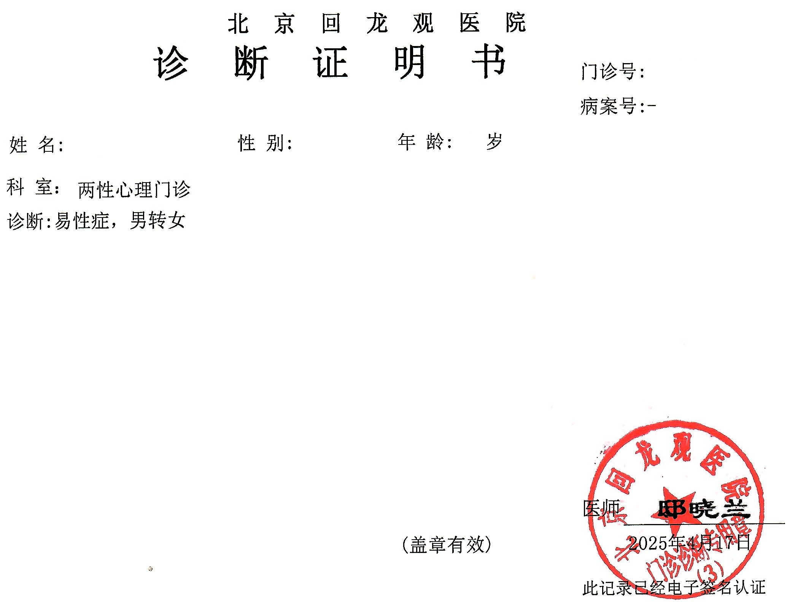



  

医生姓名：[邸晓兰](https://www.haodf.com/doctor/11007.html)
所在医院：[北京回龙观医院]()

## 总述

邸晓兰医生处可以不需要家长并且一次性地获得带有「易性症」诊断的病历，该病历是在北医三院进行 HRT 所需的条件之一。用于 SRS 的诊断证明书则需要三个月一次满一年也即一共四次的复诊，并且要求家长知情。每次复诊医生会催促向家长出柜并表示希望下次家长陪诊。

## 挂号

医生的号比较难抢。如果使用京医通挂号，由于其提前一周 18 点放号，因此需要在周四或周五 18 点踩点抢号，一般在 15 分钟内会被抢光，所以务必提前做好计划和抢号。[^1]

挂号方式详见[北京回龙观医院：预约挂号]()。

## 问诊细节

取号就诊方法参见[北京回龙观医院：取号就诊]()。

### 初诊

初诊会询问较多细节，包括确定性别认同的时间，是否 HRT，家长是否知情，性取向等等，并且会简单评价外观（比如「女性化外表」、「偏女性化外表」等）。随后会开出大量的心理量表和一些生理指标检查。

生理指标检查包括眼动检查 (EM)（注意和反应），超慢脑波（据有关医生表示测量不准确，量表没有太大异常的情况下不看），心率变异（压力评估）和红外热像检查（焦虑相关）。

心理量表包括焦虑自评量表（SAS）、明尼苏达多相个性（MMPI）、人格诊断问卷（PDQ-4+）、威斯康星卡片分类量表（WCST）、防御机制问卷（DSQ）、症状自评量表（SCL-90）、抑郁自评量表（SDS）、压力评估量表 （SAQ）、瑞文推理测验（Raven Test）等。


包含检查费用后不算医保报销价格约在 1000 元左右。可要求医生减少检查项目，这或许可以节省费用至不足 600 元。


首先缴费，然后进行检查。以上检查没有先后顺序，但是超慢脑波需要预约，如果上午就诊去得太晚容易被拖到下午，下午邸晓兰医生可能会换诊室，去分诊台询问即可。因此推荐先去预约超慢脑波，然后剩下看看哪个排队人少做哪个。做完之后拿着结果找邸晓兰医生即可。12:00 - 12:30 为各检查科室的午休时间，因此在时间安排上请务必注意。

在意识清醒的情况下（虽然本页读者应该没有这个问题）量表应是主要的判断依据，但是笔者自身量表评分问题不大，在此无法提供太多信息。从医生的描述可以推测严重的精神病性症状可能会对拿到证明有影响，MMPI 中的一些性别刻板印象的评价中打分得到「女子气」评价可能轻微地有利于得到有关证明，女性化的外表也会更有利，但这些应该不影响开出「易性症」病历。从另一名编辑者的经验来看跨性别的愿望是否足够强烈对获得病历更为重要。（另一名精神疾病更严重的编辑表示，精神病严重程度和 MMPI 量表的 Mf 分数事实上只会对开证有轻微影响，邸晓兰会判断你对跨性别相关事宜的理解与态度综合考虑是否开证，并会提醒你继续进行精神科治疗）

医生在解读完检查结果后会给出诊断，之后会建议日常女装以及出柜，会强调向家长出柜。~~因为被家长投诉过因此表示「劝家长不是我的义务」~~

从近期（2021 年 7 月以来）的成年就诊者的经历来看，如果之前交谈表现正常的话邸晓兰并不会解读检查结果而是直接去复印病历~~检查的钱其实就是打水漂~~。

就诊完成后，可以去门诊服务台申请[复印病历]()，复印的病历即可用于三院的 HRT。

### 复诊

如果想要取得诊断证明书，则需要每三个月后挂号复诊，一般没什么问题就是聊一聊近况，几分钟解决，有家长陪同则视情况而定。如果尚未和家长出柜会继续被催促。

## 开具诊断证明书

需要一年观察期。观察期内去就诊 4 次，每次间隔三个月左右。观察期满后即可开具诊断证明书，流程参见[北京回龙观医院：诊断证明书]()。


随着政策变动，获取诊断证明书所需的材料也会发生变化。可能会需要父母知情同意书、染色体检查结果等。请务必与医生提前沟通，备齐材料。


## 注意事项

- **未成年人**在首次取得京医通实体诊疗卡时需要 **家长身份证原件** 和 **本人身份证原件**。
- 复印病历收现金，也可使用京医通的余额，按页数计费，建议带十几元现金备用。
- 原则上需要跨性别想法持续 2 年及以上，只差一点（如一个月）的话会有所通融。

## 病历样式

## 出诊时刻表


周次,时间,科室,价格
周四,上午,两性心理门诊,100 元
周四,下午,普通精神病/抑郁症门诊,100 元
周五,上午,普通精神病/抑郁症门诊,100 元
周五,下午,普通精神病/抑郁症门诊,100 元


[^1]: 如果是初次挂号，为增大挂号成功概率，可考虑先提前任选一有号医生进行挂号测试直至付款页面。这是由于初次挂号可能需要填写手机验证码、在京居住地等，完成这些步骤可以提高真正挂号的速度。
