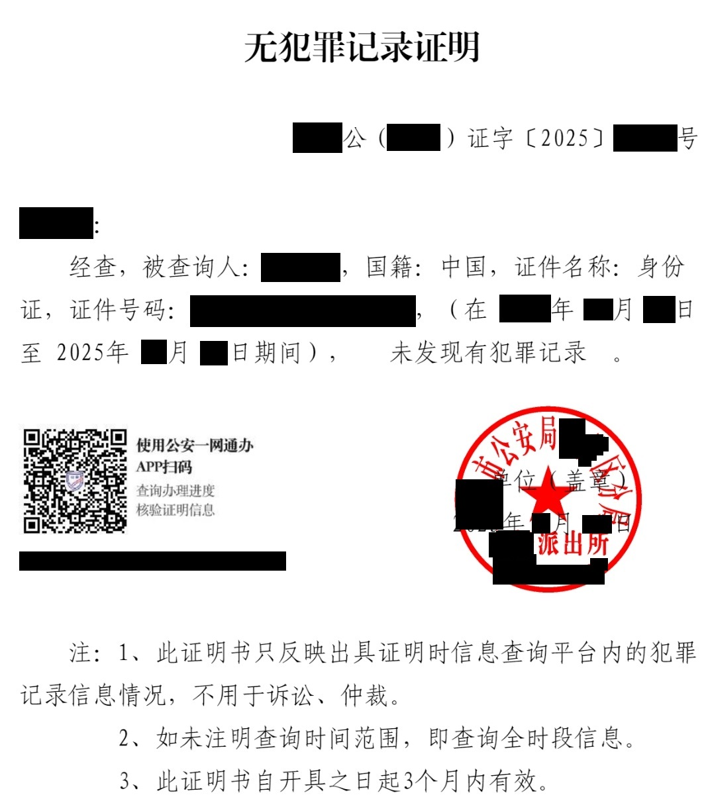



   

医生姓名：[邸晓兰](https://www.haodf.com/doctor/11007.html)
所在医院：[北京回龙观医院]()

## 总述

邸晓兰医生处（成年后）可以不需要家长并且一次性地获得带有「易性症」诊断的病历，该病历是在北医三院进行 HRT 所需的条件之一。用于 SRS 的诊断证明书则需要四次复诊，每两次之间间隔一个月以上，初诊和开具诊断证明间隔一年以上，并且要求家长知情，需要介绍信。每次复诊医生会催促向家长出柜并表示希望下次家长陪诊。

## 挂号

医生的号比较难抢。挂号平台提前一周 11 点放号，因此需要在周四或周五 11 点踩点抢号，一般在 15 分钟内会被抢光，所以务必提前做好计划和抢号。周四的号是专家号，上午在「两性心理门诊」中，下午在「普通精神病/抑郁症门诊」中，挂号费 100 元；周五上午的号是特需号，每个半个小时，挂号费 800 元，下午的号是专家号，在「普通精神病/抑郁症门诊」中，挂号费 100 元。

周四下午原则上不接诊首次因性别认同问题在回龙观医院就诊的就诊者。

挂号方式详见[北京回龙观医院：预约挂号]()。

取号就诊方法参见[北京回龙观医院：取号就诊]()。

### 初诊

建议准备好身份证原件（或社保卡原件）用来线下进行取号。

对于未成年人，初诊最好需要至少一位家长陪同（或家长指定的临时监护人），也可现场与家长电话沟通。若无家长陪同，医生可能会建议退号，也可**在不开具病历的情况下**请求继续正常问诊流程，但医生会要求下次有家长陪同就诊。

初诊会询问较多细节，包括确定性别认同的时间，是否 HRT，家长是否知情，性取向，是否有女装、留头发经历等等，并且会简单评价外观（比如「女性化外表」、「偏女性化外表」等，但如果尚未RLE且不pass，邸医生就不会评价外观，因此天残党无需担心初诊时被评价为「男性化外表」、「偏男性化外表」）。若最终目的是手术请说明，否则她看你意义不明可能顺手给你加上「为合理使用激素就诊于我院，暂不考虑变性手术」这种字样。随后会开出大量的心理量表和一些生理指标检查。

问诊过程中医生会观察体态，若存在过胖过瘦等情况，医生可能会怀疑有进食障碍等疾病，若得到确认将优先处理此类情况。

医生将开具检查及测验量表，检查项目可能包含明尼苏达多相个性（MMPI）、瑞文推理测验（Raven Test）、威斯康星卡片分类量表（WCST）等项目，量表较长答题时间较久，请合理安排时间。



截至2025年4月，医院似乎不再对量表等收取费用，收费项目仅有精神病学检查、丁类评估和初建门诊病历，检查费用为300元左右。



首先缴费，然后完成门诊病历初建，需要填写一位联系人及手机号，然后进行检查。以上检查没有先后顺序。如有超慢脑波，项目可能需要预约，如果上午就诊去得太晚容易被拖到下午，下午邸晓兰医生可能会换诊室，去分诊台询问即可。因此推荐先去预约超慢脑波，然后剩下看看哪个排队人少做哪个。做完之后拿着结果找邸晓兰医生即可。12:00 - 12:30 为各检查科室的午休时间，因此在时间安排上请务必注意。

在意识清醒的情况下（虽然本页读者应该没有这个问题）量表应是主要的判断依据，但是笔者自身量表评分问题不大，在此无法提供太多信息。从医生的描述可以推测严重的精神病性症状可能会对拿到证明有影响，MMPI 中的一些性别刻板印象的评价中打分得到「女子气」评价可能轻微地有利于得到有关证明，女性化的外表也会更有利，但这些应该不影响开出「易性症」病历。从另一名编辑者的经验来看跨性别的愿望是否足够强烈对获得病历更为重要。（另一名精神疾病更严重的编辑表示，精神病严重程度和 MMPI 量表的 Mf 分数事实上只会对开证有轻微影响，邸晓兰会判断你对跨性别相关事宜的理解与态度综合考虑是否开证，并会提醒你继续进行精神科治疗）

医生在解读完检查结果后会给出诊断，之后会建议日常女装（如果是天残党，则可能不会建议日常女装）以及出柜，会强调向家长出柜。~~因为被家长投诉过因此表示「劝家长不是我的义务」~~

从近期的就诊者的经历来看，如果之前交谈表现正常的话邸晓兰并不会解读检查结果而是直接去复印病历~~检查的钱其实就是打水漂~~。这有可能造成「家长认为该医生不够权威」的问题，需要引起注意。

就诊完成后，可以去门诊服务台申请[复印病历]()，复印的病历即可用于三院的 HRT。
需要注意，病案窗口工作人员表示病历复印必须携带实体卡证（身份证或社保卡）或线上微信小程序申请病历复印邮寄，若无法提供也可携带证件的复印件（在同一面上）。

### 复诊

如果想要取得诊断证明书，则需要间隔一个月以上挂号复诊，一般没什么问题就是聊一聊近况，几分钟解决，有家长陪同则视情况而定。如果尚未和家长出柜会继续被催促。

部分姐妹可能会视情况被邸晓兰医生介绍给别的家长以证明性别转换后的一些情况，会被要求你和该家长进行交流你性别转换后的体验，经验和教训。这可能对不擅长社交的姐妹不友好。


## 开具诊断证明书

需要一年观察期，需要已成年，需要[介绍信]()。观察期内去就诊 4 次，每次间隔一个月以上。观察期满后即可开具诊断证明书，流程参见[北京回龙观医院：诊断证明书]()。

当前（本人开具诊断证明书时）不再需要介绍信。

开具诊断证明书可能需要的材料包括：

1. 其他医生的一次相同诊断
2. 自己的身份证复印，写明自己如何体验性别困扰，使用激素和女性化生活了多久，变性手术决心以及能够承担手术的不良后果。将手写的内容放置在 A4 纸的上方，将身份证正反面复印件放置在下方即可。手写内容模板见下。
3. 父母的身份证复印，写明他们支持、同意手术，也能够承担手术的不良后果。将手写的内容放置在 A4 纸的上方，将身份证正反面复印件放置在下方即可。手写内容模板见下。
4. 无犯罪记录证明。
5. 染色体检查结果（原件或复印件均可）。
6. 如果你和你的父母三个人户口不在一起，需要证明亲属关系，可以去公安局开具亲属关系证明（别说自己有出生医学证明，否则可能不给开）；认可出生医学证明复印件（毕竟有父母姓名和身份证号）。

以上材料需要提交复印件（黑白即可），北京回龙观医院北门出门左转红绿灯处有文印店。


随着政策变动，获取诊断证明书所需的材料也会发生变化，请务必与医生提前沟通，备齐材料，以医生要求为准。

邸医生说精神障碍得到控制半年以上方可开易性症诊断证明，因此以开大证为目的的姐妹们请勿表现出过重的焦虑与抑郁。


开具的诊断证明在二楼分诊台盖章。

### 开具诊断证明书使用的各类材料的模板

#### 知情同意书

请注意此处的内容可能有时效性，请向医生索取模板，医生会为你打印如下所示的模板（可能有变化）。






我是××的父亲/母亲,了解孩子多年处于“易性症”状态,且无法逆转,
曾尝试心理疏导、异装以及激素代替治疗等方法,孩子仍难以彻底脱离痛苦状
态,了解性别重置手术是唯一拯救孩子的方法,并且对手术的效果和风险已充
分了解,同意孩子接受性别重置手术。一切与性别重置手术相关的不良结局我
们自行接受,与贵院无关。请贵院出具易性症诊断证明,仅用于性别重置手术。

父亲/母亲的签名

日期(年月日)



个人申请书建议模板
我是××(身份证号),我因不接受自己的生理性别×年,通过尝试心理疏
导、异装以及激素代替治疗等方法仍难以缓解性别焦虑,了解性别重置手术是
唯一能实现自我接纳的方法,且对手术的效果和风险已充分了解,一切与性别
重置手术相关的不良结局我自行接受,与贵院无关。请贵院出具易性症诊断证
明,仅用于性别重置手术。

个人签名

日期(年月日)


#### 无犯罪证明

简而言之，可以使用各类在线政务服务平台（可以在户籍所在地或持有有有效居住证地区的政务平台）开具。电子政务平台上生成的 PDF 文件黑白打印即可。



## 注意事项

- 原则上需要跨性别想法持续 2 年及以上，只差一点（如一个月）的话会有所通融。

## 病历样式

病历可能会根据就诊者情况掉落多种不同诊断，包括但不限于「易性症」「易性症待诊」「易性症？」「性别认同障碍」「性别不一致」「双重异装症可能大」「非二元可能大」。



目前医生已不再签名，改为电子签名。



另外，自助机上似乎可以打印电子版病历（尚未测试）。

诊断证明书如下。



## 出诊时刻表

```csv
周次,时间,科室,价格,备注
周四,上午,两性心理门诊,100 元,
周四,下午,普通精神科（含抑郁症）门诊,100 元,不看初诊
周五,上午,特需门诊,800 元,
```
