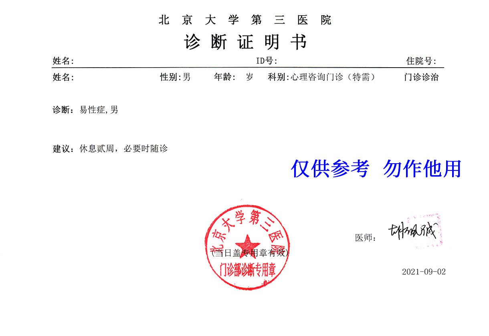





 
 


医生姓名：[胡佩诚](https://www.haodf.com/doctor/12034.html)
所在医院：[北京大学第三医院]()

## 挂号

如何挂号详见 [北医三院：预约挂号]()。

医生号源极少，且不能通过北京市预约挂号统一平台挂号。每周日上午 7:00 准时放号，只需反复切换日期即可刷出号源。

医生出诊时间详见 [胡佩诚：出诊时刻表]()。

## 问诊细节

备注：据潘柏林说尚无稳定的开证标准

- 到地方护士会先开一个心理治疗，147 元，缴费后才见到医生。
- 问诊主要方式为自述和提问，请梳理清楚自己的性别障碍史/是否 RLE/用药情况/对各种医疗方案的了解等内容。若 HRT，会考虑父母态度，但不硬性要求父母到场。对医疗方案有明确了解、对未来有明确规划、有好的 RLE 体验、外观/声音 pass 是考虑的重点。
- 没有明确的诊断标准，也没有必须的检查项目。自述中途，胡会观察、提问并依其经验判断，如似说谎或表现出抑郁、幻想等精神疾病倾向则会要求对应检查。表现得自然、诚实为上。
- 没有小证（即假条），硬性要求满 20 岁开 SRS 用证明，若就诊时满足其他条件但未满 20 岁需满 20 岁后复诊开证。为保护个人隐私，病历由其助手记录，保存在专用设备内，原则上不出诊室。是否可以提取打印未知。
- 条件好的可能一次开大证：如父母同意、外貌 pass、年龄大、已 RLE。

## 未成年就诊注意事项

- 有案例显示胡佩诚不少于两次对**持病历未成年跨儿拒绝开证**并表示回龙观病历无法在北医三院获得任何激素治疗。但实际未成年持回龙观病历(至少)可在北医三院内分泌科获得gnrha。
- 未成年跨儿如果家长不坚定支持，慎重考虑带家长前往胡处就诊或向胡咨询内分泌治疗。
- 对于持病历持证跨儿可以直接找潘刘，无证建议优先选择回龙观医院或北大六院。

## 注意事项

- 除挂号费外还需**额外缴纳心理治疗费用 147 元**，加上挂号费后实际消费 647 元（2022 年 8 月）
- 硬性要求有一年跨性别心理咨询或就诊经历（卫生部规定），会写在病历和诊断上，请明确说明（不要求纸质证明）
- 如有手术安排/家长同意书请备好并说明
- 对性取向要求不明，据传比较友好，不必刻意说谎
- 若对 HRT 及手术后的体验犹豫不决，可咨询 [北医三院]() 后复来精神科就诊。

## 其他需注意事项

- 胡佩诚与邸晓兰似乎意见不合，主要体现在胡并不认可邸所开具的病历；同样邸并不推荐来胡处就诊。

## 证明样式



## 出诊时刻表 {#schedule}

```csv
周次,时间,科室,价格
周四,下午,心理咨询门诊（特需）,500 元
```
