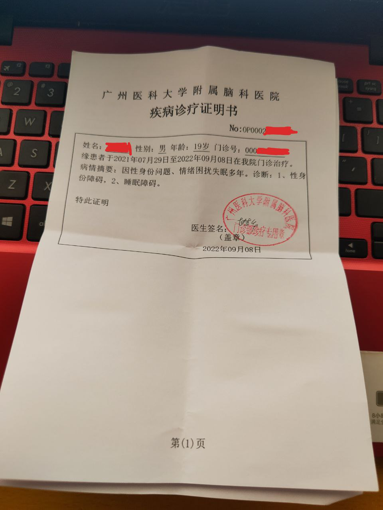



医生姓名: [赵素华](https://yyk.familydoctor.com.cn/doctor/161469/)
所在医院: [广州医科大学附属脑科医院](https://surl.amap.com/cqAixUZdm1)

## 出诊时间

```csv
周次,时间,科室,挂号费
星期四,上午,临床心理科门诊（荔湾）,300 元
```

附注：

- 挂号费包含 30/40 分钟心理咨询。
- 首诊时可能需要做题检查（前往 [芳村总院](https://amap.com/place/B00140HU1B)）。

## 挂号方式

- 微信公众号：「[广州医科大学附属脑科医院服务号](weixin://gh_3410fe88a5d4)」
  - 院区：荔湾路门诊（中山八路）
  - 科室：临床心理科门诊（荔湾）

## 注意事项

- 无需介绍信；
- 可能无需家长；
- 医生会比较谨慎，首诊可能不会开证；
- 医生十分友跨，可以放心与之交流。

## 证明样式

医生会开出一张病历，和一张诊疗证明


