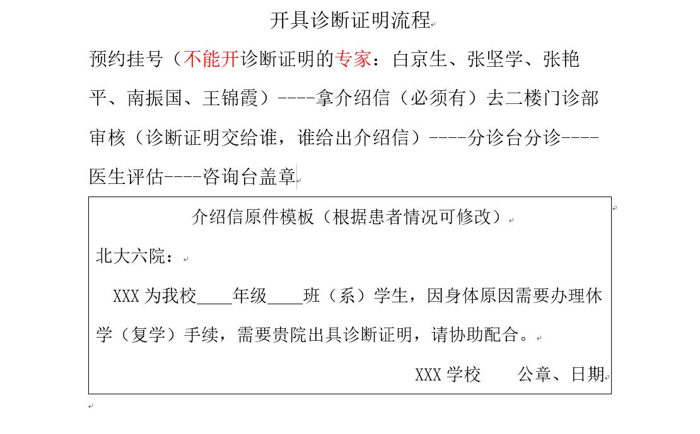
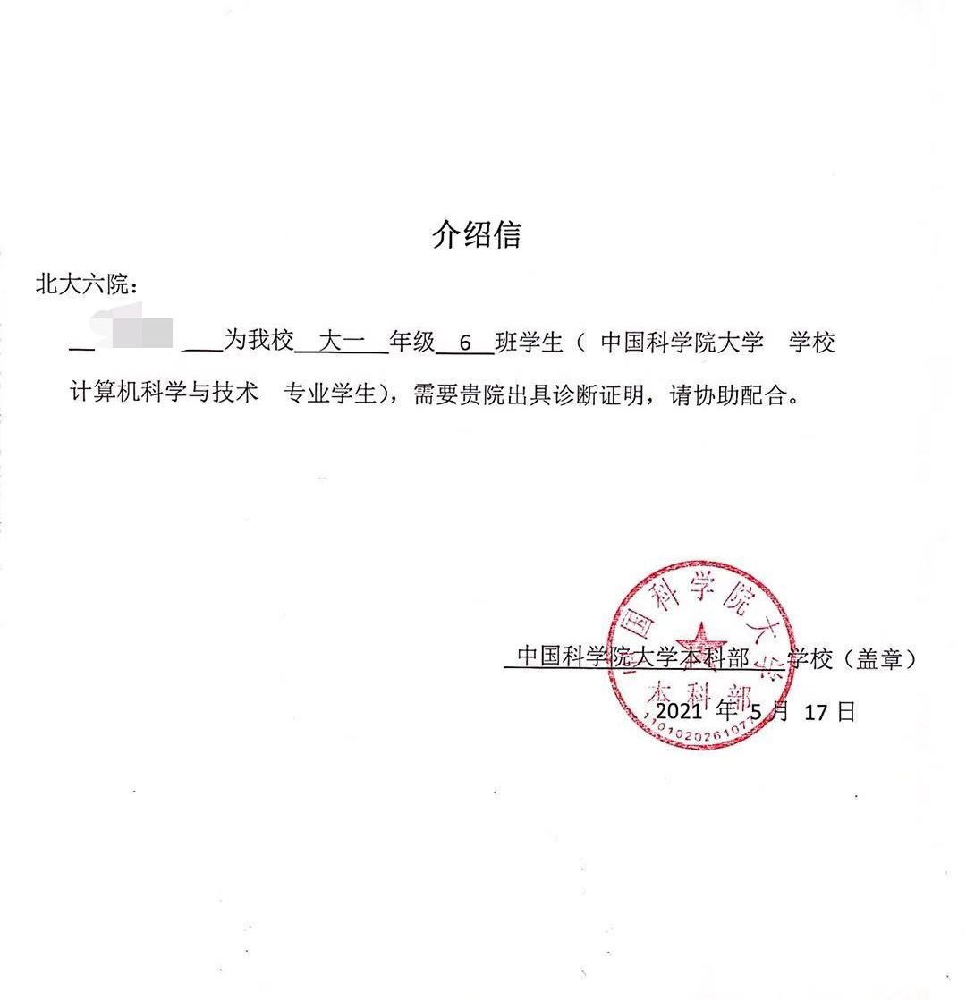

某些医院开具诊断证明需要介绍信。全日制在校学生介绍信一般由学校开具、有工作时一般由工作单位开具，若非在读学生且无全职工作则需要社区协助开介绍信。以下附几种样本。


提示：此为北京大学第六医院参考介绍信样本。（2021-07-19）据门诊部护士称，实际需要的是【在读证明】（因为跨性别者需要的是 RLE 而不是休学嘛）。

这种证明在很多 211 院校可以自助打印（甚至往往没有有效期限限制）从而避免向师长出柜，不过姐妹们有条件的话最好还是让对跨性别友好的辅导员或导师书写额外说明和签字。

另外，2022 年起由于「性别不一致」在 [ICD-11]() 中的去精神疾病化，流程中的「明确疾病诊断」一步的实际操作可能发生变化，有待其他姐妹补充。














