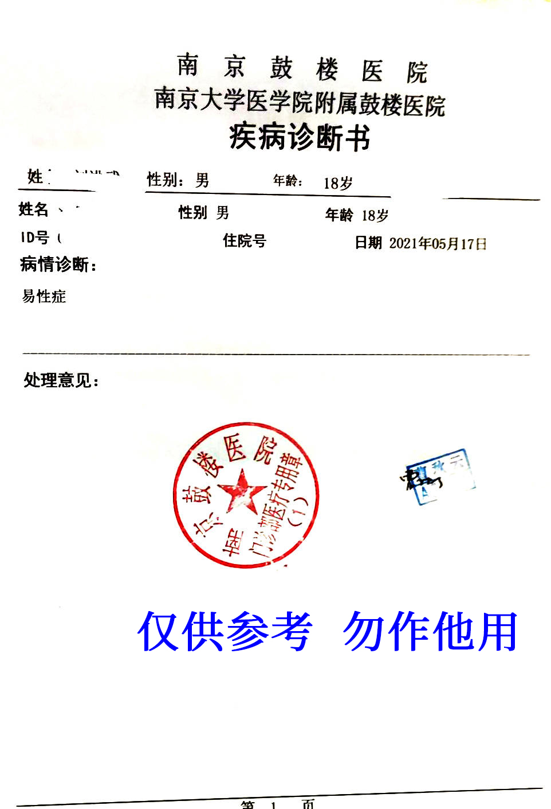



  

医生姓名：[曹秋云](https://www.haodf.com/doctor/24012.html)

科室：医学心理科

所在医院：[南京大学医学院附属鼓楼医院](https://amap.com/place/B00190B48R)

所在医院：[南京鼓楼医院江北国际医院](https://amap.com/place/B0FFH0UTCD)

## 挂号 {#register}

可在微信公众号「[南京卫生 12320](weixin://Health_NJ)」或「[南京鼓楼医院互联网医院](weixin://gh_f33184183ded)」进行挂号

## 注意事项 {#caveats}

- 曹秋云医师的号非常难挂（亲身经历），30 秒就会出现无号的情况
- 鼓楼医院上午 8 点准时开放号源
- 首次就诊，线上挂号以后需要线下要去自助机开通「一卡通」
- 诊断证明 需要到 二楼护士站 进行 盖章

## 问诊流程 {#workflow}

- 询问何时开始有想法
- 排除易装癖
  询问是 喜欢女装 还是 想成为女性
- 询问其它跨性别相关问题
  如即使接受医疗手段，也与 顺性别女性 有 生理的区别
- 询问父母是否知情，态度如何。
  **据最新反馈，需要家长同意。**
  至少要家长明确表示不反对或尊重你的意愿之类，需要双方家长，可以使用电话等形式联系
- 如携带在其他医院所做的 MMPI 结果（如果有的话），有概率免除重做之苦。
  MMPI 不用去心理评测室，交完钱后，回去重新报道。曹医生会给你扫码，然后可微信小程序做 MMPI。
  注 1：手机系统语言非中文，可能导致小程序无法使用。
  注 2：可能需要将网络代理工具关闭或使用白名单模式，否则题目可能无法加载。
- 有一定几率获得 1 年观察期
- 曹秋云的主要量表依据就是 MMPI

Pass 会更好一些哦

## 证明样式 {#prrof}

诊断证明：

病历样例（16 岁）：

