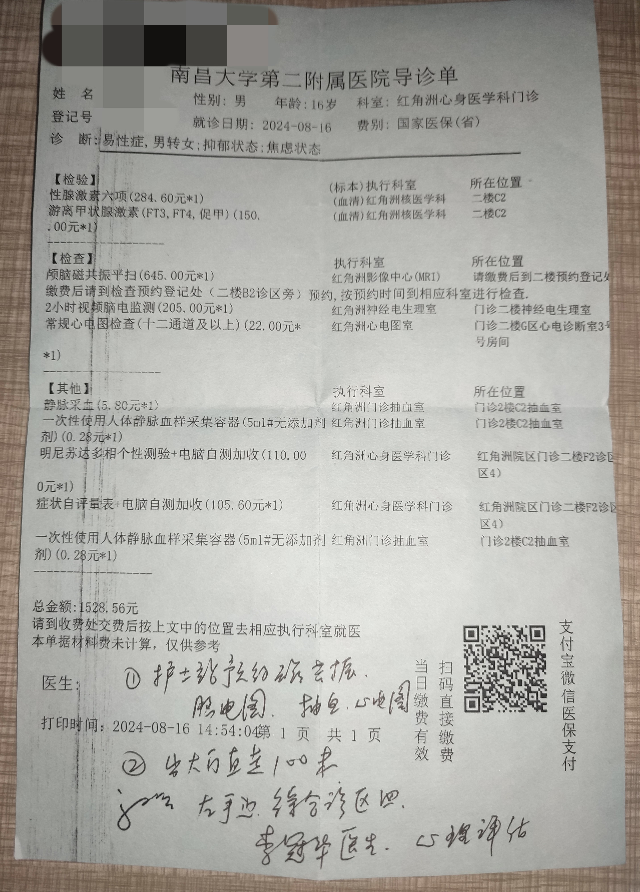

   

医生姓名：[郭明](https://www.haodf.com/doctor/281543.html)

所在医院：[南昌大学第二附属医院（东湖院区）](https://amap.com/place/B031702VZZ)

## 挂号

微信公众号「[南昌大学第二附属医院医疗服务](weixin://ndefyylfw)」-「预约挂号」-「搜索郭明（主任医师）」-「东湖身心医学科」
接诊时间：周一、周二、周五有号

## 注意事项

需要复诊至少五次，总时长跨度在三个月以上，并且至少一次需要家长陪同，父母表示明确支持，即可开到证明。

医生性格比较直率，若心理承受能力差需做好准备

证明可用于南昌大学第二附属医院进行 HRT．

第一次就诊会开性激素六项、颅脑磁共振平扫、明尼苏达多项个性测验、症状自评量表等检查，具体花费可参考下方两份导诊单。后续复诊一般只需挂号费。

部分检查可能当天不能做，需要预约，需提前做好准备




## 证明样式



## 出诊时刻表

```csv
周次,时间,科室,价格
周一,上午 8:00-11:52,心身医学科,25 元
周二,上午 8:00-11:52、下午 14:10-17:10,心身医学科,25 元
周五,上午 8:00-11:52,心身医学科 特需,300 元
```
