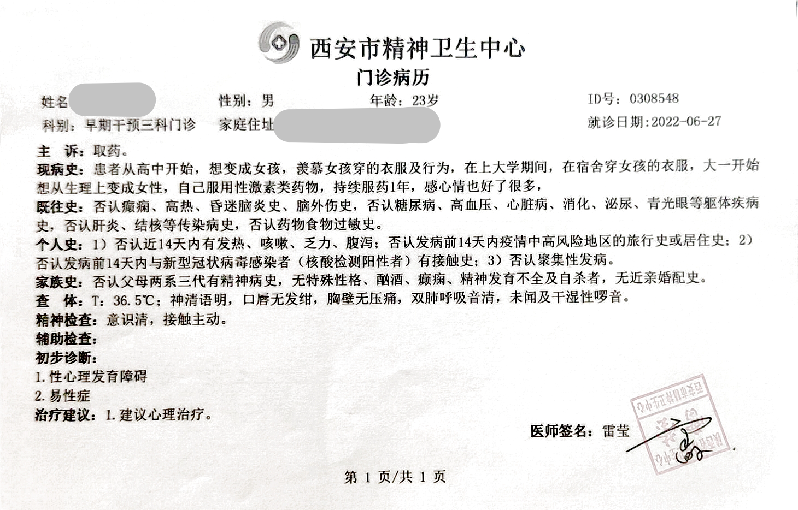



医生姓名：[雷莹](https://www.xajwzx.com/detail-1347.aspx)

所在医院：[西安市精神卫生中心](https://www.xajwzx.com/)

## 费用构成

挂号费： 15 元

首次问诊还需：

- 心里测试量表：价格暂不详
（本人自带了其他医院的MMPI、抑郁自评量表、焦虑自评量表、压力评估量表及SCL-90表。）

- 心电图、心率变异分析、眼动测定、脑电地形图、脑功能检查：共 411 元

## 挂号方式

微信搜索「西安市精神卫生中心智慧医院公众号」-「诊疗服务」-「预约挂号」-「早期干预三科」

医生坐诊时间不确定，可以在「西安市精神卫生中心智慧医院公众号」-「智慧医院」-「医生排班」处查找本周的坐诊时间并提前挂号
排班表的更新时间是每周一。（若排班表里没有雷莹医生，可能是医生在休假，请等待一到两周时间再次查询。）

## 问诊细节

医生一般坐诊的诊室在门诊二楼西侧，若为预约挂号，需要在预约时间开始的时候用微信扫墙上的签到码排号。
「西安市精神卫生中心智慧医院公众号」-「诊疗服务」-「排队签到」

向医生说明前来问诊的原因，可能会被告知“易性症已经不再算精神疾病，属于个人自由，这个证明现在好多医院都不开了”。
可以用 自己希望进行性别重置手术，这个手术在国内目前还是需要开证明的 之类的理由来解释。

医生很和蔼，可以让医生在“性心理发育障碍”后写上 “易性症”/“性别烦躁”/“性别不一致” 的字样使证明有效。

首次问诊会先问父母是否知情，然后让自述经历，如：
从什么时候开始确定不想当男孩子（心理上不想当和生理上不想当），
小的时候觉得自己有一些恨怪的想法（羡慕女孩子的打扮），
采取了哪些改变自己的措施（女性外表，伪音，HRT等），
以及改变的效果如何（在外面被叫小姐姐，伪音学不会，HRT效果等）。

做完检查并让医生看完结果后，如果没有其他明显异常，会先开具一份**门诊病历**。

随后在此院再复诊两次，复诊主要询问心情变化，复诊第二次（算上首次问诊是第三次）时即可开具**诊断证明**，需要在一楼导医台处**盖章生效**。

## 注意事项

- 就诊预约时间：
每次来看雷医生的人都很多，建议挂**上午比较早的号**-选8:00至8:30，否则会等待很长时间，因为看检查结果的人也很多。

医生坐诊时间为一整天，不用担心做不完检查或者看不了结果。

- 复诊：
间隔时间理论上为 3 至 4 天，挂任何医生的号都可以，但此院内雷莹医生对于跨性别了解程度最高，其他医生可能存在不了解或不友好的情况
所以**复诊也尽量挂雷医生的号**。

## 证明样式

