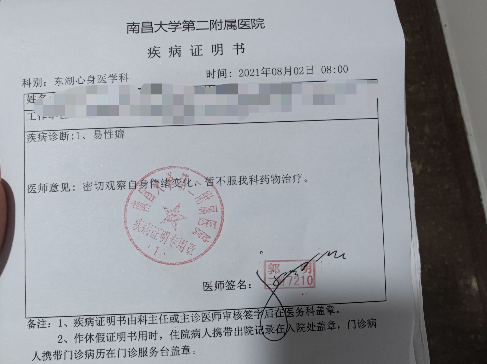



医生姓名：[郭明](https://www.haodf.com/doctor/281543.html)

所在医院：[南昌大学第二附属医院（东湖院区）](https://amap.com/place/B031702VZZ)

## 挂号

微信公众号「南昌大学第二附属医院医疗服务」-「预约挂号」-「搜索郭明（主任医师）」-「东湖身心医学科」
接诊时间：周一、周二、周五有号
挂号费：25 元。

## 问诊细节

新开发的医师，感觉特别松，问什么回答什么就好。

## 注意事项

需要复诊三次，一次间隔一个月，即可开到证明。

证明可用于南昌大学第二附属医院进行 HRT．

第一次就诊会开性激素六项（310 元）、颅脑 CT 平扫（266 元）、明尼苏达多项个性测验（100 元）、症状自评量表（70 元）等检查。后续复诊只需挂号费。

## 证明样式

## 出诊时刻表


周次,时间,科室,价格
周一,上午 8:00-11:52,心身医学科,25 元
周二,上午 8:00-11:52、下午 14:10-17:10,心身医学科,25 元
周五,上午 8:00-11:52,心身医学科,25 元

