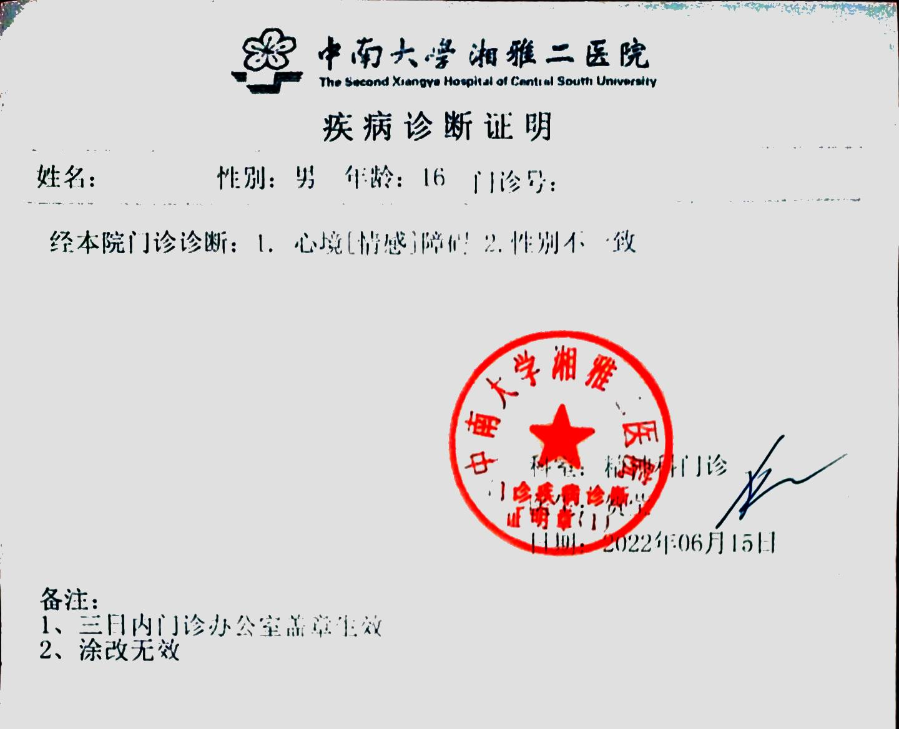

 
 

医生姓名：[贺莹](https://wy.guahao.com/expert/819738df-5ae6-4bc3-83df-aad260927d97000)

所在医院：[中南大学湘雅二医院 - 精卫楼](https://amap.com/place/B0FFGCX8WS)

总费用：10 元 ~ 约 400 元（取决于查不查激素）

## 挂号方式

不开门诊，在进行课题研究"跨性别人群心理咨询与评估"，通过其以招募研究对象为目的散布的联系方式取得联系后，约定时间直接到中南大学湘雅二医院某办公室。

## 问诊细节

投稿者好像是项目里第一个去找她的，所以后续情况可能有变而不太清楚。

在去找她之前她就应该通过聊天对你的基本情况有一定了解了。

到了之后会聊一点现状之类的，然后让下去建卡和买病历（第一次去二院的才需要）。办好之后上来找她同事做记忆力，计算力等测评（免费）。包括听对方念一组词语然后尽可能复述，限定时间内尽可能快读出指定文字/图案的实际颜色（比如蓝色油墨印刷的"绿"），自评家庭关系、自杀倾向、自残行为、校园霸凌、自我认知等量表。

然后就是自述和问答，因为我比较能聊的关系感觉大部分时间是我在说。
会问到家里情况，即使表示家里不甚支持似乎也没影响。
首先是从何时开始有想法，然后采取了什么行动，以及行动的感受/影响。
然后基本按照时间线谈论心路历程和变化，对于关键节点仍为"想法-作为-影响"的问答。
期间穿插问到恋爱情况和性的方面，包括性幻想、性经历、性行为等。
基于上面的"自己采取了什么行为（如女装、脱毛、自行 HRT 等）"会问及之后想要什么样的改变（第一性征/第二性征/面容/体型/声音）。
由于没有刻意隐藏之前自残的疤所以会询问原因，判断是否处于情绪稳定意识正常的情况。

手写证明，需要去另一栋楼盖章生效。

## 注意事项

是湘雅二院不是湘雅医院，虽然隔得不远。

近期没测过激素六项的话她会让你开始咨询前测一下（必做的自费），所以去之前禁食八小时。但是就算是测了六项还是得抽血两管（但是老娘没吃早饭没喝水所以血浓得很所以一管抽不够量所以挨了三管）存样供研究，所以还是不能吃早饭，不过就不用交三百多测试费用了。第一次去带身份证和现金，至少建卡和买病历是只收现金的，这需要 10 块。

问及年龄，18 或 20 以下可能需要家长陪同，尚不清楚，但因为已经 21 岁故直接跳过。

初次的证明即有"易性症"字样，医嘱是心理咨询治疗，需要在随后的一年内多次联系进行心理咨询（即"扭转治疗"，但她挺友好的）无效才能转为建议手术治疗。

还是比较按照规程的，因为提及曾出现了跟着一群男生练肌肉的自我矫正过程，被认为是反复现象，故记录最早也得 5 年无反复期过后才能进行手术。

湖南目前应该是没有能根据假条开具 HRT 处方的医院，需要去东部地区。

可前往湘雅三医院龙智医生处开具 HRT 处方。

有意向建立和维持本地的跨性别社群，若就医者情绪稳定境况较好，会希望其能担任志愿者。

## 证明样式

诊断证明

病历部分

## 出诊时刻

不开门诊，自己和她约时间去办公室，由于会需要空腹抽血所以大概会尽可能安排在早上
