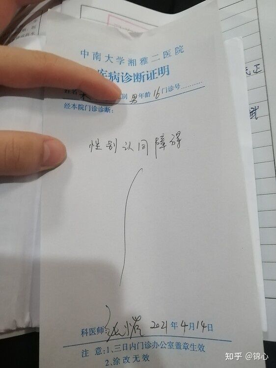



医生姓名：[张小崔](https://www.haodf.com/doctor/4995462606.html)

所在医院：[中南大学湘雅二医院 - 精卫楼](https://amap.com/place/B0FFGCX8WS)

出诊时间：<https://www.xyeyy.com/4/31/825/content_38405.html>

## 挂号方式

微信/支付宝搜索小程序「中南大学湘雅二医院]-预约挂号-医学心理中心-心理咨询门诊，每晚八点放下周号源。出诊时间可在 [好大夫在线](https://www.haodf.com/doctor/4995462606/xinxi-menzhen.html) 查询

## 问诊细节

**经原作者[许可](https://github.com/mtf-wiki/MtF-Wiki/issues/481#issuecomment-1146789611)，整理自[中南大学湘雅二医院跨性别就诊经历 · Lhc_fl Home](https://lhcfl.github.io/2021/04/16/%E4%B8%AD%E5%8D%97%E5%A4%A7%E5%AD%A6%E6%B9%98%E9%9B%85%E4%BA%8C%E5%8C%BB%E9%99%A2%E6%B8%B8%E8%AE%B0/)**

心理咨询门诊位于精卫楼六楼，就诊人员较多可能需要长时间耐心等待。

张医生会查看病历本并了解基本情况，询问诸如“什么时候开始的”之类的常见问题。

张医生会帮助向监护人解释说明跨性别相关的一些信息，倾向于跨性别先天成因较多，基本没有扭转可能。

可以由监护人以向学校交代为由要求开具“性别认同障碍”证明

张医生和她的学生正在进行跨性别成因的研究项目，会询问就诊者是否愿意免费做一些检查。具体检查内容是一个27页的心理量表，主要包括家庭状况，童年特点，社交情况，是否抑郁自残等，以及一项EPR检查。她同时希望就诊者可以推荐更多跨性别群体前来诊疗。

感受：

- 要提前挂号！要提前挂号！要提前挂号！
- 张小崔医生非常友善和蔼。
- 家长党是个很大加分点，家长友善接受的话会更容易开到证明。
- 穿着打扮建议偏向女性化外表
- 不需要做 MMPI、核磁共振等检查
- 医生会询问抑郁情况等其他心理健康状况

## 注意事项

1. 是湘雅二院不是湘雅医院，虽然隔得不远。
1. 第一次来需要在自助机办理诊疗卡，已经注册线上诊疗卡的需要在自助机领取实体卡。另需要在一楼缴费窗口购买病历本，支持使用微信/支付宝付款。

## 证明样式

