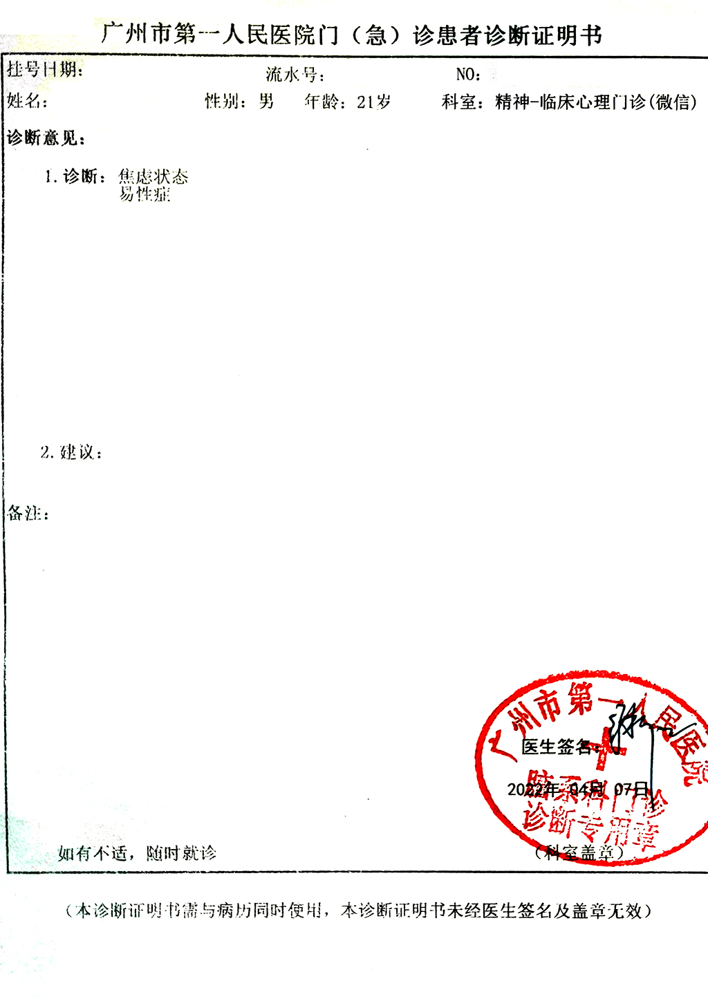

 

徐利敏医生告知，广州市第一人民医院的精神科，所有医生都有看性心理的资质，不需要只找徐医生。

## 挂号

小程序「广州市第一人民医院」挂号，精神-临床心理门诊。

徐医生为每周四上午出诊，挂号费为 20 元

## 问诊流程

初诊需在门诊护士站报到，填写心理问卷，包括艾森克个性测验、临床总体印象量表、匹兹堡睡眠质量量表、躁狂状态评测量表、症状自评量表、宗氏焦虑自评量表、宗氏抑郁自评量表、首诊心理检查，

共计 217 元。其中「首诊心理检查」价格为 80 元，此项收费为非必需项目， 可与医生护士协商退款

医生提问：什么时候出现这种感觉、什么时候出现负面情绪、有无自杀史、有无服用激素等等

关于家长方面只有少量交流

## 注意事项

徐利敏医生的初诊患者疑似不按照就诊报到顺序进行排号，会一直等到所有复诊患者就诊完毕后再按照报到顺序依次就诊。故建议挂11:30-12:00时间段的号以节省等待时间。

## 证明样式

