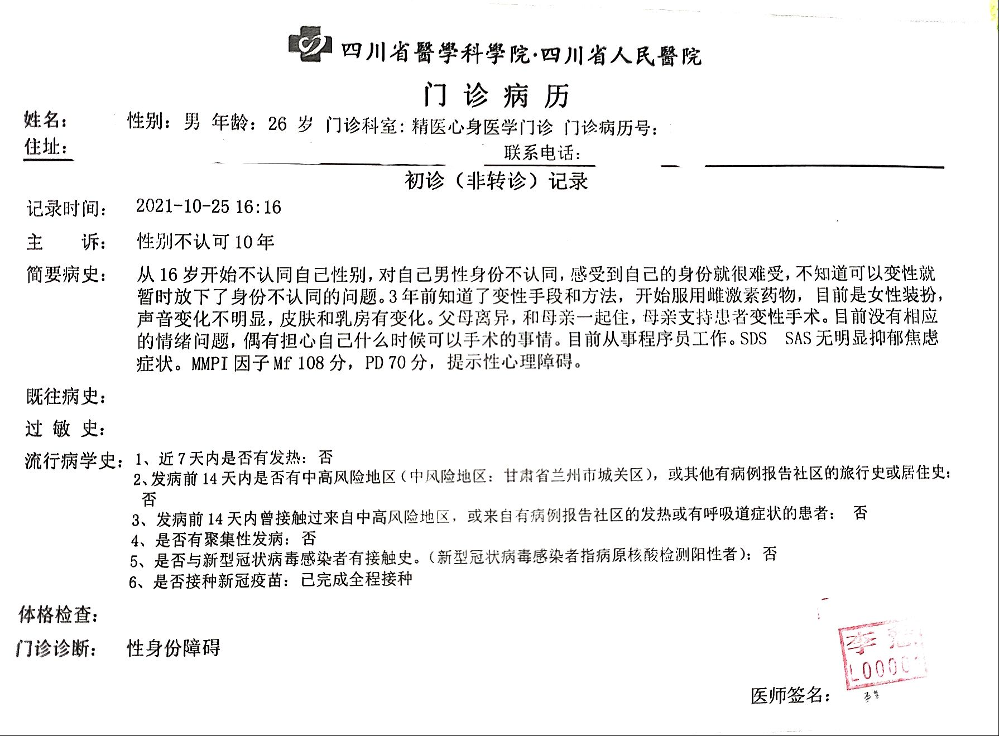



 

医生姓名：[李慧](http://www.scsjsyxzx.com/physician/2021/4oeEva0B.html)

所在医院：[四川省人民医院（四川省精神医学中心院区）](https://amap.com/place/B0FFJAYKFH)

出诊时刻：<http://www.scsjsyxzx.com/patient_scheduling/>

## 总述

李慧医生非常关心就诊人感受，用语及态度非常体贴，可一次性在无家长情况下开出「性身份障碍」的病历及证明且落款为四川省人民医院，含金量较高，方便日后在四川省人民医院内分泌或华西医院内分泌进行 HRT，以及日后在华西医院进行 SRS 手术中使用。

记得主动向医生表述需要开「门诊疾病诊断证明书」，不然医生有些时候会忘记开证明而只给病历。

如果囊中羞涩请务必和李慧医生说明，这样她会使用问诊代替量表，除挂号费外无需支付任何其他费用

## 住宿

如果外地来要在医院附近住的话, 推荐 红芙蓉酒店, 房间干净整洁, 120 元/天

## 费用

挂号费：15 元

其他费用：SAS、MMPI、SCL-90、SDS 量表总和 248 元（非必须）

## 挂号

四川省精神医学中心 官方公众号，心身医学门诊

**注意医院下班非常早, 挂号记得早点挂**
(2021 年 10 月 25 日排 21 号, 16:20 才轮到, 然后检查完回去找医生, 17:10 差了十几分钟, 医院下班了, 导致证明无法盖章)

16 岁以下需每个月复诊一次

16 岁以上可一次性当天开证

网上挂号

## 不开证触发条件

- 明显能感觉到情绪或行为异常的不开证
- 和家里冲突极大的不开证要求带家长去医院劝解或者自行沟通后才开

## 问诊细节

进去后会先进行简单的聊天消除就诊人的紧张感

询问感受与打算及首次发现想法的年限

正常情况下会让就诊人进行 SAS、MMPI、SCL-90、SDS 测试，但如果诊人主动向李慧医生说明不想进行量表测试并说明原因，李慧医生将会对就诊人口头询问问题代替量表

如果带了家长会帮忙向家长科普劝导

复诊主要是询问是否有想法的改变，询问近况

## 证明样式

## HRT

该院的 [王小红]() 提供 HRT 治疗

## SRS

该院的 [游晓波]() 提供 SRS 治疗
