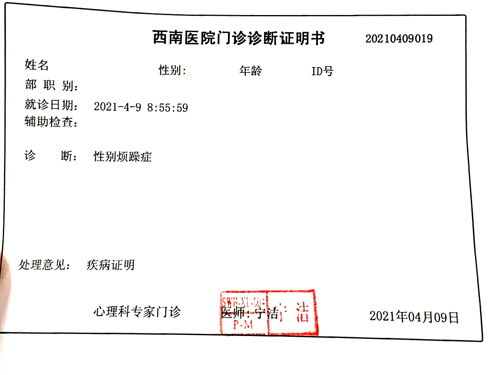



 

医生姓名：[宁洁](https://www.haodf.com/doctor/1129160221.html)

所在医院：[重庆医科大学附属第三医院](https://amap.com/place/B0FFGPSPQC)


该医生之前任职西南医院，现已转任重庆医科大学附属第三医院临床心理科，转任后暂无开证记录，本页面所提供的证明为之前在西南医院所开


## 挂号

挂号方法参见 [本站板块-任正伽]()

## 问诊细节

进去后直接说目的，能懂

询问感受与打算

量表：SCL90、MMPI

如果带了家长会帮忙向家长科普劝导

复诊主要是询问是否有想法的改变，询问近况

## 证明样式

