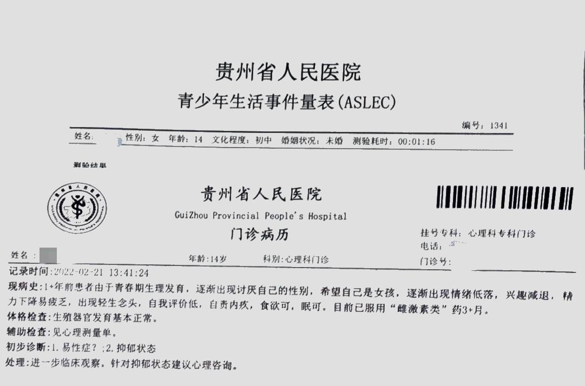

  

# 医生信息
医生姓名：吴勇

所在医院：[贵州省人民医院]](https://amap.com/place/B035300VC0)

吴医生可以在没有家长的情况下一次开出带有“易性症”的门诊病历（贵州暂未实行[ICD-11]()）

  
不要找同院的主任医师向慧，她是不会一次开证的（包括门诊病历也不会一次开）  


# 挂号
关注贵州省人民医院的官方公众号，点击“患者服务”后根据提示建卡  
微信公众号：贵州省人民医院  
  
科室是心理科专科门诊，直接找这位医生就可以，挂号费5.5元

# 出诊时刻
  
上午,8:00-11:45  
下午,13:00-16:45  
  

由于是主治医师，他的号很好挂，不像某位向医生的号不好挂还不一次开

# 细节
进入诊室后，直接说目的，然后医生会询问你的情况，包括但不限于想法、近况、心情、有MtF的想法多久了等等，他会将你说的内容摘要后写入门诊病历。  
~~吴医生很可能会要求检查生殖器官（当然是带到另一间诊室关门检查，不想炸GD可以选择闭上眼）~~  
# 心理测评
初诊交流后会开出一堆心理测评量表，但大多数是关于生活方面的，青少年会开青少年专用的量表，笔者做的量表大约收费三百元。  
做量表的诊室是三十三诊室，12：00-1：00午休，早上去看的姐妹们记得早点去，不然会等很久。  
Tips：三十三诊室（心理测评室）的个人信息填写是不联网的，所有信息都是自己报上去，如果足够Pass，可以尝试说自己性别女，这样最后打印出来的结果就是性别女 ~~（被发现了会要求改回来）~~
# 复诊
心理测评完后去分诊台挂复诊号，然后将结果给医生看，医生会分析有无其他心理疾病，一起写入门诊病历，但是只要初诊能够表现出有性别不一致，最终的门诊病历就一定会有“易性症”字样
# 证明样式
## 门诊病历（小证）

有了这样的门诊病历就可以尝试去生殖科开HRT药物  

## 诊断书(大证)
笔者还没开到