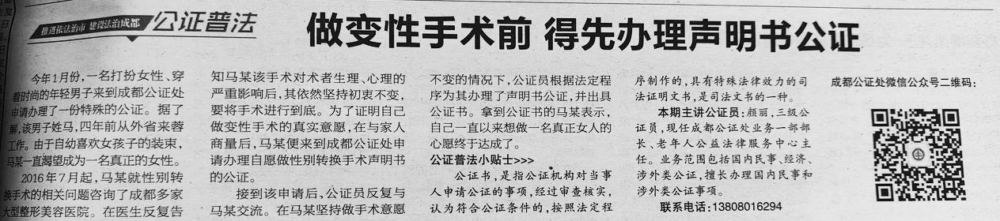

### 公证的概念

公证，是指公证机关依据自然人、法人或者其他组织的申请，依照公证法律、法规规定的法定程序对民事法律行为、有法律意义的事实和文书的真实性、合法性予以证明的活动和过程。关于公证活动、程序、组织等规范内容构成了公证制度。公证制度是国家预防纠纷、维护法治、巩固法律和社会秩序的一种法律手段。

### 公证的目的

根据 [《性别重置技术临床应用管理规范（2022 年版）》]() 的规定，手术对象应当提供本人要求手术的书面报告并进行公证。由此可见，公证对于手术同意书来说是有必要的。很多人在取得家长的手术同意书后，就开始积极筹备手术相关事宜，而忽略了家长的后续态度，相信大家也见证了不少术前反悔与术后反悔的例子，**为了以防万一以及不必要的麻烦，建议大家在有条件的情况下在取得手术同意书后请尽快前往公证处进行公证。**

### 公证的作用与意义

首先，公证的作用为了避免权利和义务所涉及到的各个方面之间可能发生的民事纠纷，从而能够效地保护当事人的正当权利和利益不受侵害。根据 [《中华人民共和国公证法》]() 第三十六条的规定，经公证的的民事法律行为、有法律意义的事实和文书，应当作为认定事实的根据，但有相反证据足以推翻该项公证的除外。因此，在经过公证后的手术同意书被赋予了一定的法律效力，比如证据上的效力，一旦家长在术前反悔发生纠纷，公证文书就能够成为特殊的书证，具有较强的证明力。除非家长能够提出公证行为并非出于自愿，不然公证后的手术同意书就具有真实性与合法性，并且持有者将享有受到法律保护的权利，使其正当权益得到切实的保护。

其次，公证工作可以预防纠纷，减少诉讼，稳定关系，**以防家长反悔**，在一定程度上起到防患于然的作用。并且当事情闹到不可开交的地步（指到法院诉讼），经过公证的手术同意书会是有力的证据，且具有**可强制执行**的效力。

### 公证流程

需要公证的文件可能包括《本人申请书》《父母知情/同意声明》。不同医院对文件材料要求各有不同，具体请询问意向医院的相关医师。

根据 [《公证程序规则》（2020 年修正）]() 第三十四条规定，可以请求公证机构可以代为起草、修改申请公证的文书。

需要提供的材料为：户口本、父母身份证

根据一些报告称，您可能会被要求提供如下材料：

1. 易性症诊断证明
1. 出生医学证明
1. 父母结婚证，如单亲可能需要提供（离异：离婚证、离婚协议，死别：死亡证明，等）


为预防因材料不足以至于需要多次往返公证处而丧失信心
建议自行前往公证处询问相关所需材料后携带家长前往（双亲家庭需要携带双方一同前往）


申请内容为:「自然人的其他证明公证」的公证书

### 可能遇到的障碍

由于《民法典》的“公序良俗”原则，有部分申请人会遭到公证机构以道德为由拒绝办理公证。

> 《公证程序规则》 第四十八条第八款 公证事项有下列情形之一的，公证机构应当不予办理公证：(八)申请公证的事项违背社会公德的;

应当向工作人员告知进行公证是 [国家法规]() 所规定的正当要求，同时可以参考下述文件，向公证机构提出自己的诉求。

### 法律依据 {#legal}

根据 [《性别重置技术临床应用管理规范（2022 年版）》](https://project-trans.org/china-legal/spec/2022-04-20/srs/readme)

> 三、技术管理基本要求
>
> （三）实施主体手术前，手术对象应当提供如下材料并纳入病历：
>
> 1. 当地公安部门出具的手术对象**无在案犯罪记录证明**。
>
> 1. 有三级医院精神科或心理科医师开具的**易性症（性别焦虑，或性别不一致）诊断证明**。
>
> 1. 手术对象本人要求手术并经**本人签字的书面报告**。
>
> 1. 手术对象提供**已告知直系亲属**拟行性别重置手术的相关证明。

相较于 2017 版具体修订内容请查看 <https://link.mtf.wiki/srs/legal-spec>

根据 [《公证程序规则》（2020 年修正）](http://www.gov.cn/gongbao/content/2021/content_5578540.htm)

> 第十四条规定，公证事项由当事人住所地、经常居住地、行为地或者事实发生地的公证机构受理。
>
> 第十五条规定，二个以上当事人共同申办同一公证事项的，可以共同到行为地、事实发生地或者其中一名当事人住所地、经常居住地的公证机构申办。
>
> 第三十四条规定，公证机构在审查中，认为申请公证的文书内容不完备、表达不准确的，应当指导当事人补正或者修改。当事人拒绝补正、修改的，应当在工作记录中注明。**应当事人的请求，公证机构可以代为起草、修改申请公证的文书。**

根据 [《中华人民共和国公证法》（2017 年修正）](http://www.npc.gov.cn/zgrdw/npc/xinwen/2017-09/12/content_2028695.htm)

> 第二十五条规定，自然人、法人或者其他组织申请办理公证，可以向住所地、经常居住地、行为地或者事实发生地的公证机构提出。
>
> 第三十六条规定，经公证的民事法律行为、有法律意义的事实和文书，应当作为认定事实的根据，但有相反证据足以推翻该项公证的除外。
