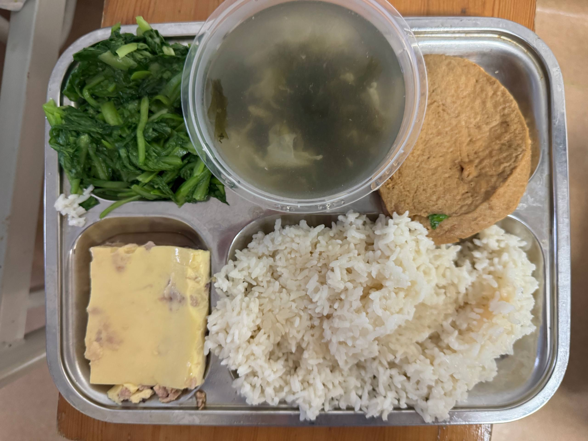



医生姓名：[赵烨德](https://www.haodf.com/doctor/6964528056.html)[^1]

所在医院：[中国融通上海四一一医院<small>（原 海军军医大学附属长海医院虹口院区<small>(原 中国人民解放军第 411 医院)</small>）</small>](https://amap.com/place/B0FFKP410J)

开展的医疗技术：

- 使用皮瓣成形阴道的 SRS
- 仅进行外阴成形的零深度 SRS
- **[仅性腺切除手术]()**（点击查看）
- **[喉结切除术]()**（点击查看）
- 钻孔脱毛
- 其他品牌阴道的第三方维修（医院床位紧张，请于面诊时详询）

赵烨德博士是国内仍在工作的最有经验的 SRS 医生，使用阴茎和或阴囊皮瓣作为阴道，阴囊皮瓣成形阴唇。411 手术主要优点在于价格相对较低，事故率低。初始宽度较大，对通模具要求较少，敏感度保留好，且能实现各个结构的外观成形。且其位于上海市区，交通物流极其便利，~~周边小跨妹也很好抓人来陪聊天~~。

缺点主要在于赵博认为 12 cm 深度的阴道足以满足大陆人需要，故阴道深度较浅。且当阴茎阴囊皮瓣不足时将需要肚皮/大腿皮瓣作为补充，此时将增大手术痛苦并延长术后恢复时间。411 的住院体验相对差，需要禁食一周、卧床两周。病房的热水供应于 2023 年 11 月起无限期停止，需要自行外出才有热水淋浴。

该医院纪律要求较严，如要求行李箱必须放在特定位置、床下和床头柜物品种类有限制且需在特定位置等。

手术前需要停止 HRT 一个月，但并不十分严格，医生会根据激素六项和凝血等结果判断是否适宜手术，**请对停止 HRT 后可能出现的问题做好心理准备**。

**当前 SRS 手术排期较长（截至 2024 年 10 月排期已需要一年半）**。

## 前置条件

1. 年龄满 18 周岁
1. 任意三级医院精神科或心理科开具的诊断证明（易性症/性别焦虑/性别不一致/性身份障碍），医生需具有高级职称医师资格
1. 父母同意书[（模板）](icf.pdf)
1. 无犯罪记录证明
1. 未婚证明
1. 个人申请书
1. [BMI](https://zh.wikipedia.org/wiki/身体质量指数) 需要控制在正常范围以内（推荐小于 24，如意愿强烈最大允许 26）
1. 需要提前告知（慢性）基础疾病
1. 高血压、糖尿病需术前一个月平稳控制（无并发症）
1. **无需**  阴性[^2]

**特别提示：赵博及伦理委员会非常重视父母在手术前的即时意见。持有公证过的父母同意书时，护士台可能不会要求必须直接与家长通话，但伦理审查人员仍可能在术前致电家长询问意见。若父母其中一方在术前强烈反对（即未能满足「家长不明确反对」这一基本要求），或无法联系到家长，均可能导致伦理审查不通过，进而无法办理住院或无法手术。**

## 费用构成

<!-- 赵烨德医生本人要求仅提供粗估数字 -->

费用具备时效性且根据个体情况有所差异，建议面诊咨询。

准备 65,000 元可以满足成形阴道的 SRS 的主要开支，零深度则为 60,000 元，入院时一般收取住院押金 50,000 元，需注意银行卡非柜面交易限额问题，提前和银行沟通解决方案。

住院押金外的费用包括：

- 下文各类杂物购买开销
- 护工费用 100 ¥/day
- 陪护费（如有） 10 ¥/day
- 术中使用的止血材料 6216 元，零深度则为 3108 元
- 术后持续穿的抗血栓弹力袜 688 元
- 出院后公证费，约数百元

抗血栓袜支持微信支付或支付宝扫码支付，止血材料只支持支付宝扫码支付。

## 挂号方法

**赵烨德医生在每周二和周四上午8点到11点出诊，周二为特需门诊，挂号费298元，周四为普通门诊，挂号费50元。其他时间段为陈医生，且其不受理售前问题。医生建议首诊挂周二的号，人少时间充裕，可以聊细致些。**

使用微信公众号挂号或现场挂号，周四上午若仅显示普通门诊，请放心预约普通号。

1. 线上预约可进入「[上海四一一医院](weixin://gh_ec7d395cb137)」微信公众号，依次点击「快捷服务」-「外科」-「整形外科」进行预约。
1. 可通过 [微医](https://wy.guahaoe.com/expert/book/96df355f-c720-11e1-913c-5cf9dd2e7135000?hospitalId=986cf2b7-c720-11e1-913c-5cf9dd2e7135000&hospDeptId=23dff9e0-f623-47f0-b65f-c08d9e2664e2000) 预约挂号
1. 可在门诊一楼现场挂号
1. 若无号可在门诊四楼整形外科现场请求护士加号

也可直接联系赵博：

1. 设法获取护士台电话后，通过护士台询问赵烨德医生在不在后联络 赵烨德医生
1. 与 赵烨德医生 交流，或在社群内设法获取其微信号后，预约面诊时间

在线上挂号后线下就诊需要注意的：

1. 请去一楼挂号处报道，进行缴费后才会叫号

## 面诊内容

赵烨德医生一般会在门诊没有人后立刻返回住院楼，请勿过晚抵达。

可能的面谈内容：

- 类似精神科医生的问诊（更详细完全版本）
- 是否取得证明
- 家长同意与否
- 手术资金来源
- 可预约时间
- 具体手术要求
- ~~你为什么喝水都胖~~
- 跟你一起来的这位是什么关系（诸如此类的家长）
- 赵烨德医生预先告知来访者更擅长的术式

手术排期时间并不严格按照就诊顺序，考虑因素可能包括是否已经 RLE，是否急于在毕业前修改身份证件等。


对于提交**染色体异常检查单**的情况，赵烨德医生可能会询问如下问题：

- 未进行 HRT 前的遗精与晨勃情况
- 染色体异常发现的时间与检查原因
- 家里的情况与看法
- 身份证上的性别
- （若已以女性身份生活）以女性身份生活的开始时间

在看过报告单/诊断书后，赵烨德医生会带至旁边小房间里检查相关部位的发育情况。



如手术材料上体毛过多可能会建议脱毛，本门诊提供钻孔取毛服务，需在手术前半年以上进行。

## 需要自行购买或携带的物品

出于便携移动的考虑，并不推荐提前在行李中携带过多物品前往医院。~~这里是上海，没有任何东西是京东和顺丰隔天送不到的，京东超市/京东自营甚至可以做到早上下单傍晚送达，下午下单次日送达。~~

如果在你刚入院的时候有认识的朋友快要出院了（即使没有朋友的话在411术前群多水群或者挨个病房转悠几圈就有了），可以刷好感度后继承 ta 的大量物资，例如脸盆、没用完的中单等。



### 入院前

- 电源插排\
   用于为手机等设备充电。每张床位仅有一个国标电源插座，若无插排术后心电监护将占用
- 靠枕（可选以改善体验）
- 粗网灭菌凡士林纱布 25×40cm 1~2包（具体数量详询护士站）\
  需在术前交至护士台，如不确定购买何种可询问护士台，<small>或参考与本站及院方均无利害关系的第三方购买链接：[振德医疗灭菌凡士林纱布油纱布烧烫伤引流不粘伤口多规格10片包邮](https://detail.tmall.com/item.htm?id=582921441062)</small>
- 饭盒/碗（半流质食物/普食早餐粥）、筷子、勺子\
   有时可以向餐车免费索要一次性筷子或购买一次性塑料碗，但供应不稳定，建议自行网购一次性餐具/旅行餐具，~~或放弃在餐车吃饭~~
- PP材质可盛装开水的塑料水壶（水房只有开水，如全程购买瓶装水可忽略）
- 耳塞 / 降噪耳机（可选以提升睡眠体验）

### 手术后

- 毛巾（用于不能下床时擦脸及身体，可购买一次性毛巾作为更卫生的替代）
- **无酒精**消毒湿巾（可购买婴儿湿巾）
- 抽纸
- 个人生活用品（洗面奶、护肤品、沐浴露、洗发水等，可购买小包装）
- 牙刷、牙膏、漱口杯（可用一次性杯）\
   建议在术前认真评估自己是否掌握了平卧单手刷牙这项技能。电动牙刷可显著提升体验
- 口香糖\
   用于在无法仔细刷牙时清洁口腔
- 水杯\
   建议使用水瓶倒置时仍可以正常饮水的瓶子，如尖叫、农夫山泉；如果水杯不带吸管护工阿姨可提供吸管
- 小镜子，手电筒\
   用于~~审批~~自行查看阴部，请自行评估是否可被手机代替
- 小风扇（用于干燥阴部和解暑）
- 医用护理垫 护理床单垫型，参考尺寸为 60cm × 90cm\
   非单层床单，需可吸收液体，如不确定可在购买前询问护工阿姨，用于换药时垫在身下或吃饭时当餐布
- 拖鞋，或便于穿脱的其他鞋子
   如果可以接受二手可不购买，护工阿姨和床下有一大堆
- 手机支架\
   这个护工阿姨一般会有
- 脸盆
- 两个不易断的橡皮筋\
   护工阿姨会在术后给你扎双马尾麻花辫 ~~，如果有 ADHD 以至于不玩头发浑身难受也可请求改换发型~~
- 浴巾\
   用于垫在身子下面，及尝试下地时围起来当裙子，根据换洗情况准备1至2个

- 药品（以下药品院方不会强制要求或开具，请自行评估后自备）
  - 草木犀流浸液片，迈之灵片（禁食结束后术区消肿）
  - 康瑞保祛疤凝胶（拆线后祛疤）
  - 适合自己且持有处方的安眠药（疼的睡不着满床打滚时服用）
  - 布洛芬（止痛）**因术后院方会静脉滴注大量「注射用盐酸丙帕他莫」，严禁使用任何包括「对乙酰氨基酚」成分的药品。谨防药物相互作用及药物过量，必要时咨询医师。**
  - 铝碳酸镁咀嚼片（禁食期间缓解胃部症状）
  - 百多邦喷雾（注意是喷剂不是涂剂，要可用于伤口消毒的款，用于大小便后术区消毒）
  - 氟比洛芬凝胶贴膏（缓解长期卧床肌肉酸痛）

- 通模用品
  - 避孕套 / 次
  - 普朗特（Prontosan®）凝胶两瓶（普朗特有凝胶和液体两种，不要买成液体）
  - [模具]()\
   赵烨德医生倾向于使用软质硅胶假阴茎作为模具，出院前仅需要 2.5 cm 直径的模具，出院后根据恢复状态将逐渐扩大尺寸

- 棉质紧身三角内裤（要求紧身以减少肿胀，由于 7×24 使用卫生巾一般无需频繁换洗）
- 卫生巾 / 天（245 - 275 mm 纯棉日用为宜）

- 身份证\
   用于核对出院小结上的信息（住址）及办理公证
- 户口本\
   用于核对出院小结上的信息（住址，与身份证有冲突时，以户口本为准）。
- 甜甜圈坐垫（痔疮手术坐垫）



## 全流程攻略


**本页面一切内容不构成医疗建议，切务谨遵医嘱。** 文中时间线仅为通常情况概述，医生根据你的恢复情况将对此保留很大的自由度。


### 入院

「前来手术前建议先查好传染病四项，以避免不必要的麻烦。大三阳、小三阳等，请控制好病情，最好转阴，再来手术。给医生安全，给自己安全。」

—— 赵博

大约在手术预约时间的一个月前，整形外科护士台会通过医院电话主动联系你确认手术意愿，要求停止 HRT，**并直接告知你具体的入院时间（一般是周二或周四）**。

同时，护士台会通知你，**医院后续将需要与你的家长通电话或微信语音**。

- 伦理审查：护士台与家长的联系属于伦理审查中较靠前的环节。其目的并非强求家长明确说「同意」或「支持」，而是向家长简单说明情况。
- 审查标准：护士台曾多次强调，**伦理审查的底线是「只要家长不反对就没问题」**。
- 同意书公证：如果有公证过的家长同意书，护士台可能不需要直接联系家长，但伦理审查人员之后仍有概率会联系家长。
- 风险：如果无法联系上家长，或者家长在沟通过程中明确表示反对，伦理审查可能会被打回来，这可能直接导致无法手术。

注意：曾有反馈称医院不主动联系预约手术者，且「不主动联系医生视为放弃手术」。虽然现在流程已改为护士台主动联系并分配时间，但为了保险起见，若在预约时间前一个月仍未收到通知，明确入院时间，建议主动通过电话、微信或挂号联系确认。

确认入院时间后，请按护士台告知的日期挂号后前往医院。

挂号后，和初次面诊一样在门诊等到叫号，赵博会开具待床证，随后至住院部一楼办理住院手续。一般而言需要预缴押金 50,000 元，支持刷卡、现金、支付宝微信，POS 机使用银联（含银联国际）卡支持非接触交易（包括 Apple Pay），外卡须实体卡插卡交易。**请妥善保管押金单至办理出院手续**，随后立刻持待床证前往 21 楼整形外科病区外科护士站报到，如需外出请在办理住院手续前或报到后。此时如知道哪个病床空着且同病房有喜欢的人可以指定床号。

住院病房默认为三人间，可选单人间或双人间，价格详询护士站。入院时间及顺序并不严格，通常情况是床位空出后先到者先住进去。少数床位爆满情况下可能会安排住在会议室，甚至先住在院外每天过来做检查，直到手术前一天再安排入院。

此时护士会对你进行入院宣教，询问既往史，签一大堆同意书，要求你背诵科室主任（也就是赵博）、主治医生（不是赵博）、护士长、管床护士的姓名，戴手腕带（出院前不能摘），发放病号服、两卷纱布。病号服有三种款式，一种为~~一看就是从宛平南路跑出来的~~蓝白条纹，一种为很好看的浅色拼图图案，还有一种是白色蓝色棕色相间的细条纹。411 会将女性倾向的 SRS 称为「反方向」。

入院时可能会收走「易性证」诊断证明或其他类似物**原件**；若家长未陪同面诊并明确表示同意可能还需家长同意书，并可能向家长致电询问意见。

### 住院

医院的作息为夜 21 时至晨 6 时期间熄灯，锁通向电梯间的大门。熄灯期间可以拉上帘子打开自己床头的灯坐在床头玩手机，但请不要打扰他人休息。

三餐分别在 06:50、11:00、16:50 或更早时由推车在走廊发放。早餐 = 一个白水煮鸡蛋 +（一个馒头/花卷/包子）+（稻/粟/黑米粥/豆浆）+ 咸菜（建议谨慎尝试）。午餐和晚餐的普食 = 米饭 + 青菜 + 一荤 + 一谜（一荤可能是带刺的鱼，一谜可能是鸡蛋），半流食则可能是馄饨/面条/粥。医院饮食一日价格为 30 元，可以计费至出院时统一支付，也可扫码支付，如选项前者，当天只要吃饭一次就会收取一天的饭钱，如果午晚餐禁食，早餐可单独扫码支付。扫码支付价格略贵一些，其中已知午晚餐的价格为 15 元/次。早餐需自备或购买碗；午餐和晚餐为铁盘盛装，但汤仍需自备碗。吃完或没吃完后将残羹剩饭倒至走廊尽头换药室对面的垃圾桶，随后将铁盘带至电梯旁边开水间稍冲洗后留在此处。**餐车的一次性塑料碗和筷子供应不稳定，有时有，有时没有，建议自行准备。**

午晚餐参考：

若不符合饮食习惯可自订外卖（但请不要点螺蛳粉），外卖会送至大门处美团外卖柜，如配送员不愿使用也可能直接放在门口闸机附近。快递会送至大门传达室内，收货地址请写明楼层。快递管理较为混乱，需自行在快递堆中翻找自己的快递。

入院后如需外出需在护士站登记并由医生签字，请不要偷偷溜走以给医院工作人员添加工作难度。术前的请假通常会被准许。

医院门卫将拦下穿病号服的病人离开，此时如需在医院对面商店购买东西，可请求保安使用你的手机上的付款码代劳。

会议室有一台冰箱，偷偷往里面塞一罐可乐或许会无事发生（记着稍后拿出来喝，不是让你投喂冰箱之神）。

病房目前有免费 Wi-Fi `BesTV-W` 覆盖。使用公共Wi-Fi请**注意信息安全**。

仅限一位陪护过夜，陪护椅可在晚上拉开变成陪护床，但必须在晨 6 时前收起。**仅允许陪护在手术当天起过夜，手术前不可过夜，请注意提前安排行程。**<small>整形外科禁止此前在整形外科住过院的人以陪护的形式在整形外科住院部过夜，理由是「此前有术后的人来当陪护混廉价住宿」。<del>但其实只要护士长和赵博对你印象不深刻就行。</del></small>

入院后请尽快完成撕纱布操作并送至护士站灭菌。需先用剪刀将发放的两卷纱布剪成长宽比约为 2:1 的长方形，随后将其全部撕成线条。先多次折叠可以减少剪裁次数，沿对角线撕较为省力。该操作预计需要数小时的工作，准备适量足够有趣的番剧或足够有趣的陪你聊天的朋友或可减轻该操作的心智负担。[^3]

住院的室友可能有跨男、非二元性别，顺弯女等各种属性，请尊重理解，勿主观判断。幸运时也可能出现一个病房三人都是跨女。病床换人时会拉上帘子打开紫外线灯消毒，请勿直视。

夜间，护工可能会为了防蚊而开启电蚊香，如果对其成分较为敏感，可告知护工。

入院后（将根据入院时间及医院情况安排，请耐心等待）护士站会给你大小便标本盒和几张检查单，检查项目包括尿常规、粪常规、血常规、血生化、肝功能、凝血功能、激素六项、传染病、血型、心电图、彩超、DR（X射线），当晚 20 时后禁食，22 时后禁水（也可能是 22 时后禁食禁水，根据医嘱进行）。其中血液检查项目会在次日晨由护士至床边或前往护士站抽血送检（所以说一定不要睡懒觉，推荐躺着或坐着进行否则可能低血糖晕倒），粪尿样本需自行采集后在早 8 时前在护士站扫描并送至换药室对面垃圾桶旁边的样本盒（粪便采样住院期间提交即可）， 其他项目需在早 8 时后自行前往楼下检查单上标注的地点完成检查，**完成当天全部检查前切勿进食**，可先领取后放在桌子上。

入院后不久会被主治医生叫去医生办公室，询问手术效果期望和侧重，图文视频 ~~（可能还有手绘简笔画）~~ 并茂地详细讲解手术原理和方法，签各种同意书，测量腿围购买弹力袜，检查手术材料。若手术材料长度和面积不足，可能需要在大腿甚至肚子取皮。过一段时间赵博也会亲自检查一次你的手术材料。

#### Day -1

手术时间确定后会被护士站的护士和手术室的护士和麻醉师分别详细询问既往史并详细记录，麻醉师会要求你签字「同意全身麻醉」，可选「同意使用镇痛泵」（除非你真的很明确的知道你到底在干什么不然不要签不使用镇痛泵）。

手术前一天不可吃午饭和晚饭（晚饭时间后当然更不可吃任何东西），晚 21 时（手术室 / 麻醉科要求）或凌晨 2 时（护士站要求，是的，他们没有统一）后不可进水。中午若不是很饿建议不要进食。

手术前一天需在 11 时、20 时整服用「川倍清」硫酸镁钠钾口服用浓溶液共 2000 mL。每次将 1 瓶全部加入附带的量杯中并加水至刻度线 500 mL 处，并再喝 500 mL 清水，注意药水和水总共需在 2 小时内喝下。部分评论称其具有浓烈的桔子香精味。根据部分个例经验，稍热时服下并用饮料漱口可能有助于减轻服用时的心智负担（禁止使用含气泡或酒精的饮料）。你可能会想要呕吐但是请尽量不要，以免影响效果。

**肠道准备不充分可能导致极其严重的后果，包括但不限于手术时间延长，台上中止手术，甚至可能致命的严重感染。切勿心存侥幸！**

下午会有护士来备皮（剃毛），晚 20 时或更早生理盐水灌肠，随后静脉注射补液。此外需自行将指甲剪短。

此外，护工阿姨会询问你是否需要请护工以及是否需要气垫床，如需护工将在手术当天开始计费，一共两位护工将负责整层楼所有人的护理。气垫床则需缴纳 150 ￥ 租金。倘若你能像我的某位朋友一样将本站所有相关内容甚至所有 issue 讨论帖反复诵读倒背如流以致刚从手术室回来也能有条不紊的指挥她的陪护的话，那么或许说不定也可以不用请。气垫床充气过满并不会带来太好的体验，可以要求护工阿姨放掉一半的气。

#### Day 0

本段时间线假设手术时间安排为早 8 时第一台，实际也可能安排至早 10 时第二台。

术晨 6:30 开塞露 2 支纳肛，憋一两分钟后如厕。赵博会在早 8 时左右查房并确认你做手术的决心。随后你需要做的事情包括前往护士站量血压，穿上之前买的弹力袜，换上新发的病号服并去除你身上除了手腕带以外的一切物品包括内衣。

当轮到你下楼时，护士站会通知你「再上个厕所，准备走了。」抓紧时间如厕后，你将被护士领着步行乘电梯前往手术室，你的陪同人员可以一起坐电梯下楼把你送到手术室第一道门口。手术室有两道门，在第一道门处，手术室的医生会向你确认一系列事项，可能有但不限于：

- 你叫什么名字
- 你今天来做的是什么手术
- 你对什么药物过敏
- 你的体重

进入第二道门后，脱干净衣服，爬到手术床上躺好（手术床又高又窄小心别摔下来），麻醉师和护士给你接各种监护，手腕插留置针。你可能会被使用七氟烷进行吸入辅助麻醉，也可能只会被使用丙泊酚注射麻醉。在前者的情况下，呼吸面罩不会和你的面部接触。麻醉师在开始麻醉前会让你闭眼深呼吸放松，此时可以把信任交给赵博和麻醉师……~~麻醉师也可能会在插好留置针后一句话没说就给你面罩里通七氟烷，七氟烷略有刺激性气味，你可能会在咳嗽和麻醉师的关切与询问中失去知觉。~~

接下来发生的事情你也许永远都不会知道了，但是我还是想要告诉你：

- 8:50 麻醉完毕
- 9:00 赵博进入手术室

此时你已经失去意识并被摆放成截石位，赵博站在你两腿之间正对着你，剩下三位主刀医生分列两侧严阵以待。

- 划开阴囊并止血，十分钟
- 阴道造穴，用手将组织推开并用纱布填充，半小时到四十分钟
- 切除睾丸 分离精索血管，每侧各十分钟
- 结扎精索，每侧各十分钟\
  这一步风险较大，若处理不当可能导致精索进入腹腔引发后果极其严重的腹腔感染
- 翻开包皮，将阴茎皮肤剥离，五到十分钟
- 设计阴蒂，分离阴蒂血管神经至阴茎根部，截断并结扎海绵体，一小时\
  最容易松脱，会使用 7 号缝线进行结扎\
  这是整个手术难度和复杂度最大的部分，攸关阴蒂的存活和敏感度保留
- 把两侧阴茎脚分离至耻骨联合，五十分钟
- 调整阴道深度和宽度，阴茎皮瓣和阴囊皮瓣比例，十分钟
- 缝合阴道
- 安装阴蒂
- 缝合大阴唇

在约午 1 时左右，赵博胜利结束手术班师回病房，而你被推到复苏室继续呼呼大睡，直到被麻醉师拍醒 ~~或者自己从睡梦中醒来发现牛子不翼而飞，喉咙里还插着管~~，当你睁眼看不到无影灯的时候就意味着手术已经结束了。此时并不会有人跟你说什么「手术很成功，你已经变成猫娘啦~」，如果需要此类仪式感请安排你的朋友在病房等你。确认你意识清醒且体征正常后你会被推回病房，请保持平静并放松平躺，切勿学某些人一定要下床自己走回来。被推着感觉头晕时，闭上眼睛也许会有帮助。

麻醉苏醒后你会开始浑身发抖。在一段时间（大约 30 min）后会感到炎热甚至出汗，这是十分正常的麻醉反应。护工阿姨在你发抖时可能会把病房的空调关掉，如果你觉得热，即使你还在发抖，也可以提出要求打开空调（冬天则是要求开窗）。

此时内含舒芬太尼、氟比洛芬和昂丹司琼的止痛泵（如果你没有作死不选的话）会开始运作，内含的药物足够不间断使用约 2 天。你的痛感可能来自于精索或海绵体或阴蒂，以及大腿根部的引流管。如果疼痛剧烈可请护工阿姨调大流量，如果痛感轻微也可降低或关闭，延长镇痛泵的使用时间。适当的音乐或视频甚至游戏或许可以帮助你缓解痛感。

刚从手术室回来时你会声音低沉沙哑，这是插管后暂时的症状，不日就会好转，请不要担心。

术后需要去枕平躺 6 小时。术中使用的麻醉剂和镇痛剂都可能导致呕吐。若需要呕吐请告知护工阿姨准备好塑料袋及卫生纸，将头偏向一侧吐出深绿色的胆汁。如果去枕平躺的实在太难受又没那么想吐就把枕头要回来吧。如果呕吐持续，请联系护士注射止吐药物。

在手术室插到你手腕的留置针会被你带回来，上面像搭积木一样插着镇痛泵，静脉注射的各种吊袋，静推时接上去的注射器。在此后的 7 天里，你会每天从早到晚打数十袋液体，请尽量减少手部的活动。请提醒护工阿姨夹上报警器，每瓶液体注射完后，报警器会响。此时你需要按床头呼叫器，提醒护士前来更换。部分药物静脉滴注时可能导致强烈疼痛和静脉炎，此时可调低流速，缓慢调高（或不调高也行，无非就是打得慢点）。留置针通常可用数天，长时间使用可能会出现注射液流量过低，静脉炎，回血等各种问题，此时需要换针。当然你也可能体质很好的到最后几天也什么事都没有，此时是否要换手重打请自行权衡。病房的护士一般会将留置针打在手背，如果你手背血管可用性低，也可能会打在手腕侧。



仅供参考

- 维生素C注射液
- 氯化钾注射液（注射时可能会导致血管疼痛，可要求护士调慢输液速度）
- 0.9%氯化钠注射液
- 5%葡萄糖输液
- 5%葡萄糖氯化钠注射液
- 盐酸雷莫司琼注射液
- 注射用盐酸丙帕他莫（作用为镇痛，但注射时会刺激血管导致剧痛）
- 喷他佐辛注射液
- 注射用尖吻蝮蛇血凝酶（推针）
- 注射用盐酸罗沙替丁醋酸酯（推针，用于抑制胃酸分泌）
- 复方醋酸钠林格注射液
- 注射用头孢美唑钠
- 左氧氟沙星氯化钠注射液（仅用于有头孢 / 青霉素过敏史的患者）



此外你还会被接上位于手臂的血压计，血压计会每小时自动充气测量你的血压，一次次的把你从美梦中吵醒。夹在手指的心率或者可能是血氧计，身上连着的几个贴片。幸运的是这些在 Day +1 清晨就会移除。监护仪可能会出于各种原因发出蜂鸣，只要你还意识清醒就请不要过度慌张，大部分都是无关紧要的。

你还会获得 7 天的氧气供应以增加血氧含量，促进血运。自我感觉良好不想吸了也可以随时拿下来。

术后拆包前你需要一直保持平躺，禁止活动大腿及腰腹部，也就是其他部位都可以活动。

每天清晨，护工阿姨会帮助你刷牙，并用毛巾帮你擦洗身体，晚间也有一次擦洗。

通气（放屁后）你将可以进水，但是前 7 天由于每天大量的静脉输液，你可能完全不会感到渴，一直不喝水也是没有什么问题的。此外，你可能在通气时带出粪便。若出现此类情况请放心告知护工阿姨以及时清理。护工阿姨可能会拿一个小的便盆垫在你屁股下面让你一次拉完并帮你清洁，此后直至下地，大便都请呼叫护工阿姨在床上解决。

你需要每天运动下肢，促进静脉回流，防止深静脉血栓的形成：

| 运动方式 | 运动要求 |
| :--: | :--: |
| 主动运动 | 指导患者踝关节屈伸运动，患者躺或坐在床上，下肢伸展，大腿放松，缓缓勾起脚尖，尽力使脚尖朝向自己，至最大限度时保持 10 秒，然后脚尖缓缓下压，至最大限度时保持 10 秒，然后放松。这样一组动作完成稍休息后可再次进行下一组动作，反复的屈伸踝关节，最好每小时练习 4-10 分钟，一天 5-8 次。|
| 被动运动 | 告知家属（或护工）由下而上按压小腿上的比目鱼肌及腓肠肌每 2 小时一次，每次不超过 15 分钟 |

从今天开始的三个晚上，你将可以每晚获得一针成分为吗啡或哌替啶（杜冷丁）的止痛针，在熄灯前或半夜实在睡不着时向护士提出即可，在臀部肌肉注射后痛觉甚至身体感觉会很快消失，然后安稳地睡个好觉。~~部分体质特殊者会出现幻觉。~~

### Day +2

如果不是零深度手术（零深度手术没有引流管），这一天会拆引流管，可能会很疼但是一下子就拔出来所以没等你叫出来就拔完了，剩下时间就是留你自己哀嚎。

拆引流管、换药、拆包等操作一般是你的主治医生操作，但也可能周末时由值班医生代为进行，或赵博遛弯过来看见你了心情好顺手给你拆了。

前面的镇痛泵在这天可能输完了，若疼痛难忍可要求加一个泵。

### Day +3

这一天将是第一次换药。你可能会害怕不敢看但是没事因为你努力探头也看不到你的批长什么样子。不过，在每次换药时，你或许都可以让陪护人员给你拍照，取决于医生是否允许。零深度手术可能不会经历这次换药，但会经历另外两次。

从这一天或者稍晚开始，至几天之后，你会因为平躺时间过长腰酸背痛肩膀难受，总之除了批之外哪里都疼，更倒霉的情况下你可能连批也一起疼。甚至出现白天不疼晚上疼，没人的时候疼把赵博喊来了就不疼了的情况。这类疼痛会在几天后缓解（这是真的虽然我当时自己也不信前人写下的这句话），如果因为疼痛而晚上睡不着觉或者因为晚上睡不着觉而疼痛，请不要慌张焦虑，只需要做一些平时消磨时间的事情，如听歌、看视频、打游戏。你是刚做完手术的人，你想晚上不睡就不睡，你想什么时候睡就什么时候睡，反正白天不需要上学/上班，等你真困到不行了就不疼了能睡着了。可以尝试使用氟比洛芬缓解肌肉酸痛；如果你有安眠药类药品的处方，也可尝试服用，但需自带。<small>（术前请尽量充分地认知安眠药类药品在自己身上可能出现的效果，避免像笔者之一一样，服用喹硫平后以一个不那么利于恢复的姿势睡着。）</small>此外倘若你的大腿也开始疼，这是由于手术时间过长压迫血管导致的，一般无需担忧，几天后就会缓解。

### Day +6

今天将进行第二次换药，同时也该拔掉手上的留置针啦。

如果你的消化系统提前启动（极早期症状如术后一天内通气，早期症状为肚子咕咕叫，中期如胃疼、胃食管返流，后期可能演变为胃溃疡乃至胃穿孔），在和赵博说明的情况下，你或可在今天开始服用米汤等流食。在这种情况下，特别是真的老老实实躺床上一动不动的人，建议早点咨询医生并开始服用铝碳酸镁咀嚼片，以免胃酸长期处于一个位置不动、腐蚀同一处胃壁而出现的胃溃疡。

### Day +7

今天开始你将从禁食改为半流质饮食。是否直接吃点刺激的比如疯狂星期四取决于你对你的肠胃功能和不规律饮食的后果或没有后果是否有清晰的认知。如果你实在很馋，请至少在今天日出时开始进食而不是零点时。



护工可能会为了减少你的疼痛而减轻擦拭的力度，请结合实际情况与护工沟通或再次清洁，若有污物残留将会增加伤口感染风险。

由于如下因素，你在术后的排遗物可能会偏离理想外观和性质，导致腹泻或便秘：

- 止痛剂和止痛药会减缓肠道蠕动
- 术前的全肠道灌洗和术后的抗生素使用，可能清空肠道菌群 ~~（消化是一个五十亿细菌的大系统）~~
- 对术区的加压包扎可能会阻碍排遗物到达直肠
- 6 天禁食和 12 天卧床后，加上下体构造的一些改变，导致你可能忘了如何排遗 / 在正确的部位使劲

对腹泻的应对方案：

- 在能下床前只服用肠内营养粉（注意不能是若饭™，若饭™含有纤维素，会产生粪便），注意嘱咐护工阿姨严格按照配方调制，不要多加 / 少加水
- 使用蒙脱石散等止泻剂（可向护士台联系获取蒙脱石散）
- 减少纤维素的摄入，转而食用瘦肉等易使排遗物结块的食物
- 可使用“双歧杆菌三联活菌胶囊/三联活菌散/四联活菌片”、酸奶（不是含乳饮料）等调节肠道菌群

对便秘的应对方案：

- 在错误的位置过于用力可能导致下联合轻度撕裂，一般无大碍，如厕后若有疼痛 / 额外渗血，可以考虑咨询经验丰富的护工，并在早上医生查房时要求医生们看看
- 向护士索要开塞露，一至两枚纳肛后一般可起足够的润滑作用，并使粪便软化，以及辅助你回忆起应该用力的位置
- 增加纤维素在食物中的占比，如多吃水果、在特定几餐只吃青菜。含乳糖较多的纯牛奶也可作为轻泻剂使用
- ~~疑似有点极端了：一些住院者手中可能有剩余的聚乙二醇电解质散（绝不鼓励剩余）~~



### Day +9

今天将进行第三次换药，并且改为普食。

### Day +12

今天拆包，可以自行用镜子或手机欣赏。此时由于长时间包裹挤压皮肤可能发皱，以及被碘伏泡到黝黑，请不要落差过大。此外，今天可能不会拆除阴蒂及阴道内部的纱布。你还需要请护工阿姨或护士用胶带固定尿管防止滑动。

今天开始你要进行憋尿训练，将尿管夹住，直至两小时后或你憋不住了再放开。

### Day +13

今天你将练习下床。练习顺序为：摇高床头，坐床上不晕 → 坐床边不晕 → 下地不晕。

请量力而行，循序渐进，下地后不长时间就头晕甚至失去视力都是正常的，谨防摔倒。下地可能需要一到两天的练习，当然如果你能直接跳下床整层楼乱窜我们都为你竖大拇指。在能较长时间站立行走后可多去其他病房串门，排解其他姐妹孤苦的同时锻炼行走能力。若出现流感等疾病的院内感染，请尽量待在自己的病房以减缓传播。

此时你就可以告别弹力袜了。如果你要穿内裤请记着加垫卫生巾。

### Day +14

阴道内部的纱布可能会在今天拆除。此时你可能会随机收获诸如「怎么这么深啊」的感叹。

当你能走到卫生间时，请联系护士或主治医生，让他们来给你拔尿管。拔尿管一般来说很疼但是也很快所以你大概也是拔完才开始哀嚎。拔掉尿管后你将需要自行上厕所，小便时请放松肌肉，如小便困难可尝试与大便一起进行。如一直无法排尿可能会被插回尿管受罪翻倍。便后请用餐巾纸和湿巾将阴部清洁干净，切记擦屁股要从前往后擦。

### 拆线与通模具

在你能独自走到换药室之后，请告知你的主治医生，以便他安排拆线。你会在换药室拆掉阴唇部明显的缝线，留下部分可吸收线用一两个月的时间慢慢消失。拆线痛感不至于无法忍受但过程漫长，可考虑戴耳机听歌转移注意力。

如果此前收获了「怎么这么深啊」的感叹，医生可能会担心有纱布遗留在阴道内（存在已知的案例），因此会在换药室的无影灯下使用扩阴器进行检查。这时你可能会痛出杀猪叫，属引凄异，哀转久绝。

拆线后某天（或者当天~~甚至刚拆完线后~~），赵博会亲自来教你通模。通模需要避孕套和直径 25 mm 的硅胶软质模具。前期通模需使用普朗特凝胶润滑，在用完两瓶凝胶后可使用普通润滑。通模频率以一日两次为宜。

### 出院

床位紧张时，一般在术后 15~20 天，你能下地行走的几天后，你会被要求出院。若床位不紧张，你将有机会自己和医生商量出院日期。

<!-- 不要提供出院小结和出院诊断证明的图片 -->

请在出院前持身份证、户口本找你的主治医生核对身份信息，尤其是姓名和住址与户口本上保持一致。如需「不宜体育运动」等字样也请此时向你的主治医生提出。请仔细核对出院小结、诊断证明，确保性别鉴定写的是「性别为女」而不是「性别为男」，将上述材料分别找末尾署名的医生签字盖章。赵博办公室及护士台张贴有公证员的联系方式，请拍照留存。前往护士站领取《三甲医院证明》。

出院当天，请持「押金单」、上段所述全部材料，前往住院部一楼结账，并在所有材料上盖章。出院办理窗口在工作日全天开放，周末上午开放。向护工阿姨付清费用。

### 公证

公证请提前联系上文让你拍照留存的那位公证员，前往上海东方公证处。该公证员业务娴熟，可快速办结。

## 术后护理

术后护理的一般性内容，请参阅 [术后护理]()。

以下情况偶见报告，但是并不常见：

- 阴道内可能有毛发生长，且无解决办法。手术时会尽量选用毛发稀少的皮肤，但并不能完全保证，若体毛过多请考虑术前脱毛。阴道口外部生长的毛发可于后续寻求医疗手段脱除。

若出院后发现缝合处有黑色缝线，一般为不可吸收皮内减张线，无需拆除。可剪除外露部分，切勿生拉硬拽。白色缝线为可吸收线，会在出院后数月内自行吸收脱落。

输液用的那根静脉的疼痛（包括压痛与非压痛）可能会一直持续。如果疼痛一直未减退，并且你发现这根静脉出现了远深于其它静脉的青紫，请前往医院门诊检查。

## 术后评价



### 2024 年 11 月手术

- 术后 30 天拍摄



- 术后 110 天拍摄



### 2023 年 9 月手术，术后 200 日拍摄



### 2023 年 7 月手术

- 术后 12 天拍摄



- 术后 30 天拍摄



### 2023 年 6 月手术

- 术后两月余拍摄



- 术后一年拍摄





### 2023 年 4 月手术，术后一年拍摄

妇科检查者的评价：

> 妇科检查者在使用鸭嘴钳撑开阴道口后，声称「为什么这个阴道口是分开的但深度只有两三厘米」（因为即使连我本人手指进一步深入都需要拐弯），同时把稍微靠上一点的小黑洞（尿道口？）识别成了另一个无法插入的阴道（因为它确实有液体分泌），并且还在已经触及阴蒂的情况下声称找不到阴蒂，最终得出了这是发育畸形的结论。
>
> 另一方面图中可以看到明显的V形疤痕（因为过于对称而被其识别为幼年的金属烫伤疤痕）和引流管的两个点状疤痕。



### 2022 年 11 月手术，术后半年拍摄




### 2021 年 6 月手术，术后 7 个月拍摄





## 官方宣教链接

以下链接指向科室官方发布的宣教信息（以二维码形式发布在病房内）：

- [MtF 手术](http://qr61.cn/oWtfl1/qnGi3dj)
- [术后用药](http://qr61.cn/oWtfl1/qXLtGrb)
- [出院流程](http://qr61.cn/oWtfl1/qGkmRMx)

## 交流投稿

已预约手术或已完成手术可通过向<srs-411@mtf.wiki>发送邮件申请加入相关交流群组。

如希望编辑此页面或提交术后评价，可在我们的[Github仓库](https://github.com/project-trans/MtF-wiki/)进行相关讨论，或发送邮件至<srs-411@mtf.wiki>

[^1]: 医生叫赵烨德，不叫赵博。
[^2]: 现阶段正进行病房改造，HIV阳性患者需前往指定医院完成SRS后转回411医院恢复，具体流程请同医生交涉，预计改造完成后将可以在院内完成相关患者的手术。
[^3]: 疑似用途见赵烨德作为通讯作者的论文 [《应用尿道海绵体黏膜组织瓣构建会阴前庭的临床研究》](https://doi.org/10.15909/j.cnki.cn61-1347/r.004496)
