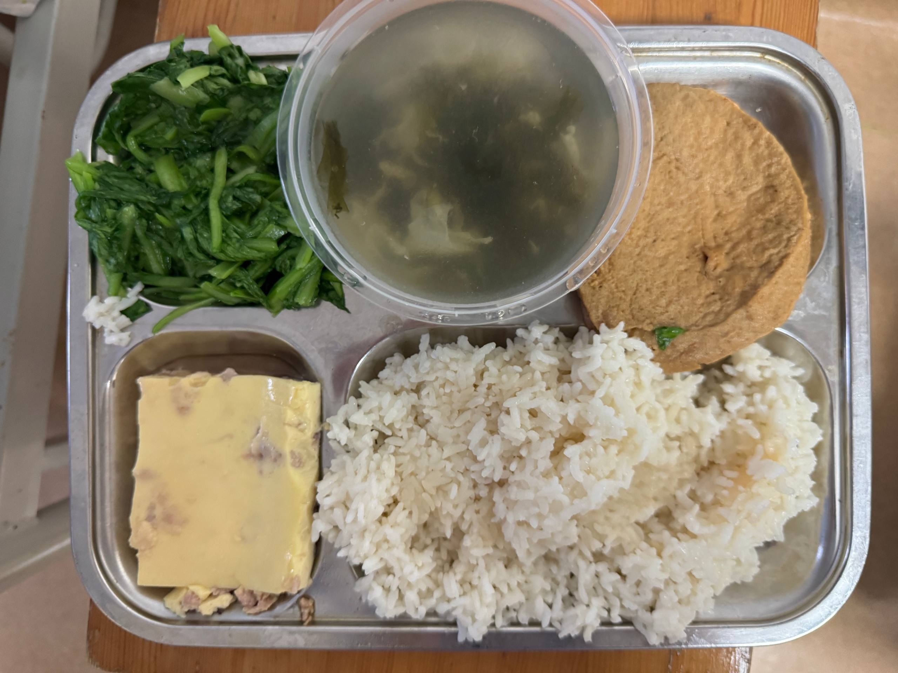
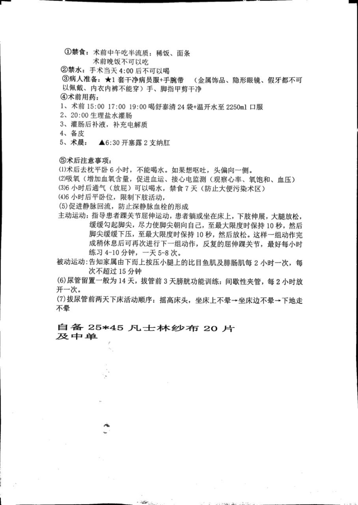


**本页面一切内容不构成医疗建议，请务必谨遵医嘱。** 文中时间线仅为通常情况概述，医生根据你的恢复情况将对此保留很大的自由度。


## 入院

「前来手术前建议先查好传染病四项，以避免不必要的麻烦。大三阳、小三阳等，请控制好病情，最好转阴，再来手术。给医生安全，给自己安全。」

—— 赵博

到达约定的入院时间（参考[入院通知]()）后，请按护士台告知的日期挂号后前往医院。

挂号后，和初次面诊一样在门诊等到叫号，赵博会开具住院证，收走[所需文件]()，随后至住院部一楼办理住院手续。需要预缴押金 50,000 元，支持刷卡、现金、支付宝微信，POS 机使用银联（含银联国际）卡支持非接触交易（包括 Apple Pay），外卡须实体卡插卡交易。**请妥善保管押金单和上面粘附的任何物品（如POS机签字条）至办理出院手续**，随后立刻持住院证前往住院证指示地点的护士站报到，如需外出请在办理住院手续前或报到后。此时如知道哪个病床空着且同病房有喜欢的人可以指定床号。

住院病房默认为三人间，可选单人间或双人间，价格详询护士站。入院时间及顺序并不严格，通常情况是床位空出后先到者先住进去。少数床位爆满情况下可能会安排住在会议室，甚至先住在院外每天过来做检查，直到手术前一天再安排入院。

此时护士会对你进行入院宣教，询问既往史，签一大堆同意书，要求你背诵科室主任（也就是赵博）、主治医生（不是赵博）、护士长、管床护士的姓名，戴手腕带（出院前不能摘），发放病号服、两卷纱布。病号服有三种款式，一种为~~一看就是从宛平南路跑出来的~~蓝白条纹，一种为很好看的浅色拼图图案，还有一种是白色蓝色棕色相间的细条纹。411 会将女性倾向的 SRS 称为「反方向」。

在开具住院证时会收走「易性症」诊断证明或其他类似物**原件**；若家长未陪同面诊并明确表示同意可能还需家长同意书，并可能向家长致电询问意见。

## 住院

医院的作息为夜 21 时至晨 6 时期间熄灯，锁通向电梯间的大门，护士要求外出应在 20 时前返回。熄灯期间可以拉上帘子打开自己床头的灯坐在床头玩手机，但请不要打扰他人休息。

陪护应在 21 时前离开，否则会被锁在里面。

三餐分别在 06:50、11:00、16:50 或更早时由推车在走廊发放。早餐 = 一个白水煮鸡蛋 +（一个馒头/花卷/包子）+（稻/粟/黑米粥/豆浆）+ 咸菜（建议谨慎尝试）。午餐和晚餐的普食 = 米饭 + 青菜 + 一荤 + 一谜（一荤可能是带刺的鱼，一谜可能是鸡蛋），半流食则可能是馄饨/面条/粥。医院饮食一日价格为 30 元，使用医院系统计费，如需取消请联系管床医生；午餐和晚餐为铁盘盛装，但汤仍需自备碗。吃完或没吃完后将残羹剩饭倒至走廊尽头换药室对面的垃圾桶，随后将铁盘带至电梯旁边开水间稍冲洗后留在此处。**餐车的一次性塑料碗和筷子供应不稳定，有时有，有时没有，建议自行准备。**

午晚餐参考：

若不符合饮食习惯可自订外卖（但请不要点螺蛳粉），外卖会送至大门处美团外卖柜，如配送员不愿使用也可能直接放在门口闸机附近。快递会送至大门传达室内，收货地址请写明楼层。快递管理较为混乱，需自行在快递堆中翻找自己的快递。

入院后如需外出需在护士站登记并由医生签字，请不要偷偷溜走以给医院工作人员添加工作难度。术前的请假通常会被准许。

医院门卫将拦下穿病号服的病人离开，此时如需在医院对面商店购买东西，可请求保安使用你的手机上的付款码代劳。

会议室有一台冰箱，偷偷往里面塞一罐可乐或许会无事发生（记着稍后拿出来喝，不是让你投喂冰箱之神）。

病房目前有免费 Wi-Fi `BesTV-W` 覆盖，无密码。使用公共Wi-Fi请**注意信息安全**。

仅限一位陪护过夜，陪护椅可在晚上拉开变成陪护床，但必须在晨 6 时前收起。**仅允许陪护在手术当天起过夜，手术前不可过夜，请注意提前安排行程。**<small>整形外科禁止此前在整形外科住过院的人以陪护的形式在整形外科住院部过夜，理由是「此前有术后的人来当陪护混廉价住宿」。<del>但其实只要护士长和赵博对你印象不深刻就行。</del></small>

入院后请尽快完成撕纱布操作并送至护士站灭菌。需先用剪刀将发放的两卷纱布剪成长宽比约为 2:1 的长方形，随后将其全部撕成线条。先多次折叠可以减少剪裁次数，沿对角线撕较为省力。该操作预计需要数小时的工作，准备适量足够有趣的番剧或足够有趣的陪你聊天的朋友或可减轻该操作的心智负担。[^1]

住院的室友可能有跨男、非二元性别，顺弯女等各种属性，请尊重理解，勿主观判断。幸运时也可能出现一个病房三人都是跨女。病床换人时会拉上帘子打开紫外线灯消毒，请勿直视。

夜间，护工可能会为了防蚊而开启电蚊香，如果对其成分较为敏感，可告知护工。

入院后（将根据入院时间及医院情况安排，请耐心等待）护士站会给你大小便标本盒和几张检查单，检查项目包括尿常规、粪常规、血型鉴定、血常规、生化、凝血功能、激素六项（系统显示为免疫-i2000）、传染病（系统显示为免疫-安图）、心电图、彩超、DR胸片（X射线），当晚 20 时后禁食，22 时后禁水（也可能是 22 时后禁食禁水，根据医嘱进行）。其中血液检查项目会在次日早 6 时由护士至床边或前往护士站抽血送检（所以说一定不要睡懒觉，推荐躺着或坐着进行否则可能低血糖晕倒），粪尿样本需在 8 时-14 时采集，后在护士站扫描并送至换药室对面垃圾桶旁边的样本盒（粪便、尿液采样手术前提交即可），请不要放置样本过久， 其他项目需在预约单上的时间自行前往楼下检查单上标注的地点完成检查，**完成当天全部检查前切勿进食**，可先领取后放在桌子上。

入院后会被管床医生开具精神科会诊，请按照管床医生指示到达门诊楼精神科与精神科医生进行充分沟通，以及完成明尼苏达人格测试，焦虑抑郁自评和他评。

入院后不久会被主治医生叫去医生办公室，询问手术效果期望和侧重，图文视频 ~~（可能还有手绘简笔画）~~ 并茂地详细讲解手术原理和方法，签各种同意书，~~测量腿围购买弹力袜~~，检查手术材料。若手术材料长度和面积不足，可能需要在大腿甚至肚子取皮。过一段时间赵博也会亲自检查一次你的手术材料。

### Day -1

**通常入院后不会立即安排手术**，会有 5-7 天等待期，在此期间仅收取床位费和基础护理费。这段时间里你需要完成医生安排的各项检查和心理科会诊，完成后可以与医生沟通请假外出。在此期间请注意个人卫生，如有感冒等情况可能会导致你的手术计划日期被推迟甚至取消。

手术时间确定后会被护士站的护士和手术室的护士和麻醉医生分别详细询问既往史并详细记录，麻醉医生会要求你签字「同意全身麻醉」，可选「同意使用镇痛泵」（除非你真的很明确的知道你到底在干什么不然不要签不使用镇痛泵）。请和麻醉医生充分讨论你术前使用的可能影响麻醉的药物，镇痛泵使用时长（不够可以后面加），是否需要额外的腰麻。

手术前一天不可吃午饭和晚饭（晚饭时间后当然更不可吃任何东西），晚 21 时（手术室 / 麻醉科要求）或凌晨 2 时（护士站要求，是的，他们没有统一）后不可进水。中午若不是很饿建议不要进食。建议在禁食开始前不要食用难以消化的水果，改变到流食或半流食有利于清肠。

手术前一天需在 11 时、20 时整服用「川倍清」硫酸镁钠钾口服用浓溶液共 1500 mL。每次将 1 瓶全部加入附带的量杯中并加水至刻度线 500 mL 处，并再喝 1000 mL 清水，注意药水和水总共需在 2 小时内喝下。部分评论称其具有浓烈的桔子香精味。根据部分个例经验，稍热时服下并用饮料漱口可能有助于减轻服用时的心智负担（禁止使用含气泡或酒精的饮料）。你可能会想要呕吐但是请尽量不要，以免影响效果。

**肠道准备不充分可能导致极其严重的后果，包括但不限于手术时间延长，台上中止手术，甚至可能致命的严重感染。切勿心存侥幸！**

下午会有护士来备皮（剃毛），晚 20 时或更早生理盐水灌肠，随后静脉注射补液。此外需自行将指甲剪短。

如遇灌肠失败（如无法进入），可以尝试将屁股垫高侧躺再试，或参考小红书灌肠攻略调整体位。

此外，护工阿姨会询问你是否需要请护工以及是否需要气垫床，如需护工将在手术当天开始计费，一共两位护工将负责整层楼所有人的护理。气垫床则需缴纳 150 ￥ 租金。倘若你能像我的某位朋友一样将本站所有相关内容甚至所有 issue 讨论帖反复诵读倒背如流以致刚从手术室回来也能有条不紊的指挥她的陪护的话，那么或许说不定也可以不用请。气垫床充气过满并不会带来太好的体验，可以要求护工阿姨放掉一半的气。

### Day 0

本段时间线假设手术时间安排为早 8 时第一台，实际也可能安排至早 10 时第二台。

医生会开具两只开塞露，遵医嘱在次日六点半或前一天晚上使用，如不会使用请联系护工获得帮助。

赵博会在早 8 时左右查房并确认你做手术的决心。随后你需要做的事情包括前往护士站量血压、血氧等，穿上之前买的弹力袜，换上新发的病号服并去除你身上除了手腕带以外的一切物品包括内衣、发圈、手表。建议在护士站称体重以免体重发生变化误导麻醉医生。

当轮到你下楼时，护士站会通知你「再上个厕所，准备走了。」抓紧时间如厕后，你将被护士领着步行乘电梯前往手术室，你的陪同人员可以一起坐电梯下楼把你送到手术室第一道门口。手术室有两道门，在第一道门处，手术室的医生会向你确认一系列事项，可能有但不限于：

- 你叫什么名字
- 你今天来做的是什么手术
- 你对什么药物过敏
- 是否做过手术
- 是否最近服用药品，特别是影响麻醉和肠蠕动的
- 你的体重

进入第二道门后，脱下裤子，爬到手术床上躺好（手术床又高又窄小心别摔下来），麻醉医生和护士给你接各种监护，手腕插留置针。建议要求将留置针插在手背上，以免术后不方便活动手臂。  

在进行全身麻醉前，可能会进行椎管内注射麻醉，此操作可能有助于减少手术当日的疼痛。椎管内注射时你需要遵从麻醉医生的指令侧卧弓背，麻醉医生会在浅表麻醉后向脊髓内注射麻醉剂，**请注意，如有不适感请告知麻醉医生**。（此过程没有难以忍受的疼痛，也全程不可见，所以无需害怕） 。  

完成椎管内麻醉后，开始进行全身麻醉，你可能会被使用七氟烷进行吸入辅助麻醉，也可能只会被使用丙泊酚注射麻醉。在前者的情况下，呼吸面罩不会和你的面部接触。麻醉医生在开始麻醉前会让你闭眼深呼吸放松，此时可以把信任交给赵博和麻醉医生……~~麻醉医生也可能会在插好留置针后一句话没说就给你面罩里通七氟烷，七氟烷略有刺激性气味，你可能会在咳嗽和麻醉医生的关切与询问中失去知觉。~~

接下来发生的事情你也许永远都不会知道了，但是我还是想要告诉你：

- 8:50 麻醉完毕
- 9:00 赵博进入手术室

此时你已经失去意识并被摆放成截石位，赵博站在你两腿之间正对着你，剩下三位主刀医生分列两侧严阵以待。

- 划开阴囊并止血，十分钟
- 阴道造穴，用手将组织推开并用纱布填充，半小时到四十分钟
- 切除睾丸 分离精索血管，每侧各十分钟
- 结扎精索，每侧各十分钟\
  这一步风险较大，若处理不当可能导致精索进入腹腔引发后果极其严重的腹腔感染
- 翻开包皮，将阴茎皮肤剥离，五到十分钟
- 设计阴蒂，分离阴蒂血管神经至阴茎根部，截断并结扎海绵体，一小时\
  最容易松脱，会使用 7 号缝线进行结扎\
  这是整个手术难度和复杂度最大的部分，攸关阴蒂的存活和敏感度保留
- 把两侧阴茎脚分离至耻骨联合，五十分钟
- 调整阴道深度和宽度，阴茎皮瓣和阴囊皮瓣比例，十分钟
- 缝合阴道
- 安装阴蒂
- 缝合大阴唇

在约午 1 时左右，赵博胜利结束手术班师回病房，而你被推到复苏室继续呼呼大睡，直到被麻醉医生拍醒 ~~或者自己从睡梦中醒来发现牛子不翼而飞，喉咙里还插着管~~，当你睁眼看不到无影灯的时候就意味着手术已经结束了。此时并不会有人跟你说什么「手术很成功，你已经变成猫娘啦~」，如果需要此类仪式感请安排你的朋友在病房等你。确认你意识清醒且体征正常后你会被推回病房，请保持平静并放松平躺，切勿学某些人一定要下床自己走回来。被推着感觉头晕时，闭上眼睛也许会有帮助。

麻醉苏醒后你会开始浑身发抖。在一段时间（大约 30 min）后会感到炎热甚至出汗，这是十分正常的麻醉反应。护工阿姨在你发抖时可能会把病房的空调关掉，如果你觉得热，即使你还在发抖，也可以提出要求打开空调（冬天则是要求开窗）。

此时内含舒芬太尼、氟比洛芬和昂丹司琼的止痛泵（如果你没有作死不选的话）会开始运作，内含的药物足够不间断使用约 2 天。你的痛感可能来自于精索或海绵体或阴蒂，以及大腿根部的引流管。如果疼痛剧烈可请护工阿姨调大流量，如果痛感轻微也可降低或关闭，延长镇痛泵的使用时间。如果非常疼痛，请按压一下按钮，请勿连续按压导致大剂量给药。适当的音乐或视频甚至游戏或许可以帮助你缓解痛感。

刚从手术室回来时你会声音低沉沙哑，这是插管后暂时的症状，不日就会好转，请不要担心。

术后需要去枕平躺 6 小时。术中使用的麻醉剂和镇痛剂都可能导致呕吐。若需要呕吐请告知护工阿姨准备好塑料袋及卫生纸，将头偏向一侧吐出深绿色的胆汁。如果去枕平躺的实在太难受又没那么想吐就把枕头要回来吧。如果呕吐持续，请联系护士注射止吐药物。

在手术室插到你手腕的留置针会被你带回来，上面像搭积木一样插着镇痛泵，静脉注射的各种吊袋，静推时接上去的注射器。在此后的 7 天里，你会每天从早到晚打数十袋液体，请尽量减少手部的活动。请提醒护工阿姨夹上报警器，每瓶液体注射完后，报警器会响。此时你需要按床头呼叫器，提醒护士前来更换。部分药物静脉滴注时可能导致强烈疼痛和静脉炎，此时可调低流速，缓慢调高（或不调高也行，无非就是打得慢点）。留置针通常可用数天，长时间使用可能会出现注射液流量过低，静脉炎，回血等各种问题，此时需要换针。当然你也可能体质很好的到最后几天也什么事都没有，此时是否要换手重打请自行权衡。病房的护士一般会将留置针打在手背，如果你手背血管可用性低，也可能会打在手腕侧或手肘。

注意，手术室的输液器不是精密输液器，没有自动排气功能，所以本日输液时请时刻注意剩余液体量。



仅供参考

- 维生素C注射液
- 氯化钾注射液（注射时可能会导致血管疼痛，可要求护士调慢输液速度）
- 0.9%氯化钠注射液
- 5%葡萄糖输液
- 5%葡萄糖氯化钠注射液
- 盐酸雷莫司琼注射液
- 注射用盐酸丙帕他莫（作用为镇痛，但注射时会刺激血管导致剧痛）
- 喷他佐辛注射液
- 注射用尖吻蝮蛇血凝酶（推针）
- 注射用盐酸罗沙替丁醋酸酯（推针，用于抑制胃酸分泌）
- 复方醋酸钠林格注射液
- 注射用头孢美唑钠
- 左氧氟沙星氯化钠注射液（仅用于有头孢 / 青霉素过敏史的患者）



此外你还会被接上位于手臂的血压计，血压计会每小时自动充气测量你的血压，一次次的把你从美梦中吵醒。夹在手指的心率或者可能是血氧计，身上连着的几个贴片。幸运的是这些在 Day +1 清晨就会移除。监护仪可能会出于各种原因发出蜂鸣，只要你还意识清醒就请不要过度慌张，大部分都是无关紧要的。如遇监护仪报警（连续发出蜂鸣声），请联系护士站检查，或许只是心电监护的贴片脱落。

你还会获得 7 天的氧气供应以增加血氧含量，促进血运。自我感觉良好不想吸了也可以随时拿下来。

与此同时，由于进行了气管插管，医生会开具布地奈德等药物雾化吸入处方以帮助气道恢复。

术后拆包前你需要一直保持平躺，禁止活动大腿及腰腹部，也就是其他部位都可以活动。

每天清晨，护工阿姨会帮助你刷牙，并用毛巾帮你擦洗身体，晚间也有一次擦洗。

通气（放屁后）你将可以进水，但是前 7 天由于每天大量的静脉输液，你可能完全不会感到渴，一直不喝水也是没有什么问题的。此外，你可能在通气时带出粪便。若出现此类情况请放心告知护工阿姨以及时清理。护工阿姨可能会拿一个小的便盆垫在你屁股下面让你一次拉完并帮你清洁，此后直至下地，大便都请呼叫护工阿姨在床上解决。

你需要每天运动下肢，促进静脉回流，防止深静脉血栓的形成：

| 运动方式 |                           运动要求                           |
| :------: | :----------------------------------------------------------: |
| 主动运动 | 指导患者踝关节屈伸运动，患者躺或坐在床上，下肢伸展，大腿放松，缓缓勾起脚尖，尽力使脚尖朝向自己，至最大限度时保持 10 秒，然后脚尖缓缓下压，至最大限度时保持 10 秒，然后放松。这样一组动作完成稍休息后可再次进行下一组动作，反复的屈伸踝关节，最好每小时练习 4-10 分钟，一天 5-8 次。 |
| 被动运动 | 告知家属（或护工）由下而上按压小腿上的比目鱼肌及腓肠肌每 2 小时一次，每次不超过 15 分钟 |

建议认真进行下肢运动，**否则会增加深静脉血栓形成的风险**，且可能因长期保持同一姿势导致后续数日下肢活动困难 ~~（也就是脑子忘了腿怎么用）~~

从今天开始的三个晚上，你将可以每晚获得一针成分为吗啡或哌替啶（杜冷丁）的止痛针，晚上八点护士会询问你是否需要，并在晚上九点注射，在臀部肌肉注射后痛觉甚至身体感觉会很快消失，然后安稳地睡个好觉。~~部分体质特殊者会出现幻觉。~~

### Day +2

如果不是零深度手术（零深度手术没有引流管），这一天会拆引流管，可能会很疼但是一下子就拔出来所以没等你叫出来就拔完了，剩下时间就是留你自己哀嚎。

拆引流管、换药、拆包等操作一般是你的主治医生操作，但也可能周末时由值班医生代为进行，或赵博遛弯过来看见你了心情好顺手给你拆了。

前面的第一个镇痛泵在这天可能输完了，若疼痛难忍可要求加一个泵。

### Day +3

这一天将是第一次换药。你可能会害怕不敢看但是没事因为你努力探头也看不到你的批长什么样子。不过，在每次换药时，你或许都可以让陪护人员给你拍照，取决于医生是否允许。零深度手术可能不会经历这次换药，但会经历另外两次。

医生可能会要求家属回避，也会考虑拒绝拍照，以避免血淋淋的场面引发抢救家属。

从这一天或者稍晚开始，至几天之后，你会因为平躺时间过长腰酸背痛肩膀难受，总之除了批之外哪里都疼，更倒霉的情况下你可能连批也一起疼。甚至出现白天不疼晚上疼，没人的时候疼把赵博喊来了就不疼了的情况。这类疼痛会在几天后缓解（这是真的虽然我当时自己也不信前人写下的这句话），如果因为疼痛而晚上睡不着觉或者因为晚上睡不着觉而疼痛，请不要慌张焦虑，只需要做一些平时消磨时间的事情，如听歌、看视频、打游戏。你是刚做完手术的人，你想晚上不睡就不睡，你想什么时候睡就什么时候睡，反正白天不需要上学/上班，等你真困到不行了就不疼了能睡着了。可以尝试使用氟比洛芬缓解肌肉酸痛；如果你有安眠药类药品的处方，也可尝试服用，但需自带。<small>（术前请尽量充分地认知安眠药类药品在自己身上可能出现的效果，避免像笔者之一一样，服用喹硫平后以一个不那么利于恢复的姿势睡着。）</small>此外倘若你的大腿也开始疼，这是由于手术时间过长压迫血管导致的，一般无需担忧，几天后就会缓解。

如遇脚背疼痛，可适当调整袜子的位置以免产生勒痕。

护士将视情况移除留置针以免堵塞，并在次日输液时打新的留置针。

### Day +6

今天将进行第二次换药，同时也该拔掉手上的留置针啦。

如果你的消化系统提前启动（极早期症状如术后一天内通气，早期症状为肚子咕咕叫，中期如胃疼、胃食管返流，后期可能演变为胃溃疡乃至胃穿孔），在和赵博说明的情况下，你或可在今天开始服用米汤等流食。在这种情况下，特别是真的老老实实躺床上一动不动的人，建议早点咨询医生并开始服用铝碳酸镁咀嚼片，以免胃酸长期处于一个位置不动、腐蚀同一处胃壁而出现的胃溃疡。

### Day +7

今天开始你将从禁食改为半流质饮食。是否直接吃点刺激的比如疯狂星期四取决于你对你的肠胃功能和不规律饮食的后果或没有后果是否有清晰的认知。如果你实在很馋，请至少在今天日出时开始进食而不是零点时。

医生会开具甜梦口服液和热淋清颗粒或膀胱冲洗操作以预防尿路感染。



护工可能会为了减少你的疼痛而减轻擦拭的力度，请结合实际情况与护工沟通或再次清洁，若有污物残留将会增加伤口感染风险。

由于如下因素，你在术后的排遗物可能会偏离理想外观和性质，导致腹泻或便秘：

- 止痛剂和止痛药会减缓肠道蠕动
- 术前的全肠道灌洗和术后的抗生素使用，可能清空肠道菌群 ~~（消化是一个五十亿细菌的大系统）~~
- 对术区的加压包扎可能会阻碍排遗物到达直肠
- 6 天禁食和 12 天卧床后，加上下体构造的一些改变，导致你可能忘了如何排遗 / 在正确的部位使劲

对腹泻的应对方案：

- 在能下床前只服用肠内营养粉（注意不能是若饭™，若饭™含有纤维素，会产生粪便），注意嘱咐护工阿姨严格按照配方调制，不要多加 / 少加水
- 使用蒙脱石散等止泻剂（可向护士台联系获取蒙脱石散）
- 减少纤维素的摄入，转而食用瘦肉等易使排遗物结块的食物
- 可使用“双歧杆菌三联活菌胶囊/三联活菌散/四联活菌片”、酸奶（不是含乳饮料）等调节肠道菌群

对便秘的应对方案：

- 在错误的位置过于用力可能导致下联合轻度撕裂，一般无大碍，如厕后若有疼痛 / 额外渗血，可以考虑咨询经验丰富的护工，并在早上医生查房时要求医生们看看
- 向护士索要开塞露，一至两枚纳肛后一般可起足够的润滑作用，并使粪便软化，以及辅助你回忆起应该用力的位置
- 增加纤维素在食物中的占比，如多吃水果、在特定几餐只吃青菜。含乳糖较多的纯牛奶也可作为轻泻剂使用
- ~~疑似有点极端了：一些住院者手中可能有剩余的聚乙二醇电解质散（绝不鼓励剩余）~~



### Day + 8

今日改为普食。

### Day +9

今天将进行第三次换药。

### Day +12

今天拆包，可以自行用镜子或手机欣赏。此时由于长时间包裹挤压皮肤可能发皱，以及被碘伏泡到黝黑，请不要落差过大。此外，今天可能不会拆除阴蒂及阴道内部的纱布。你还需要请护工阿姨或护士用胶带固定尿管防止滑动。

如遇拆包后从阴道内掉落纱布，请联系护士联系医生检查纱布情况，并视情况消毒，填充新的棉球。

今天开始你要进行憋尿训练，将尿管夹住，直至两小时后或你憋不住了再放开。

### Day +13

今天你将练习下床。练习顺序为：摇高床头，坐床上不晕 → 坐床边不晕 → 下地不晕。

请量力而行，循序渐进，下地后不长时间就头晕甚至失去视力都是正常的，谨防摔倒。下地可能需要一到两天的练习，当然如果你能直接跳下床整层楼乱窜我们都为你竖大拇指。在能较长时间站立行走后可多去其他病房串门，排解其他姐妹孤苦的同时锻炼行走能力。若出现流感等疾病的院内感染，请尽量待在自己的病房以减缓传播。

此时你就可以告别弹力袜了。如果你要穿内裤请记着加垫卫生巾。

### Day +14

阴道内部的纱布可能会在今天拆除。此时你可能会随机收获诸如「怎么这么深啊」的感叹。

同时今天会进行拆线，可以提前数小时联系医生征得同意后，涂抹封膜利多卡因乳膏以减轻疼痛。

## 拆线与通模具

在你能独自走到换药室之后，请告知你的主治医生，以便他安排拆线。你会在换药室拆掉阴唇部明显的缝线，留下部分可吸收线用一两个月的时间慢慢消失。拆线痛感不至于无法忍受但过程漫长，可考虑戴耳机听歌转移注意力。

同时会在换药室进行拔尿管操作，拔尿管一般来说很疼但是也很快所以你大概也是拔完才开始哀嚎。拔掉尿管后你将需要自行上厕所，小便时请放松肌肉，如小便困难可尝试与大便一起进行。如一直无法排尿可能会被插回尿管受罪翻倍。便后请用餐巾纸和湿巾将阴部清洁干净，切记擦屁股要从前往后擦。

如果此前收获了「怎么这么深啊」的感叹，医生可能会担心有纱布遗留在阴道内（存在已知的案例），因此会在换药室的无影灯下使用扩阴器进行检查。这时你可能会痛出杀猪叫，属引凄异，哀转久绝。

拆线后某天（或者当天~~甚至刚拆完线后~~），赵博会亲自来教你通模。通模需要避孕套和直径 25 mm 的硅胶软质模具。前期通模需使用普朗特凝胶润滑，在用完两瓶凝胶后可使用普通润滑。通模频率以一日两次为宜。

## 出院

床位紧张时，一般在术后 15~20 天，你能下地行走的几天后，你会被要求出院。若床位不紧张，你将有机会自己和医生商量出院日期。

<!-- 不要提供出院小结和出院诊断证明的图片 -->

请在出院前持身份证、户口本找你的主治医生核对身份信息，尤其是姓名和住址与户口本上保持一致。如需「不宜体育运动」等字样也请此时向你的主治医生提出。请仔细核对出院小结、诊断证明，确保性别鉴定写的是「性别为女」而不是「性别为男」，以及你做的手术的内容，特别不是阴茎再造手术或女跨男手术，将上述材料分别找末尾署名的医生签字盖章。赵博办公室及护士台张贴有公证员的联系方式，请拍照留存。前往护士站领取《三甲医院证明》。

出院当天，请持「押金单」、上段所述全部材料，前往住院部一楼结账，并在所有材料上盖章。出院办理窗口在工作日全天开放，周末上午开放。向护工阿姨付清费用。护工阿姨可以代为完成本段内容。

## 公证

上海东方公证处位于凤阳路598号。从医院打车约20分钟，可以和同时出院的病友一起拼车。公证后约7个工作日可以领取（寄出）。

### 公证员联系方式

请在上班时间拨打。

- 龙炎鸣：13818477976
- 吕臻卿：18017325320

### 公证费用

- 副本费：10元人民币（每本**副本**）
- 上门取证费：30元人民币
- 公证费：100元人民币
- 调查核实费：200元人民币
- 快递费：顺丰到付

### 公证过程

将你在医院获得的全部材料和身份证，户口本（可用户籍证明代替）交给公证员即可，另需签署未婚声明、笔录、公证说明、快递声明、签署回证等材料。

全程约30分钟。座椅为硬质材料，请考虑使用甜甜圈坐垫。

[^1]: 疑似用途见赵烨德作为通讯作者的论文 [《应用尿道海绵体黏膜组织瓣构建会阴前庭的临床研究》](https://doi.org/10.15909/j.cnki.cn61-1347/r.004496)
