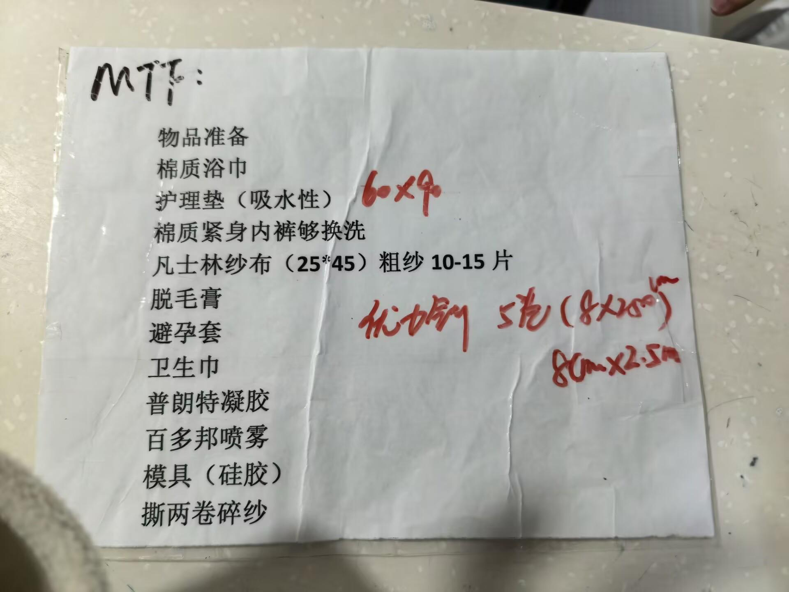
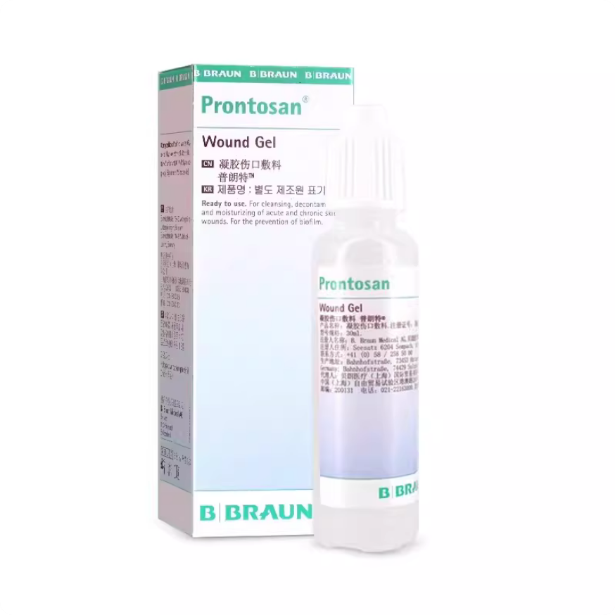
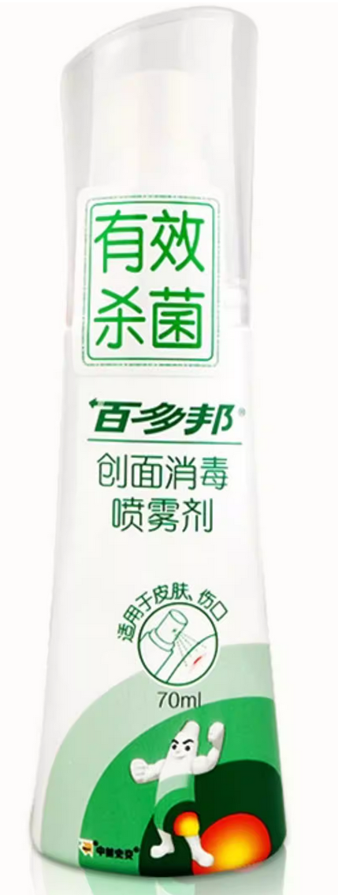
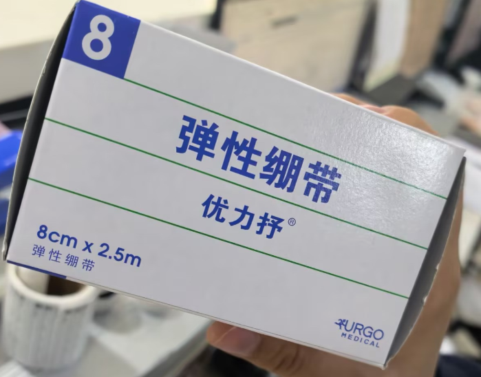
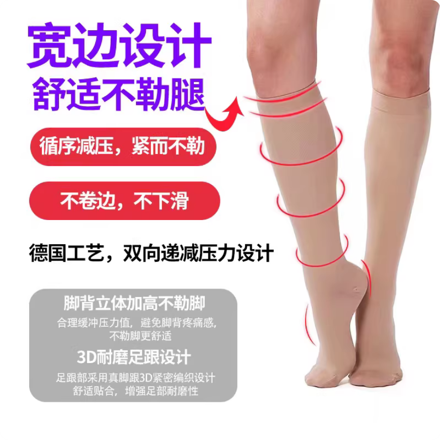

## 入院通知

「前来手术前建议先查好传染病四项，以避免不必要的麻烦。大三阳、小三阳等，请控制好病情，最好转阴，再来手术。给医生安全，给自己安全。」

—— 赵博

大约在预约的手术排期的两个月前，整形外科护士台会通过医院电话主动联系就诊者预约时留下的联系方式确认手术意愿，要求停止 HRT，**并直接告知就诊者具体的入院时间（一般是周二或周四）**。

同时，护士台会通知，**医院后续将需要与就诊者的家长通电话或微信语音**。

- 伦理审查：护士台与家长的联系属于伦理审查中较靠前的环节。其目的并非强求家长明确说「同意」或「支持」，而是向家长简单说明情况。
- 审查标准：护士台曾多次强调，**伦理审查的底线是「只要家长不反对就没问题」**。
- 同意书公证：如果有公证过的家长同意书，护士台可能不需要直接联系家长，但伦理审查人员之后仍有概率会联系家长。
- 风险：如果无法联系上家长，或者家长在沟通过程中明确表示反对，伦理审查可能会被打回来，这可能直接导致无法手术。

注意：曾有反馈称医院不主动联系预约手术者，且「不主动联系医生视为放弃手术」。虽然现在流程已改为护士台主动联系并分配时间，但为了保险起见，若在预约时间前一个月仍未收到通知，明确入院时间，建议主动通过电话、微信或挂号联系确认。

确认入院时间后，请按护士台告知的日期挂号后前往医院。

## 需要准备的材料与满足的条件

1. **年龄满 18 周岁**（预约时未满 18 周岁的，在术前入院时年满即可）
2. **诊断证明（易性症/性别焦虑/性别不一致/性身份障碍）**，由中国大陆任意三级医院精神科或心理科开具，医生需具有高级职称医师资格，诊断书上需加盖医院公章（诊疗意见中如有「随诊观察」「建议药物治疗」等字样，则**可能**被伦理委员会驳回，可以尝试与开具诊断证明的医生沟通并删去），**一份原件、两份复印件**
3. **父母同意书**[（模板）](icf.pdf)（正文部分手写或打印均可，签字必须手写，截止 26 年 3 月的信息均无需公证、无需按手印，如有特殊家庭情况参照对应的同意书相关要求），**一份原件、两份复印件**
4. **无犯罪记录证明**（可在各省公安小程序办理，也可到线下户籍地派出所办理。该项材料有时效，一般为三个月，入院上交时没过期即可），**一份原件、两份复印件**
5. **未在婚姻状态声明**（**即使入院时未满法定婚龄，也需要该项材料**。部分地区街道办或居委会已经不再开具该证明，可**提交户口本本人页复印件一份并手写「本人声明处于未婚状态（签名按手印）」替代**），**手写三份或一份手写原件、两份复印件**
6. **个人申请书**（内容需包含姓名、指派性别、身份证号、确诊与 HRT 相关经历、为什么一定要手术、不手术会造成什么困扰、声明已经了解手术相关风险，全篇套用模板可能被伦理委员会驳回，100-200 字即可，字数无上限），**手写一份、两份复印件**
7. **户口簿的户口首页、户主页、本人页复印件，复印三份即可**
8. [BMI](https://zh.wikipedia.org/wiki/身体质量指数) 需要控制在正常范围以内（推荐小于 24，最高不可大于 26，暂无因太瘦被医院拒绝手术的报告）
9. 提前告知（慢性）基础疾病，高血压、糖尿病需术前一个月平稳控制（无并发症）
10. 由于雌激素可能带来的血栓风险，**需停用雌激素类药物一个月**。执行并不严格，医生会根据激素六项和凝血等结果判断是否适宜手术，请对停止用药后可能出现的问题做好心理准备
11. **不拒绝**  阳性患者[^1]

以上提到的材料**需要提交给医院。**

1. **户口本原件**，用于核对出院小结上的信息（住址，与身份证有冲突时，以户口本为准）。集体户口或没有户口本可与公证处公证员联系，前往就近的派出所开具户籍证明
2. **在有效期内的二代身份证原件**，用于核对出院小结上的信息（住址）及办理公证

以上材料**无需上交，但需要随身携带**。

## 需要自行购买或携带的物品

出于便携移动的考虑，并不推荐提前在行李中携带过多物品前往医院。~~这里是上海，没有任何东西是京东和顺丰隔天送不到的，京东自营可以做到早上下单傍晚送达，下午下单次日送达。~~

如果认识即将出院的朋友，可以考虑接收朋友的物资，例如脸盆、没用完的护理垫等。如果还没有认识的朋友，可以通过在 411 术前群多水群或是挨个病房转悠几圈找朋友。

### 护士台要求准备的物品

下列物品会在入院宣教时要求就诊者准备。

- 棉质浴巾，1-2 个（主要用于下床后围在腰上在病房活动，准备可穿戴的浴衣可以降低浴巾掉落走光的风险）
- 护理垫（吸水性）60x90，15-20 片（非单层床单，需可吸收液体，如不确定可在购买前询问护工阿姨，用于换药时垫在身下或吃饭时当餐布）
- 棉质紧身内裤够换洗（要求紧身以减少肿胀，2 条即可，通常只有出院当天需要穿，由于 7×24 使用卫生巾一般无需频繁换洗）
- 粗网灭菌凡士林纱布（25×45 或 25×40）粗纱，1-2 盒，需在术前交至护士台，如不确定购买何种可询问护士台，<small>或参考与本站及院方均无利害关系的第三方购买链接：[振德医疗灭菌凡士林纱布油纱布烧烫伤引流不粘伤口多规格10片包邮](https://detail.tmall.com/item.htm?id=582921441062)</small>
- 脱毛膏（备皮时无法刮除肛周毛发，如有肛周毛发时使用）
- 卫生巾（纯棉日用款 245 - 275 mm 即可，以轻薄透气的款式为宜，仅在出院当天需要使用）
- 百多邦喷雾（住院期间需准备 2-3 瓶，注意**是喷剂不是涂剂**，需选择可用于伤口消毒的款式，用于大小便后术区消毒）
- 撕两卷碎纱
  - 入院时会给你三卷纱布，护士站提供剪刀，但请优先完成剪裁后立刻归还。
  - 请将纱布撕成纱线

- 优力抒弹性绷带（8cm × 250cm），5 卷

仅成形阴道的 SRS 需要准备的物品（用于通模具，零深度无需准备）：

- 普朗特凝胶（请**认准凝胶款而非液体款**；30 mL装，两瓶）
  - 请勿购买大瓶的液体版本
- 避孕套（住院期间大约会使用 15-20 个）
- 模具（硅胶）
  - 模具可在购买前和管床医生沟通。
  - 医生要求使用**软质透明**硅胶假阴茎作为模具，使用玻璃模具可能导致通模困难、疼痛和撕裂等问题。出院前仅需要 2.5 cm 直径的模具，出院后根据恢复状态将逐渐扩大尺寸。





如有疑义请与管床医生或护士沟通。

### 其他建议准备的生活用品

#### 入院前

- 电源插排\
  用于为手机等设备充电。每张床位仅有一个国标电源插座，若无插排术后心电监护将占用
- 靠枕（可选以改善体验）
- 饭盒/碗（半流质食物/普食早餐粥）、筷子、勺子\
  有时可以向餐车免费索要一次性筷子或一次性塑料碗，但供应不稳定，建议自行网购一次性餐具/旅行餐具，~~或放弃在餐车吃饭~~
- ~~PP材质可盛装开水的塑料水壶（水房只有开水，如全程购买瓶装水可忽略）~~ 病房提供公用热水壶，也可自带
- 耳塞 / 降噪耳机（可选以提升睡眠体验）
- **2m 或以上** 的 USB 线缆（插座离床有一定距离）

#### 手术后

- 毛巾（用于不能下床时擦脸及身体，可购买一次性毛巾作为更卫生的替代）
- **无酒精**消毒湿巾（可购买婴儿湿巾）
- 抽纸
- 个人生活用品（洗面奶、护肤品、沐浴露、洗发水等，可购买小包装）
- 牙刷、牙膏、漱口杯（可用一次性杯）\
  建议在术前认真评估自己是否掌握了平卧单手刷牙这项技能。电动牙刷可显著提升体验
- 口香糖\
  用于在无法仔细刷牙时清洁口腔
- 水杯\
  建议使用水瓶倒置时仍可以正常饮水的瓶子，如尖叫、农夫山泉；如果水杯不带吸管护工阿姨可提供吸管
- 小镜子，手电筒\
  用于~~审批~~自行查看伤口及术区恢复情况，请自行评估是否可用手机替代
- 小风扇（用于干燥阴部和解暑）
- 拖鞋，或便于穿脱的其他鞋子
  **可能**可以继承别人的，如果接受使用二手可不购买
- 手机支架\
  护工阿姨有多的
- 脸盆，病房里可能有，如果接受使用二手可不购买
- 两个不易断的橡皮筋\
  可麻烦护工阿姨在术后给你扎辫子以避免打结等问题，如有不适可请求改换发型。
- 甜甜圈坐垫（痔疮手术坐垫），拆包前购买即可，用于术后及出院后作为坐垫，痔疮手术坐垫相比甜甜圈坐垫更硬、支撑性更好，请根据个人情况和喜好选择。
- 药品（以下药品院方不会强制要求或开具，请自行评估后自备，**请在使用任何药品前与管床医生充分讨论以免发生计划外问题，本列表不构成医疗建议**）
  - 草木犀流浸液片，迈之灵片（禁食结束后术区消肿）
  - ~~康瑞保祛疤凝胶（拆线后祛疤）~~ 直接在医院购买即可
  - 适合自己且持有处方的安眠药（疼的睡不着满床打滚时服用）
  - 布洛芬（止痛）**因术后院方会静脉滴注大量「注射用盐酸丙帕他莫」，严禁使用任何包括「对乙酰氨基酚」成分的药品。谨防药物相互作用及药物过量，必要时咨询医师。**
  - 铝碳酸镁咀嚼片（禁食期间缓解胃部症状）
  - 氟比洛芬凝胶贴膏（缓解长期卧床肌肉酸痛，实际上你的镇痛泵中无意外已经有这个成分了。因此可能部分人效果不佳）
  - 利多卡因软膏（**是软膏不是喷雾**，如担心拆线时过于疼痛，可以提前半小时涂抹减轻疼痛，医生认为减少挣扎也能让他们更好操作，**用药前请务必再次咨询医生并得到许可**。**切忌用于通模**，可能会导致你对通模时的疼痛感知产生偏差造成伤害）
  - 甲钴胺（手术中不可避免会切断和重新连接许多细小的神经，甲钴胺可以帮助这些受损的神经更好地修复）

[^1]: 现阶段正进行病房改造，HIV阳性患者需前往指定医院完成SRS后转回411医院恢复，具体流程请同医生交涉，预计改造完成后将可以在院内完成相关患者的手术。
