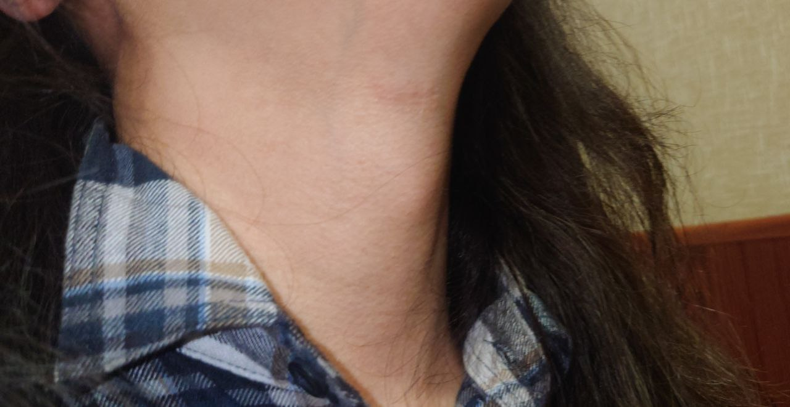
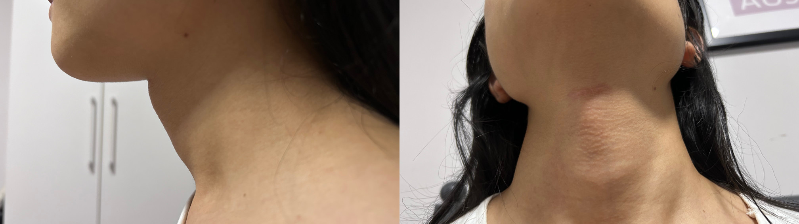



本页面所述为在上海四一一医院进行喉结切除的经历。挂号等一般性内容请同时参考阅读[上级页面]()。



## 费用

在上海四一一医院进行喉结手术的费用约为六至七千元。

## 术前

喉结手术预约需当面面诊，或可尝试于「[好大夫]((https://www.haodf.com/doctor/6964528056.html))」线上预约，无需精神科诊断证明，无需直系亲属知情。

手术一般会视医院繁忙程度安排在预约后的一至两周内，术前需进行血常规、凝血功能、传染病等常规术前检查。

## 手术风险

手术的主要风险为术后出血导致窒息，及损伤喉返神经的可能性。此外，若年龄较大，可能会出现软骨硬化的情况，且无法在术前提前预知，若出现软骨硬化可能需采用更激进的手术器械，增加手术风险。手术效果因人而异，可能无法使喉部完全平坦（任何不非常激进疯狂的医生都无法保证手术效果）。

## 手术

若预定手术时间为工作日，可于手术当天直接前往医院门诊楼四楼开单缴费；若非工作日，请于手术当日向护士站致电询问，或提前与赵博约定好时刻地点，~~或直接前往住院部（可能会扑空）~~。

手术在住院部21楼整形外科换药室进行，换药室位于进门左转走廊尽头倒数第二个房间。手术由 赵烨德 博士 亲自主刀，麻醉方式为局部麻醉。手术前会给你一个黄色橡皮鸭子，如果医生忘记请主动询问，手术过程中若需吞咽或说话请提前用鸭子示意医生。手术过程中可能会蒙眼（也可能不蒙，手术过程中可通过无影灯镜面观察手术过程，请做好心理准备）。

## 术后

喉结切除术无需住院，术后需平躺冰敷数小时，随后便可自行离开医院。术后不影响进食及言语，但请尽量减少相关活动。术后请不要喝开水。

术后数小时将会开始剧烈疼痛，一般持续至当晚或严重可能数日后减轻。可酌情遵说明书服用非甾体抗炎药（如布洛芬、对乙酰氨基酚）等止痛药，亦可冰敷缓解疼痛。

一般而言，术后三天左右回门诊或于您所在地的医院换药，七天后可拆除纱布。手术使用可吸收缝线，无需拆线。可使用「康瑞保」、「倍舒痕」等外用药减淡疤痕。\

## 术后评价

### 案例一

### 案例二

- 术前
    
- 术后
    
