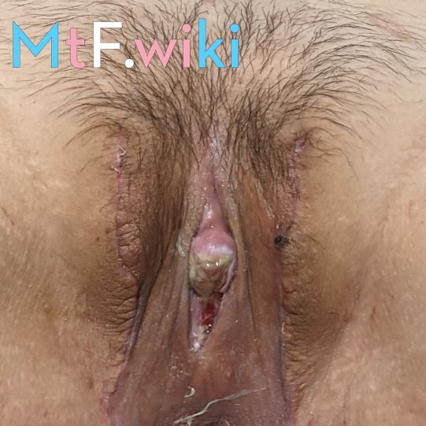

## 九院跨性别序列治疗团队

团队：

- [刘阳](https://www.haodf.com/doctor/74805.html)（主任医师）
- [程辰]()（主治医师）
- [张盈帆](https://www.haodf.com/doctor/275463.html)（副主任医师）
- [麻荪香](https://www.haodf.com/doctor/599858232.html)（副主任医师）
- [周怡雯](https://www.haodf.com/doctor/9032015682.html)（住院医师）

特别顾问：

- [程开祥](https://www.haodf.com/doctor/12887.html)（主任医师）

其中 MtF SRS：

- [刘阳](https://www.haodf.com/doctor/74805.html)（主任医师）
- [麻荪香](https://www.haodf.com/doctor/599858232.html)（副主任医师）
- [程开祥](https://www.haodf.com/doctor/12887.html)（副主任医师）

## 前置条件 {#prerequisites}

1. 达到 20 周岁以上
1. 以心理认同的性别至少生活一年以上（RLE）
1. 易性症诊断：易性症证明（目前仅承认由 [邸晓兰]()、过斌、[丛中]()、[陆峥]()、[刘娜]() 开出的证明），并证明无其他心理疾病
1. 公证证明：公证处开具，证明本人及至少一位直系亲属同意行性别重置手术
   [本人申请书 + 父母知情同意声明](icf.pdf)（模版，需要公证）
1. 高血压、糖尿病需术前六个月平稳控制（无并发症）

## 术式、价格

(最后更新时间 `2021-11-08` 刘阳)
PI 皮瓣技术，但是需要脱毛。
手术费用约 6 ~ 8 万 (缺乏精确数据)

## 问诊

1. 会详细询问 使用激素的效果及感受 (比如身体有哪些变化)
1. 会详细询问 RLE 细节及感受/打算
1. (可能) 需要体检 (脱光, 医生看胸部和阴部)
1. 如果阴部毛发太多, 医生会要求首先进行 **激光脱毛** (大约需要 3 至 6 个月), 脱毛之后才能手术.

## 手术评价

  
  
  
