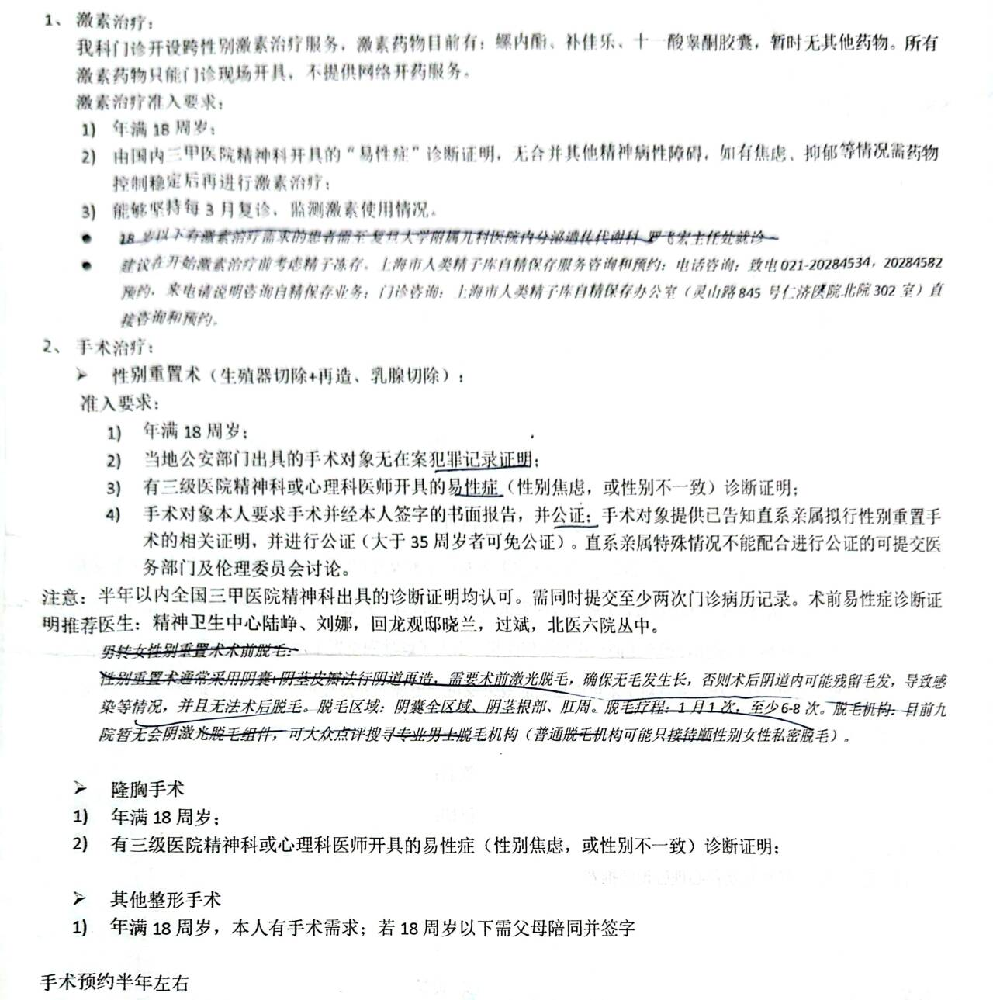
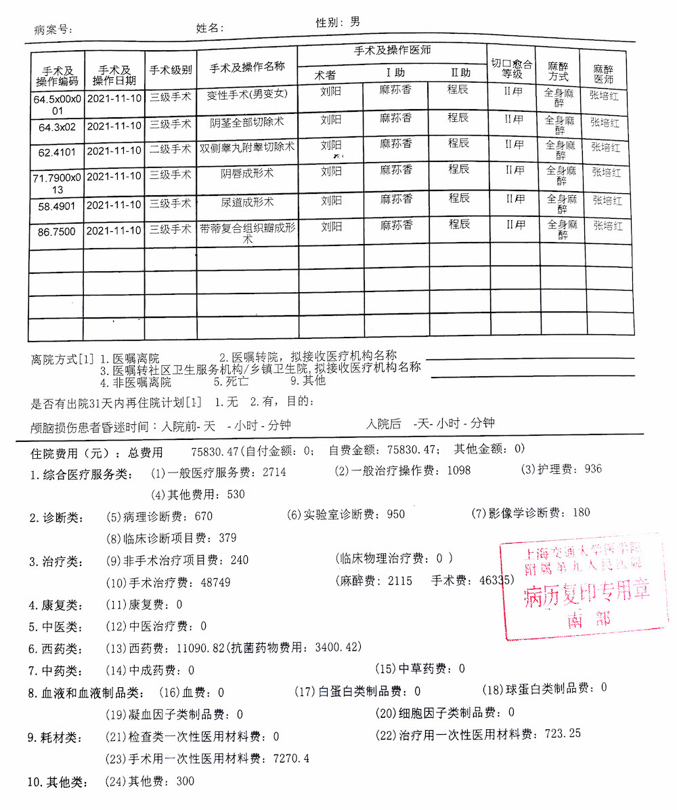

## 九院跨性别序列治疗团队

团队：

- [刘阳](https://www.haodf.com/doctor/74805.html)（主任医师）
- [程辰]()（主治医师）
- [张盈帆](https://www.haodf.com/doctor/275463.html)（副主任医师）
- [麻荪香](https://www.haodf.com/doctor/599858232.html)（副主任医师）
- [周怡雯](https://www.haodf.com/doctor/9032015682.html)（住院医师）

特别顾问：

- [程开祥](https://www.haodf.com/doctor/12887.html)（副主任医师）

其中 MtF SRS：

- [刘阳](https://www.haodf.com/doctor/74805.html)（主任医师）
- [麻荪香](https://www.haodf.com/doctor/599858232.html)（副主任医师）
- [程开祥](https://www.haodf.com/doctor/12887.html)（副主任医师）

## 挂号与就诊 {#appointment}

### 挂号方式

1. 在微信「搜一搜」中搜索「上海九院」，点击「预约挂号」
1. 选择「门诊预约」，完成预约
1. 就诊当天前往「我的预约」页面完成挂号支付
1. 到达**南部园区新门诊楼 9 楼整复外科**，在右前方扫描就诊码完成挂号登记

### 需要挂的门诊

SRS 流程需要分别挂以下两个门诊：

```csv
门诊,出诊时间,挂号费,用途
整复外科 刘阳（主任医师）,每周一,50 元,面诊、评估
整复外科 性别医学专科门诊,每周二,25 元,提交手术审核材料、排期
```

两个门诊均**需要父母一方陪同前往**。

## 问诊内容 {#consultation}

需在性别医学专科门诊或刘阳主任专家门诊线下面诊。

以下为早期就诊记录，**未必会被问及**——笔者 2026 年 7 月的问诊中，下列内容均未涉及，也没有进行体检。是否进行检查与提问，或与医生对就诊人的外貌印象有关：

1. 会详细询问 使用激素的时长，用量，效果及感受（比如身体有哪些变化）
1. 会详细询问 RLE 细节及感受/打算
1. 会询问是否合并其他精神类疾病
1. （可能）需要体检（脱光，医生视检胸部和阴部）
1. 甚至询问你去哪个厕所（预约 SRS）

若年龄低于 22 岁，且无学业上的必要，或并没有对自己的身体感到厌恶、只是想修改证件性别，可能会被医师劝告慎重考虑。

此种情况下仍然可以先行排期，且在排期过程中可以取消。先行排期的目的之一，是给就诊人和父母提供考虑清楚的时间。

## 准入条件 {#prerequisites}

### 性别重置术（生殖器切除 + 再造、乳腺切除）

1. 年满 18 周岁
1. 当地公安部门出具的手术对象无在案犯罪记录证明
1. 未在婚姻状态（若相关部门无法开具，可免去提交《未在婚姻状态证明》）
1. 三级医院精神科或心理科医师开具的易性症（性别焦虑，或性别不一致）诊断证明
1. 手术对象本人要求手术并经本人签字的书面报告，并公证；手术对象提供已告知直系亲属拟行性别重置手术的相关证明，并进行公证（大于 35 周岁者可免公证）。直系亲属特殊情况不能配合进行公证的，可提交医务部门及伦理委员会讨论

此外，高血压、糖尿病需术前六个月平稳控制（无并发症）。

### 隆胸手术

1. 年满 18 周岁
1. 三级医院精神科或心理科医师开具的易性症（性别焦虑，或性别不一致）诊断证明

### 其他整形手术

1. 年满 18 周岁，本人有手术需求；若 18 周岁以下需父母陪同并签字

以上准入条件出自院方提供的书面说明：





## 所需材料 {#documents}

### 就诊时必须提供

1. **三甲医院开具的易性症 / 性别不一致诊断证明**
1. **经公证处公证的《本人性别重置手术申请书》与《父母知情同意书》**



病历是**不可用**的，即使病历上有诊断字样；需要是明确的、带有医院公章的**诊断书**。

半年以内全国三甲医院精神科出具的诊断证明均认可，同时需提交至少两次门诊病历记录。

院方推荐的开具医师：上海市精神卫生中心 陆峥、刘娜；北京回龙观医院 邸晓兰、过斌；北医六院 丛中。



公证材料的格式可参考[《跨性别女性（MtF）生殖器手术须知》](https://www.sar.com.cn/huiyin/yxp/13032.html)。年龄在 35 周岁以上不需提交公证。公证流程详见[术前公证]()。

### 可在就诊后补交

**无犯罪记录证明**可在就诊后通过**在线问诊**提交给医生。该证明可在户籍地政府办事小程序在线开具。

## 排期 {#schedule}

排期在**性别医学专科门诊**进行，所有资料提交完毕后即可开始排期。

手术排期约为半年左右。

例：2026 年 7 月 28 日咨询零深度术式，需排到 2027 年 3 月。

## 术式与费用 {#procedure-fee}

```csv
术式,费用,住院时长
零深度术式,6 万元,约 2 周
PI 皮瓣术式,7 - 8 万元,—
```

- 零深度术式的费用与住院时长最后更新于 2026 年 7 月。
- PI 皮瓣术式费用最后更新于 2021 年 11 月，可能已有变动。





术后可能会要求一段时间内 24 小时佩戴模具。模具或需自行购买。

## 术前准备 {#preop}

### 会阴部激光脱毛（皮瓣术式）

皮瓣术式通常采用阴囊 + 阴茎皮瓣法行阴道再造，**需要术前激光脱毛**，确保无毛发生长，否则术后阴道内可能残留毛发，导致感染等情况，并且无法术后脱毛。

- 脱毛区域：阴囊全区域、阴茎根部、肛周
- 脱毛疗程：1 月 1 次，至少 6 ~ 8 次
- 脱毛机构：九院暂无会阴激光脱毛项目，需在外院进行。可自行搜寻专业的男士脱毛机构（普通脱毛机构可能只接待顺性别女性私密脱毛）

## 手术评价

刘阳医生，2021 年 11 月手术



术后 1 个月拍摄



术后 18 个月拍摄






