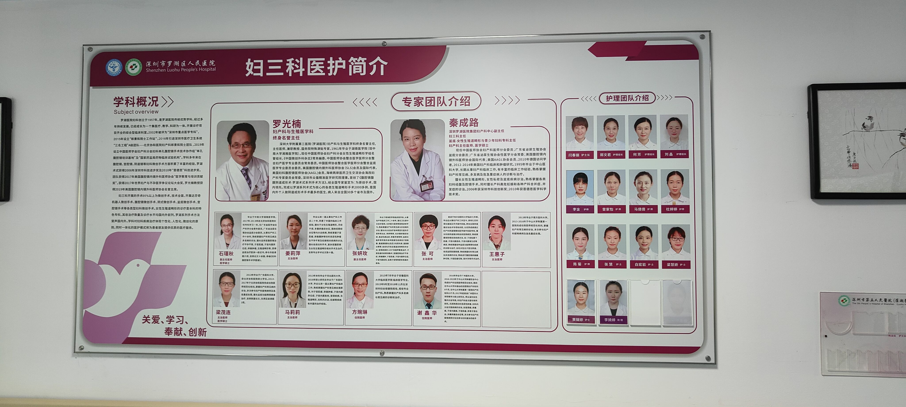
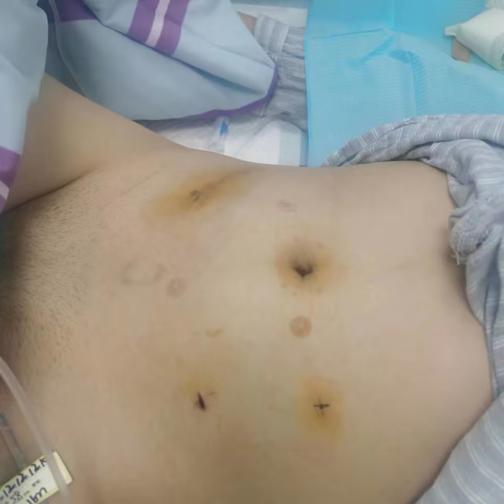
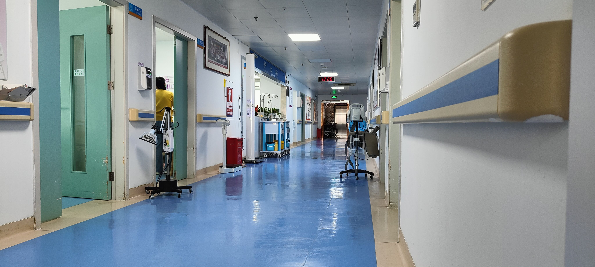

<!-- 罗光楠教授已于2023年2月4日逝世，罗光楠教授在阴道成形领域做出了突出贡献，在此向其致敬 -->


该医院无 SRS 资质，故来该院进行阴道成形术要求身份证上性别必须为女。



本页面编写者为女假两性畸形，手术流程可能与跨性别女性略有出入，但大体相同，请以医生宣教为准。


## 基本情况

医院：[深圳市罗湖区人民医院](https://www.szlhyy.com.cn)（院本部）

地址：[深圳市罗湖区友谊路 47 号](https://amap.com/place/B02F38IHAD)

科室：[妇三科](https://www.szlhyy.com.cn/ksjs/lcks/fsk.htm)

医生：

- [秦成路](https://www.szlhyy.com.cn/info/1352/9047.htm)（主刀医生，也是妇三科主任）
- 张可、王惠子、马莉莉、梁茂莲、任俊旭、黎雪茹（随机分配，似乎可以要求更换医生，也有可能安排到其他医生）





深圳市罗湖区人民医院是国内外进行阴道成形术最多的医院之一，以“罗湖术式”闻名海内外，对腹腔镜下的阴道成形术有非常丰富的经验。对于“石女”（即无阴道女性）来说，深圳市罗湖区人民医院是她们极其信赖的医院之一。近几年，该院接受过不少 SRS 术后修复的案例，也接受过不少在其他地方进行“零深度 SRS”后再来进行阴道成形术的案例，故该院对跨女手术的经验积累已经丰富。经费较为充足且对自己的阴道期望较高的跨女可以选择二次手术。

深圳市罗湖区人民医院对跨女一般是进行“回肠代阴道”术式，若有要求也可进行“乙状结肠代阴道”术式。对于为什么不给跨儿做腹膜术式或生物补片术式的原因，罗光楠教授做出了如下回复：

1. 腹膜和补片对于无阴道女性仅仅只是作为“打框架”的作用。在无阴道女性的案例中，当阴道框架打好后，她会慢慢按照打好的框架生长出一个正常的女性阴道。而跨女没有卵巢，雌性激素分泌不够，也没有前庭大腺，故无法生长出正常的女性阴道。
1. 对于 XY 雄激素不敏感综合征的患者，深圳市罗湖区人民医院也采用的是“回肠代阴道”术式。我们医院在以前也给雄激素不敏感综合征患者和跨儿做过腹膜，做过补片，效果都不如回肠代（阴道）好。
1. 腹膜、补片是没有分泌作用的，自然分泌是需要腺体才能进行，腹膜、补片都只是半透膜，没有腺体，不可能有自然分泌。而且对于雌激素分泌不够的患者，在腹膜术后都有很明显的萎缩，通模具的时候很痛，补片亦然。

故我们在此只讨论该院进行“回肠代阴道”术式的优缺点。
回肠代阴道有相对自然的分泌，回肠内壁与阴道内壁相似，相比于乙状结肠分泌物的味道不大，可以获得足够的深度，不易萎缩，通模具要求低。
缺点在于会在腹部留下一块疤痕<del>（可以说自己是余华，阑尾切了）</del>，分泌物仍然有异味并且呈棕色，对术前的灌肠清肠要求高。


有案例表明，该院某些医生有反跨倾向，在门诊曾有医生因为患者的跨儿身份而拒绝让其住院并进行手术。因为该院妇一，妇二和妇三经常处于对立状态，故建议直接挂妇三科医生的号，以秦成路主任的号优先。


## 前置条件

已经是女性身份证。

## 费用构成

30,000 - 40,000 元，建议准备 40,000 元，一般来说在 35,000 元左右。

## 预约方法

在「[健康 160](https://www.91160.com)」上挂妇三科医生的号，以秦成路主任的号优先，也可以挂常在门诊的姜莉萍、石瑾秋、张可医生的号。

## 术前准备

尽量有人陪护，如果实在没人陪护的话尽量请八天的护工，也就是从手术当天直到术后第七天。

1. 电源插排[^1]
1. 纯棉内裤（三角的最好，好放卫生巾，多买几条换洗）[^2]
1. 避孕套（通模具用，平均一天需要两个）[^3]
1. 牙刷、脸盆、拖鞋、一次性浴巾、面巾纸、梳子、毛巾、抽纸、发箍、免洗洗发水等日用品，吹风机在门口便民柜有
1. 水杯（在门口便民柜有吸管，可以自取，也可以在百里臣买）
1. 可以立起来的镜子（通模具的时候找准靶心，涂药也需要）
1. 湿巾

Ps：病号服每天都会发，只要找那个勤劳辛苦的保洁阿姨要一套就行了。

## 手术流程

一般来说，问诊当天就可以住院。根据医院规定，住院后不可随意进出，每天晚上必须在床位上（晚上护士会查房），故建议在办理入院前提前玩好、吃好、睡好，准备好所有要买的东西，否则你将看到来自医院的十几个未接电话。

住院期间医生会开具雌二醇类药物，如补佳乐、雌二醇凝胶。请告知你的主管医生你每日的雌二醇摄入量，医生会酌情给你药物。

住院后，医生需要进行全方面的术前检查，并可能要求做染色体检查（大约 3000，检查 20 个位点），如果没有做染色体等结果都出来后便可手术，如果做了染色体检查请务必要求尽快手术。一般来说，手术是当天第一堂，也就是八点左右。

- 术前第三天只允许吃半流质饮食，即粥类。
- 术前第二天，流食。
- 手术前一天，只能喝水，护士会让你在 14:00 开始喝泻药共 2000mL，必须在 17:00 前喝完，喝完后还需要喝 2000mL 纯净水。<del>痛苦啊！！！</del>晚上 20:00 护士会先给你刮毛，然后给你灌肠，灌到第三次护士会让你拍照给她看，直到拉出清水为止。晚上十二点后，禁水。
- 手术当天，护士会给你上止痛泵。止痛泵是少剂量周期性给你注射麻药。[^t]
- 术后第一天，护士会来贴上排气贴，就像磁针一样。你得尽量翻身，尽量放屁，不然肚子会涨，会痛，然后开止痛泵，然后晕，晕了想吐，然后关掉，然后痛……如果觉得自己没办法熬过第二天晚上，就让护士开着直到你睡醒吧。
- 术后第二天，你应该注意到你每天会吊一袋特别大的白色的乳状糊糊，~~那是奶茶，好好喝~~。这时候你要努力下床走走了，尿袋可以绑在病号服裤腿上的绳子上，阴道引流管和盆腔引流管需要你自己拿着。走走有助于排气，也有助于得到医生护士和其他姐妹们的赞许。
- 术后第三天，你应该要适应你每天两只手一起打针的情况了。
- 第四天，努力下床走走，因为第五天医生会让你走到妇检室去的。
- 第五天，医生会让你走到妇检室给你拔盆腔引流管，并且给你换药。到时候不要紧张，其实不疼，只是会有奇妙的感觉。有可能喷血，会需要换件衣服。
- 第六天，放松心态，不会痛的，我都没痛。慢慢走到妇检室，医生会给你拔尿管，然后拆去阴道内的纱布。在拆完纱布后你的主管医生将会用她的手指夺去你的第一次（处女杀手雪茹姐，白手套近红手套出），这天不会要求通模具，但是医生会用手指给你扩一下，然后塞上油纱。在此之后，你可以吃半流质饮食了，但还是不要喝豆浆！
- 第七天开始医生会让小红（一号模具，21mm 粗）侍寝，放松心态，如果痛可以让医生给你开止痛药或是盐酸利多卡因凝胶。如果开了的话务必在每次去妇检室做功课前一小时至半小时服用或涂抹。
- 在第八天之后，留置针会全部拔去，你得听从医生的饮食建议，每天忍受小红的撕裂，在妇检室大哭大闹，最后到小蓝成功侍寝，自己上手。
- 大概术后三周就可以要求出院了。出院前医生会评估恢复程度，并做检查，所以尽量在工作日内提出出院申请。

## 其他信息

### 饮食

1. 门后面有食堂订餐二维码，早餐需要在前一天 18:00 前订购完毕，中餐需要在 8:00 前订购完毕，晚餐需要在当天 12:00 前订购完毕。（毕竟在罗湖区，外卖动辄 25+，如果受得了清淡的广东口味建议吃食堂饭菜）
1. 流食期间，可以喝一些脉动、海之言、维他柠檬茶、维他果汁之类的饮料，也可以喝一些米糊。咖啡、牛奶、奶茶要少喝，不可以喝豆浆！
1. 为了术后能在短时间内消灭臭逼，并预防肠梗阻和创口感染的发生，请务必遵守术前术后的禁食规则，请务必努力喝下 2000mL 的泻药！

### 通模具

在罗湖医院，这被叫做“做功课”。罗湖医院的做功课是将模具插入人造阴道后再抽插 30 下。医生届时会提供三根模具，长度都是 160mm，只是直径不同：

- 红色模具（小红）：21mm
- 蓝色模具（小蓝）：23mm
- 绿色模具（小绿）：25mm

这一套是 750 元，需要你当场付钱而不能记在住院费用单上，所以在拆完纱布后第二天去妇检室时准备好钱，支持微信支付宝。
术后医生会要求一天做一次功课，在复查后可降低频率，有性生活后可停止。复查时间在出院时医生会告知。

### 关于妇三科

> 妇三科是一个很温馨的科室，里面有保胎的，有子宫肌瘤的，有各种各样饱受妇科疾病折磨的姐妹们。但妇三科最主要的，还是各位无阴道女性。术后会有罗教授或秦主任的健康宣教，会有各位「石油」们的开怀大笑，经验分享，痛苦传递。在这里，我们没有什么特别的，大家都是普普通通的女孩子，都是平等而真诚的。在这里，石女们、XY 雄激素不敏感综合征或是其他原因的两畸患者们，亦或是在屏幕前的你，来了妇三科都是姐妹，都是世界上最美的女孩子。

### 资料图片








[^1]: 注意一下，如果不幸被分到了四人间的最后一张床，你隔壁床头靠近你的插座是属于你的，是属于你的！请不要害怕直接索要并插上你的排插。
[^2]: 当然，我更建议直接使用夜安裤，特别是晚上，分泌物巨多。但是医生可不这么想，医生会建议不用夜安裤，因为夜安裤不透气，可能导致外口感染发炎。
[^3]: 医生在你通模具后会给你一些，但那不够用几天。这时你就需要去门诊大楼一楼，那里有免费的避孕套领取机器供各位使用，请不要怕，拿着身份证大胆去刷！
[^t]: 非常沾灰的豆腐，因为不开会痛，开了会晕。如果痛就叫护士来开，如果晕就叫护士停掉吧，请仔细斟酌是否撤走！撤走了你就装不回去只能打屁股针止痛了！
