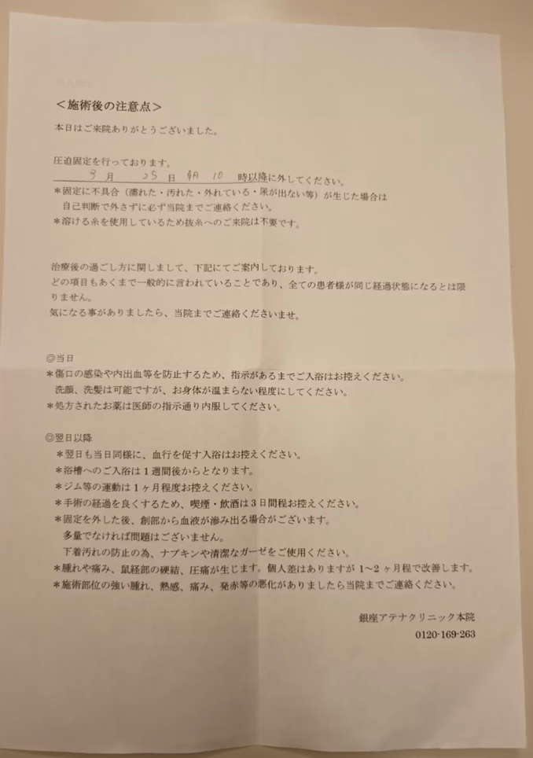
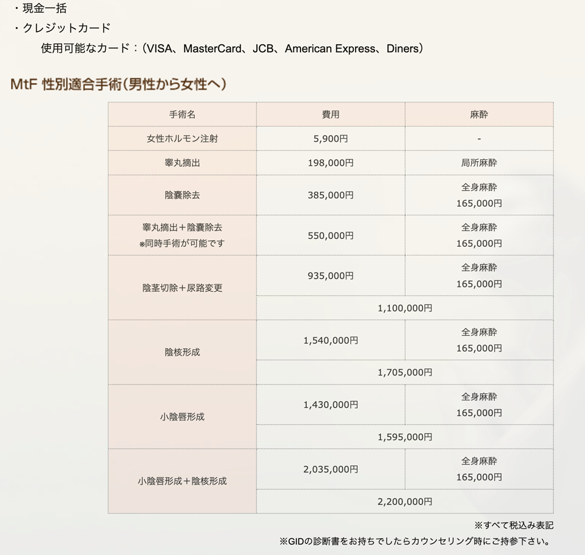

地址：〒104-0061　東京都中央区銀座7-10-5DUPLEX銀座3F\
官网：<https://srs.athenaclinic.net/>



建议找一个居住在日本且懂日语的人进行陪伴或协助。



## 预约方法渠道

- 进入诊所官网，使用LINE或者电话进行预约。
- 日本的LINE注册需要本地电话号码，所以这也是上面建议找一个居住在日本的人进行协助的原因。

## 预约手术有哪些要求

必须持有相关心理证明，诊所不提供心理鉴定，如果证明语言并非日语/英语，则需要进行翻译，具体情况可以联系诊所。

下面是我准备的材料，供参考：

- 病例A1、诊断证明B1（大证，写明建议外科治疗），需要加盖公章。
- 认证机构出具的翻译件A2、B2（我找的是natti认证的翻译）。
- 原件和翻译件的公证材料A3、B3，需要带公章。

翻译和公证的获取可以在网络参考，关键词：留学医疗文件翻译/公证。

建议先联系医院，提交材料，确认无误后确定预约手术时间，然后在规定时间内携带材料前往就诊。

## 手术和恢复情况

进入诊所后，在有日语翻译的情况下，咨询时长约一小时左右，咨询结束后需要等待医生准备手术室。手术时长约半小时，从进手术室到结束大约一小时左右。

手术会结合笑气麻醉和局部麻醉，手术前吸入笑气，可能在术中醒来，此时术区的疼痛感会减弱，直到医生完成手术。手术后一个小时内无明显痛感，可以适当进行一些活动。

手术后注意事项：

- 按时服用抗生素，按需服用止痛药。
- 医生给予的压力包扎，需要在3天后取下。
- 3天内不允许抽烟喝酒，3天后可以洗澡，但是注意不要使体温过高。
- 一周后可以泡澡。
- 一个月内，不要进行健身之类的运动。
- 有问题及时联系医院。

手术注意事项图片如下：

术后护理方案因地区和医生的理念不同而有所差异。例如，日本的医疗方案相对激进，通常允许患者在术后3天左右洗澡；而部分中国医生则倾向于更为保守的常规护理方式。

中国医生的建议如下：

- 术后一个月内避免淋浴或盆浴，期间可使用湿毛巾擦拭清洁身体，一个月后再恢复正常洗澡。
- 每天早晚两次使用碘伏对伤口进行消毒。消毒后使用吹风机（冷风档）将伤口吹干，并用无菌纱布覆盖患处。
- 为规避感染风险，建议连续服用抗生素7天。在部分实际案例中，患者在服用完主治医师开具的抗生素后，会继续以中等抗感染剂量服用阿莫西林胶囊直至满一周。

个体的手术恢复情况存在差异，但整体恢复进程通常如下：

- 在恢复良好的情况下，拆除压力包扎时通常无明显渗血，纱布上仅有少量干涸血迹（部分患者即使在术后安排了较高强度的行程，如“铁人三项”，也未出现严重出血，具体高强度活动注意事项详见后文）。
- 拆除压力包扎后，伤口会逐渐结痂。大约在术后二十余天时，结痂会自然脱落。若部分结痂与手术缝线粘连，切勿强行撕扯，可待伤口完全愈合后慢慢去除。
- 通常在术后一个月左右，伤口可基本愈合。
- 术后十天内，精索部位出现酸胀感属于正常的术后反应。这种感觉会随着时间推移逐渐减弱直至完全消失。整体而言，手术对日常行走的影响较小。

## 花费

手术价格是198,000日元，约合RMB8000+

其他项目手术可以参考官网：

