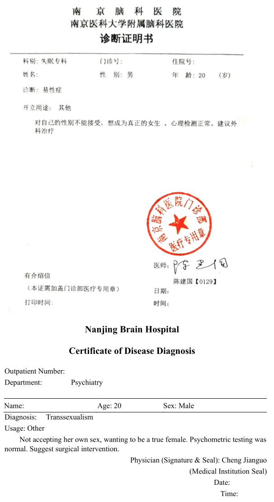





医生姓名：Chettawut，蔡达武

所在医院：WIH International Hospital <admin.wih@wihhospital.com>

[官网介绍](http://www.chet-plasticsurgery.com/zh-hans/性别重置手术/)

### 价格

手术费用：

- 皮瓣 

酒店费用： 一天，大概需要 3 ~ 4 周。

**预约**：可以找中介梁金（微信：`liangjin3039`），也可以通过 <chettawut@gmail.com> 或 <cset@truemail.co.th> 联系

## 手术介绍

Chet 的技术与 Suporn 类似，使用阴囊皮瓣作为阴道内壁和大阴唇，包皮和尿道黏膜作为阴道前庭和小阴唇内侧，阴茎皮瓣作为小阴唇外侧，龟头作为阴蒂。此外，一部分龟头也会保留在阴道前庭作为次级敏感器官，同时 Chet 还会在阴蒂包皮和系带、小阴唇及系带以及前列腺附近连接相应神经。对于材料不足的手术对象，Chet 也可以使用腹股沟皮片作为阴道内壁（需另收费）。与 Suporn 不同的是，Chet 还接受使用结肠的 SRS 和 0 深度 SRS，而且通常使用一次手术成形，也因此会有单次手术无法解决的阴唇后联合的问题。

基于同样的技术，Chet 同样有更高的并发症风险，时有肉芽组织增生和阴道狭窄的状况，而且有类似的每日 3 次 60 分钟的通模具要求。同样的，Chet 也会有对会阴处脱毛的需求。Chet 在曼谷自家诊所手术。总体来说，Chet 的技术在外观上与 Suporn 近似，且相对 Suporn 在阴道成形等方面更加保守，出现严重问题的情况较少，因此也是不错的选择。

## 预约事项

1. 为了保证手术质量，正常情况下 Chettawut 医生作为唯一的主刀医师每天只会安排一个手术，因此确认手术日期时间会稍长。

1. **一旦双方确认了手术日期，顾客需要在 10 天内支付 20% 的订金。** 如果订金没有按时支付，手术日期将被延后。

1. **不接受未满 18 岁或 70 以上的顾客。** 18-20 岁的顾客需要得到父母或法定监护人的陪同来到泰国，并在咨询面谈当天签字同意。父母或法定监护人需要提供经公证过的关系证明。

1. 由于手术需要进行全身麻醉，如果顾客有以下疾病将不能接受手术：

    - 心脏病
    - 肺部疾病病
    - 肾脏疾病
    - 肝脏疾病（包括乙型肝炎和丙型肝炎）
    - 艾滋病毒携带者（无论有症状还是无症状艾滋病毒携带者）
    - 深静脉血栓
    - 癌症患者和一切有可能引起并发症的慢性疾病}

1. BMI <= 33， 结肠重塑阴道手术 BMI < 25

## 术前事项

1. 手术需要两位心理医生的证明

    其中可以自行提供一份中国的医院证明（翻译成英文，注意：证明上必须写有<u>建议手术</u>的字样）
    
    泰国心理医生价格  每位

1. 术前检查项目（建议在中国医院做好翻译成英文）：

    - CBC 全血检测报告
    - HIV
    - BUN  肾功能
    - PT, PTT 凝血
    - FBS 空腹血糖
    - 电解质（K, Na, P, Cl, Mg）
    - HCV 丙肝
    - 正面胸部 X 光
    - （40 岁以上检查心电图）

## 手术日程


时间节点（天）,进度
-3,软食
-2,流食
1,手术
5,拆引流管 出院
8,拆包
11,拔尿管

