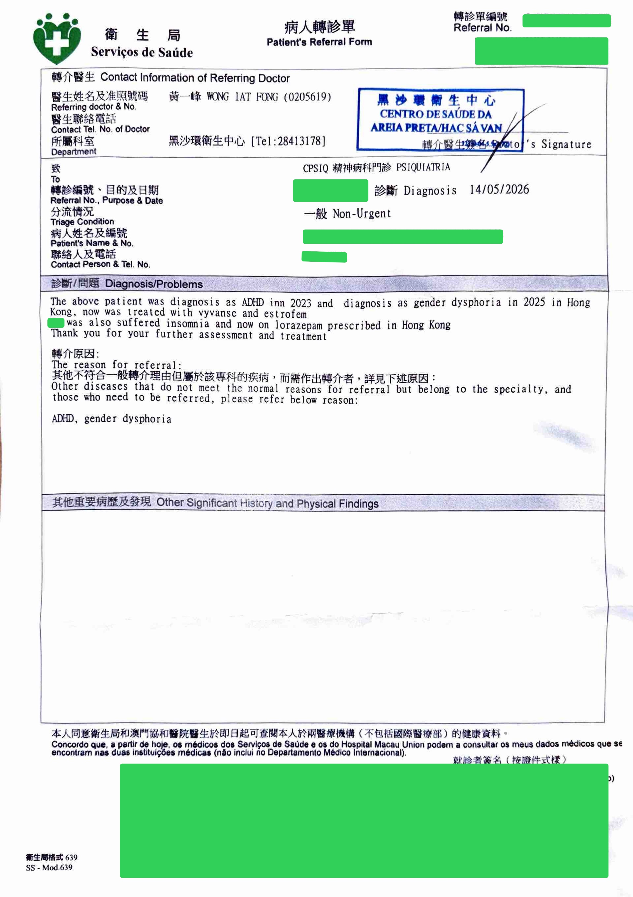

## 流程

已持有性別焦慮/易性症相關診斷時，可先到衛生中心 Walk-in，請醫生開轉介至仁伯爵綜合醫院（CHCSJ）相關內分泌門診；再到衛生中心掛號處，由護士協助預約 CHCSJ 門診，拿到預約單（含時間、地點）。

如果尚未持有相關診斷，在衛生中心 Walk-in 即可，請醫生開精神科轉介信，在衛生中心掛號處預約精神科門診；在精神科完成評估並取得相關診斷後，精神科可直接轉介至內分泌相關門診，然後按流程到掛號處預約。精神科等待時間通常較長（約三至四個月），內分泌相關門診預約相對更快（約一週）。

## 示例

