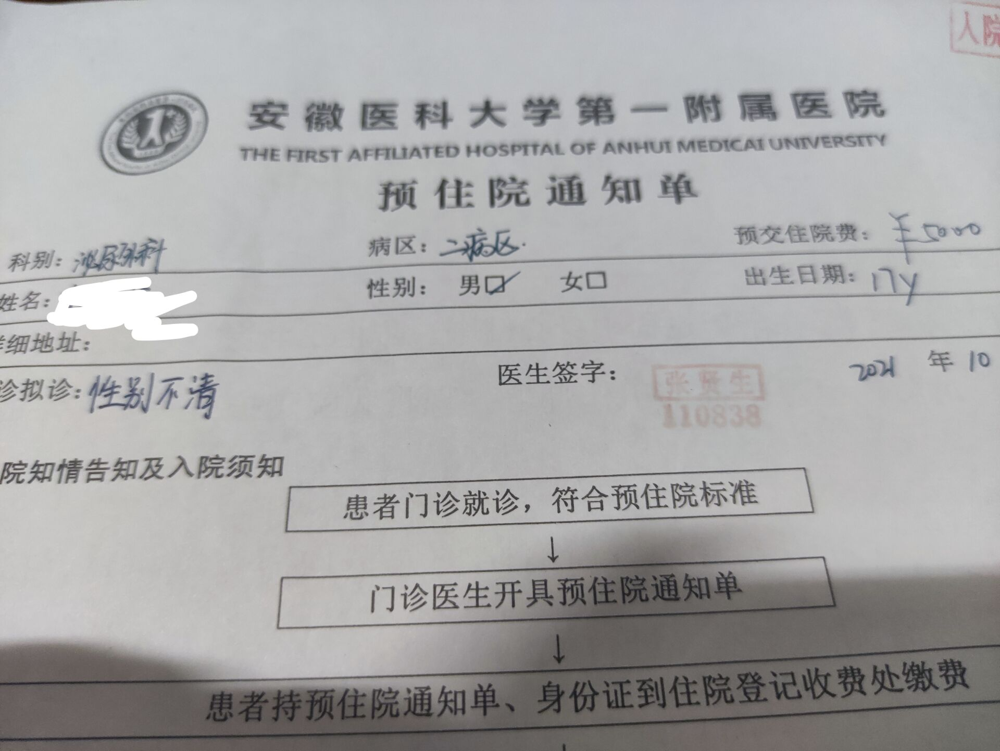
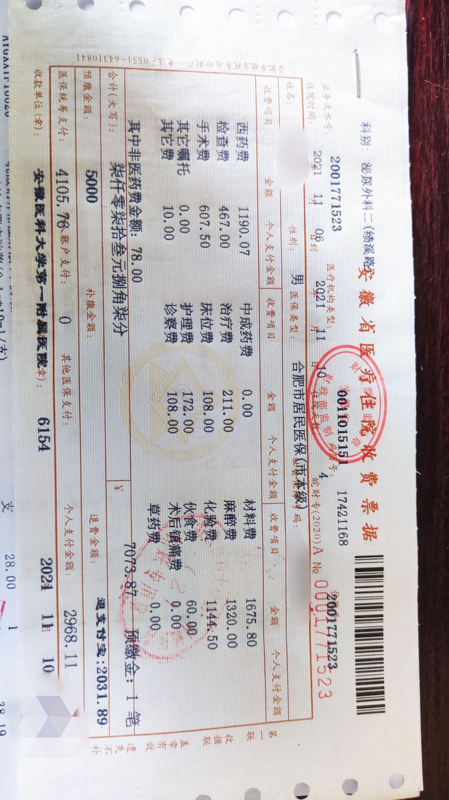


該醫院目前的信息只有確定可以做性腺切除，完整 srs 是否可以做目前未知
以下所有信息均為性腺切除相關信息


## 前置條件

1. 16 歲以上
1. 監護人簽字

## 費用相關

住院預繳費 5000
總體花費在 8000 上下，可以使用社保

## 注意事項

1. 術後需要住院三天
1. 麻醉可以選擇局麻與全麻
1. 醫生比較友好，~~你醒啦，你已經是女孩子啦~~，不過沒有單人病房

## 住院必須品

1. 現金 100 元(手術前洗澡用的水卡，50 押金 50 水費，退卡也是退現金)
1. 日常洗漱用品:洗臉盆，毛巾幾條（洗臉和洗澡用)，牙刷牙膏刷牙杯以及沐浴露洗髮露之類水杯（醫院裡提供開水和每個床都配一個熱水瓶)
1. 紙巾拖鞋
1. 飯盒兩個，筷子和勺子(住院費裡包括了每天的三餐費用十五元)
1. 尿壺(手術結束當天不能下地)
1. 醫用護墊（以免術後漏液)
1. 醫用敷貼（醫院裡換藥用的，出院後一兩個月裡應該還要用)
1. 棉棒(手術當天禁食水，患者可能大約 20 小時不能喝水，嘴巴很乾，需要用棉棒沾水潤嘴唇)

## 入院通知





~~醫生也吐槽了醫院病症更新不及時沒有易性症相關診斷，所以診斷為兩畸的 性別不清~~

## 費用清單




