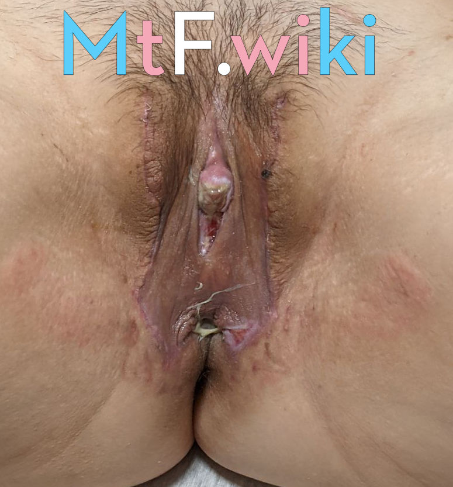

## 九院跨性別序列治療團隊

團隊：

- [劉陽](https://www.haodf.com/doctor/74805.html)（主任醫師）
- [程辰]()（主治醫師）
- [張盈帆](https://www.haodf.com/doctor/275463.html)（副主任醫師）
- [麻蓀香](https://www.haodf.com/doctor/599858232.html)（副主任醫師）
- [周怡雯](https://www.haodf.com/doctor/9032015682.html)（住院醫師）

特別顧問：

- [程開祥](https://www.haodf.com/doctor/12887.html)（主任醫師）

其中 MtF SRS：

- [劉陽](https://www.haodf.com/doctor/74805.html)（主任醫師）
- [麻蓀香](https://www.haodf.com/doctor/599858232.html)（副主任醫師）
- [程開祥](https://www.haodf.com/doctor/12887.html)（副主任醫師）

## 前置條件

1. 達到 20 週歲以上
1. 以心理認同的性別至少生活一年以上（RLE）
1. 易性症診斷：易性症證明（目前僅承認由邸曉蘭、過斌、叢中、陸崢、劉娜開出的證明），並證明無其他心理疾病
1. 公證證明：公證處開具，證明本人及至少一位直系親屬同意行性別重置手術
   [本人申請書 + 父母知情同意聲明](icf.pdf)（模版，需要公證）
1. 高血壓、糖尿病需術前六個月平穩控制（無併發症）

## 術式、價格

(最後更新時間 `2021-11-08` 劉陽)
PI 皮瓣技術，但是需要脫毛。
手術費用約 6 ~ 8 萬 (缺乏精確數據)

## 問診

1. 會詳細詢問 使用激素的效果及感受 (比如身體有哪些變化)
1. 會詳細詢問 RLE 細節及感受/打算
1. (可能) 需要體檢 (脫光, 醫生看胸部和陰部)
1. 如果陰部毛髮太多, 醫生會要求首先進行 **激光脫毛** (大約需要 3 至 6 個月), 脫毛之後才能手術.

## 手術評價

  
  
  
  